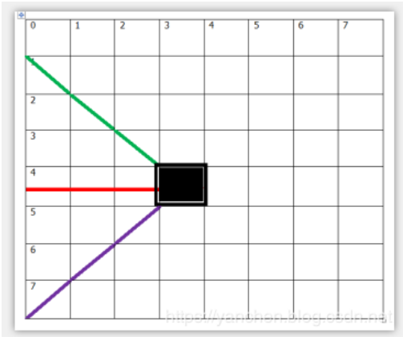
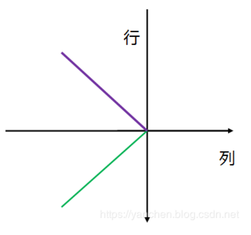
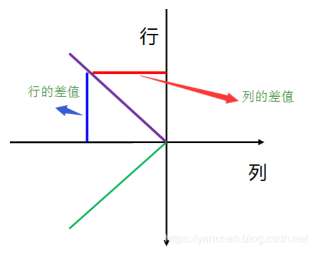

---

title: 八皇后算法解析
date: 2019-11-26 11:29:24
description:
{: id="20201220214147-8n6s9od"}

tags:
{: id="20201220214147-k9gj31p"}

- {: id="20201220214147-c689aop"}八皇后
- {: id="20201220214147-oq2xwmm"}算法
{: id="20201220214147-6q0izu2"}

nav:
{: id="20201220214147-6rrhr7f"}

- {: id="20201220214147-u2fr0wf"}算法
{: id="20201220214147-s3y6mmt"}

categories:
{: id="20201220214147-2aj92k3"}

- {: id="20201220214147-7rhprtj"}算法
{: id="20201220214147-idujzz9"}

image: images/algorithm.jpg
{: id="20201220214147-bf2gvt2"}

---

今天研究力扣的一道题死活写不出来对应的算法，没办法自己算法基础太差。于是看了下答案，发现使用什么回溯算法，菜鸟表示平时开发期间写的最复杂的程序就是写了两层for循环，已经很牛逼了有木有？这个回溯算法什么鬼？于是乎百度了下，算是了解了回溯算法是什么玩意儿。这里分析一波八皇后算法来加深一下理解。
{: id="20201220214147-q0k371j"}

八皇后算法描述如下：在8×8格的国际象棋上摆放八个皇后，使其不能互相攻击，即任意两个皇后都不能处于同一行、同一列或同一斜线上，问有多少种摆法！
{: id="20201220214147-l0cqal6"}


{: id="20201220214147-k8bgz3x"}

下面来分析一波，假设此时我们想要在黑色方块位置放置一个皇后：
{: id="20201220214147-wz2vbj6"}


{: id="20201220214147-af4ft52"}

如果一列一列的放置皇后的话，图中黑色位置能放置一个皇后的合法性条件为：
{: id="20201220214147-1o2lb2c"}

1. {: id="20201220214147-2fm7rmm"}绿色线条经过的方格没有皇后 （不处于同一斜线）
   {: id="20201220214147-rl82yhl"}
2. {: id="20201220214147-jdvp3rj"}红色线条经过的方格没有皇后 （不处于同一行）
   {: id="20201220214147-gals6ba"}
3. {: id="20201220214147-t73zy0i"}紫色线条经过的方格没有皇后 （不处于同一斜线）
   也就是说如果以黑色方块位置为参照原点：（0,0）坐标点，紫色和绿色两个线条分别是斜率为1和-1的两个函数，如下图：
   {: id="20201220214147-0rthbks"}
{: id="20201220214147-i4t15zj"}

紫色线所代表的函数是：y = -x;
{: id="20201220214147-d778nz0"}

绿色先所代表的函数是：y=x;
{: id="20201220214147-wgg2xsh"}

（横坐标是列，纵坐标为行，注意行从上到下递增）
{: id="20201220214147-gmr4k0b"}


{: id="20201220214147-3l00f3f"}

凡是位于这两条函数线上的位置（点）以及横坐标（说明位于同一行）都不能有皇后。
所以假设某一列皇后的位置用行来记录，比如queen[column] = row,意思是第column列的皇后的位置在第row行。
{: id="20201220214147-w5eseou"}

同行的逻辑很好判断，那么我们想要在黑色方块位置放置一个皇后，怎么判断前面几列是否在绿色线条和紫色线条上已经有了皇后呢？思路也很简单：
{: id="20201220214147-7j7g13r"}

假设黑色方块的位置为n列，nRow行，假设位于m列的所在的行是否有皇后位于紫色线或者绿色上，那么就符合下面条件：
{: id="20201220214147-4iits1n"}

```
//假设此时即将在n列放置一个皇后,n>m

]//获取m列上皇后所在的行
int mRow = queen[m]
int nRow = queen[n]；
//行的差值
int rowDiff = nRow - mRow;

//列的差值
int columnDiff = n-m;

```
{: id="20201220214147-pcnspmf"}

上面代码中 rowDiff的绝对值等于columnDiff的绝对值的话，说明点位于y=x或者y=-x的函数线上：
{: id="20201220214147-ee1bb0i"}


{: id="20201220214147-y2d8fim"}

就说明此时黑色方块的位置是不能放置皇后的，因为在紫色或者绿色线上已经有了皇后。
那么用代码来（currentColumn,curreentRow）是否可以放置皇后的方法如下
{: id="20201220214147-8rpo624"}

```
     /**
     * 判断当（currentRow,currentColumn)是否可以放置皇后
     * @param currentColumn 
     * @return
     */
    public boolean isLegal(int currentRow,int currentColumn) {
        //遍历前面几列
        for(int preColumn=0;preColumn<currentColumn;preColumn++) {
                int row = queen[preColumn];
                //说明在子preColumn的低currentRow已经有了皇后
                if(row==currentRow) {
                        return false;
                }
                
            //行与行的差值
            int rowDiff= Math.abs(row -currentRow);
          
            //列于列的差值
            int columnDiff =  Math.abs(currentColumn-preColumn);
            //说明斜线上有皇后
            if(rowDiff==columnDiff ){
                return false;
            }
        }//end for
        
        //说明（currentRow,currentColumn)可以摆放。
        return true;
    }

}

```
{: id="20201220214147-hd0dij0"}

因为博主是按照一列一列的方式来进行放置的，所以整体思路就是：在当前列逐步尝试每一行是否可以放置皇后，如果有一个可以放置皇后，就继续查看下一列的每一行是否可以放置皇后。所以代码如下：
{: id="20201220214147-zc9jvkp"}

```
    int queen[] = new int[8];
    int count = 0;
    
    private void eightQueen(int currentColumn) {
                //这个for循环的目的是尝试讲皇后放在当前列的每一行
                for(int row=0;row<8;row++) {
                        //判断当前列的row行是否能放置皇后
                        if(isLegal(row,currentColumn)) {
                        //放置皇后
                                queen[currentColumn] = row;
                                if(currentColumn!=7) {
                                        //摆放下一列的皇后
                                        eightQueen(currentColumn+1);
                                
                                }else {
                                        //递归结束，此时row要++了
                                        count++;
                                }
                        }
                }//end for
        }

```
{: id="20201220214147-tln110e"}

需要注意的是当currentColumn==7的时候，说明此时已经完成了一种摆放方法，然后for循环继续执行，去尝试其他摆放方法。
{: id="20201220214147-g74liuf"}

测试一波，一共有92种摆放方法：
{: id="20201220214147-3psyejv"}

```
   public static void main(String args[]) {
        Queen queen = new Queen();
        queen.eightQueen(0);
        System.out.println("总共有 " +queen.count+ " 摆放方法");
    }

```
{: id="20201220214147-o4pkdp6"}

所以结合八皇后的实现来看看到底什么是回溯算法，看[百度百科解释](https://baike.baidu.com/item/%E5%9B%9E%E6%BA%AF%E7%AE%97%E6%B3%95/9258495?fr=aladdin) (rel=undefined)：回溯算法实际上一个类似枚举的搜索尝试过程，主要是<font color#ff00ff>在搜索尝试过程中寻找问题的解，当发现已不满足求解条件时，就“回溯”返回，尝试别的路径。但当探索到某一步时，发现原先选择并不优或达不到目标，就退回一步重新选择，这种走不通就退回再走的技术为回溯法
{: id="20201220214147-aker83b"}

比如八皇后算法来说，我们根据约束条件判断某一列的某一行是否可以放置皇后，如果不可以就继续判断<font color #ff00ff>当前列的下一行是否可以放置皇后.如果可以放置皇后，就继续探寻下一列中可以放置皇后的那个位置。完成一次摆放后。再重新挨个尝试下一个可能的摆放方法。#
{: id="20201220214147-ggy2i8g"}

下面用一个[力扣的题](https://leetcode-cn.com/problems/combination-sum/) (rel=undefined)再次巩固下回溯算法的应用。该题描述如下：
{: id="20201220214147-7sbfcq6"}

```
给定一个无重复元素的数组 candidates 和一个目标数 target ，找出 candidates 中所有可以使数字和为 target 的组合。candidates 中的数字可以无限制重复被选取。

说明：所有数字（包括 target）都是正整数。解集不能包含重复的组合。 
示例 1:输入: candidates = [2,3,6,7], target = 7,
所求解集为:
[
  [7],
  [2,2,3]
]

示例 2:输入: candidates = [2,3,5], target = 8,
所求解集为:
[
  [2,2,2,2],
  [2,3,3],
  [3,5]
]

```
{: id="20201220214147-881ijds"}

做该题的重要条件是无重复的数组，那么问题就很好解了。
{: id="20201220214147-at9ihwb"}

首先对数组从大到小排序。这是解题的关键。
{: id="20201220214147-0eggc2p"}

然后为了减少不必要的遍历，我们要对原来的数组进行截取：
{: id="20201220214147-e69mu3l"}

```
        List<List<Integer>> res = new ArrayList<>();
         //重要的要大小排列
        Arrays.sort(candidates);
        //说明原数组中就没有满足target的数
        if (candidates[0] > target) {
               return res;
         }

        List<Integer> newCandidates= new ArrayList<Integer>();
        int len = candidates.length;
        // 取小于target的数 组成一个临时数组
        for (int i = 0; i < len; i++) {
                int num = candidates[i];
                if (num > target) {
                        break;
                }
               newCandidates.add(num);
         } // end for
         
```
{: id="20201220214147-ob23xre"}

通过上面的步骤我们拿到了一个从小到大排列的无重复数组newCandidates，数组中的元素都<=target.
{: id="20201220214147-yeomezw"}

因为数组从小到大排列，所以我们有如下几种情况，以candidates = [2,3,5], target = 8为例：
{: id="20201220214147-yok6mlx"}

符合条件的子数组满足条件如下
{: id="20201220214147-wuaxg0y"}

1. {: id="20201220214147-1j3me35"}target循环减去一个数，如果能一直减到到差值等于0，那么这个数组成的数组就是一个解,比如[2,2,2,2];
   {: id="20201220214147-jzyidvz"}
2. {: id="20201220214147-0rhgjft"}target减去一个数，然后形成了一个新的newTarget=target-num[i],让这个newTarget减去下一个数num[i+1],然后执行步骤1，则又是一个解，比如[2,3,3];（其实步骤1是步骤2的一个特例）
   {: id="20201220214147-1sffy9t"}
3. {: id="20201220214147-8ow09bd"}target减去一个数，然后形成了一个新的newTarget=target-num[i],让这个newTarget减去下一个数num[i+1]，如果能一直减到到差值等于0说明又是一个解.，比如[3,5];
   {: id="20201220214147-6j9d86e"}
{: id="20201220214147-l5udgh3"}

如此得到了一个规律，只要是相减之后得到差值=0,就说明就得到一个解。
{: id="20201220214147-ksxa15y"}

得到一个新的解之后继续循环数组中的下一个数字，继续执行1,2,3步骤即可。
{: id="20201220214147-5npsonm"}

所以完成的解法如下：
{: id="20201220214147-6v85ip4"}

```
class Solution {
     public List<List<Integer>> combinationSum(int[] candidates, int target) {
        List<List<Integer>> res = new ArrayList<>();
         //重要的要大小排列
        Arrays.sort(candidates);
         
                List<Integer> temp = new ArrayList<Integer>();

     
                if (candidates[0] > target) {
                        return res;
                }

        int len = candidates.length;
         
                // 取小于target的数 足证一个临时数组
                for (int i = 0; i < len; i++) {
                        int num = candidates[i];
                        if (num > target) {
                                break;
                        }

                        temp.add(num);
                } // end for
         
         //
        find(res, new ArrayList<>(), temp, target, 0);
         
        return res;
    }
    
    public void find(List<List<Integer>> res, List<Integer> tmp, List<Integer> candidates, int target, int start){
        //target==0.找到一个新的解
        if (target == 0) {
            res.add(new ArrayList<>(tmp));
        }else if(target>0){
          for (int i = start; i < candidates.size(); i++) {
             int num = candidates.get(i);
             if(num<=target){               
                  tmp.add(num);
                  //查找新的target
                  int newTarget = target-num;
                  find(res, tmp, candidates, newTarget, i);
                  tmp.remove(tmp.size() - 1);
             }
           
           }//end for
        }
    }
}

```
{: id="20201220214147-63kr6tw"}

原文：https://blog.csdn.net/chunqiuwei/article/details/90113087#commentBox
{: id="20201220214147-8jchi2k"}


{: id="20201220214147-pggp1pi" type="doc"}
