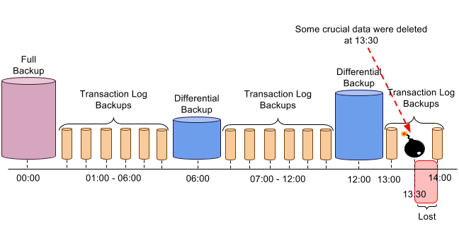
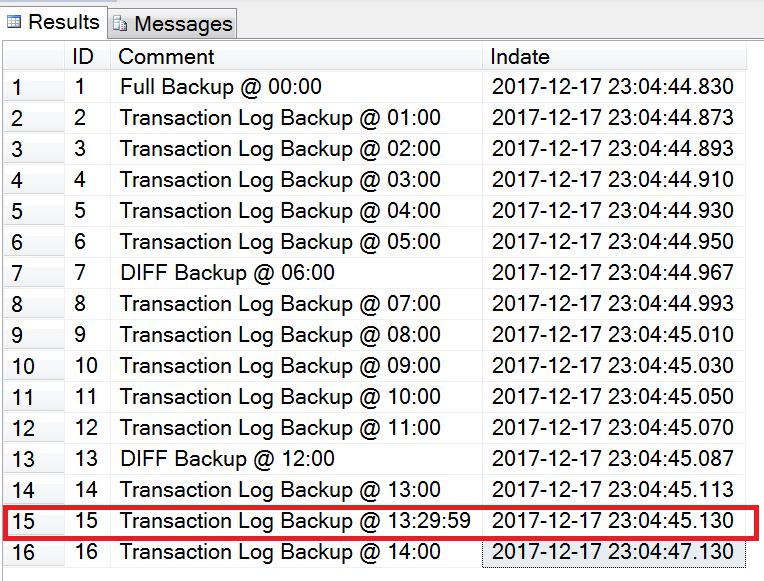
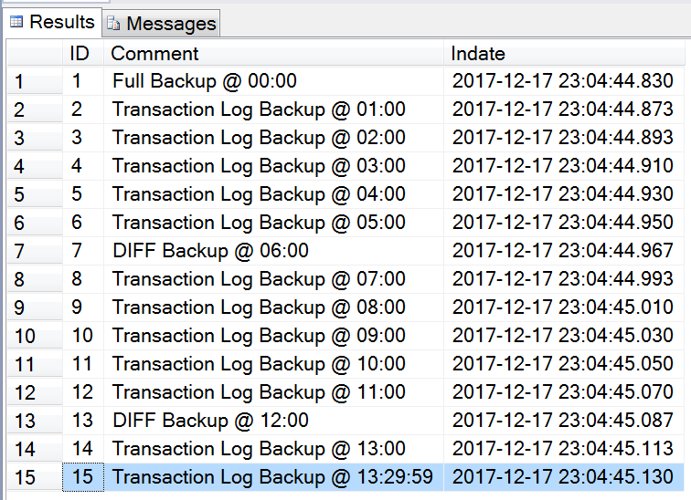
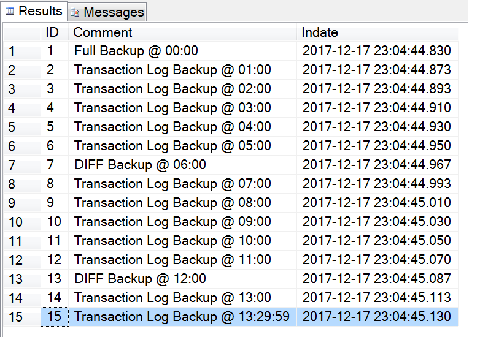
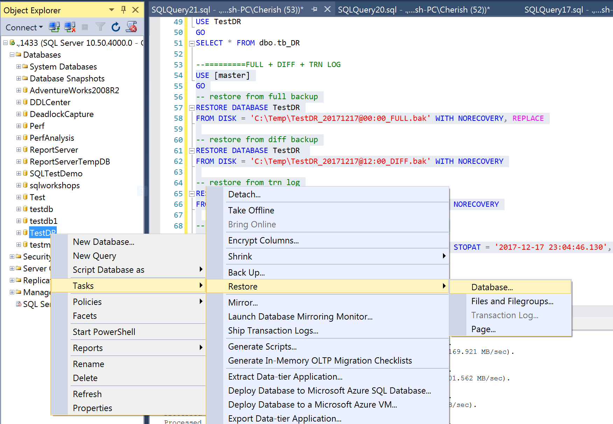
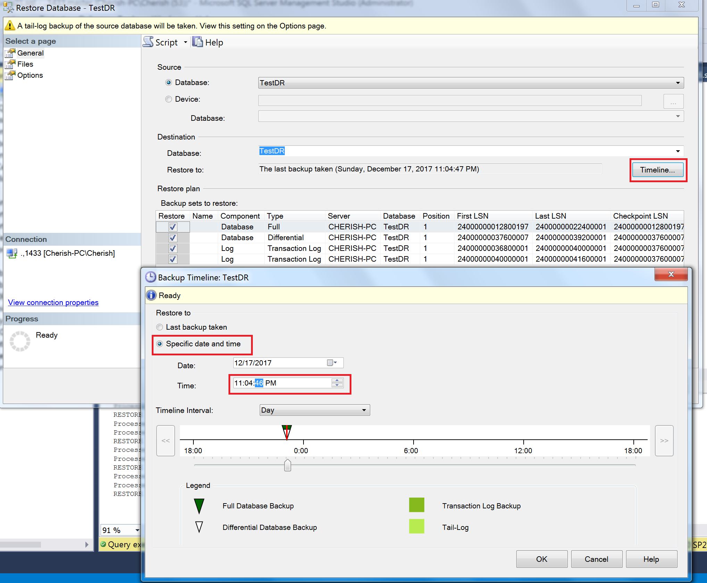

----
title: MSSQL · 最佳实践 ·  SQL Server备份策略
date: 2020-09-08
description: 

tags:
- 备份
- MSSQL

nav:
- 数据库

categories:
- MSSQL

image: images/MSSQL.png

----
# 摘要

在上一期月报中我们分享了SQL Server三种常见的备份技术及工作方式，本期月报将分享如何充分利用三者的优点来制定SQL Server数据库的备份和还原策略以达到数据库快速灾难恢复能力。

[上期月报：MSSQL · 最佳实践 · SQL Server三种常见备份](http://mysql.taobao.org/monthly/2017/11/03/)

# 三个术语

在详细介绍SQL Server的灾备策略之前，我们先简要介绍三个重要的术语：

- RTO (Recovery Time Objective)恢复时间目标，是指出现灾难后多长时间能成功恢复数据库，即企业可容许服务中断的最大时间长度。比如说灾难发生后一天内恢复成功，则RTO值就是二十四小时；
- RPO (Recovery Point Objective)恢复点目标，是指服务恢复后，恢复回来的数据所对应的最新时间点。比如企业每天凌晨零晨进行完全备份一次，那么这个全备恢复回来的系统数据只会是最近灾难发生当天那个凌晨零时的资料；
- ERT(Estimated Recovery Time)预估恢复时间，是指根据备份链路的长度和备份文件的大小以及设备的还原效率来估算的服务恢复时间。
从以上的三个术语解释来看，最优的灾备方案是RTO极小，即出现故障能够立马恢复数据；RPO无线接近故障时间点，即最少的数据丢失；ERT最小，即可快速恢复服务。但是，现实场景中的灾备方案往往很难达到如此优化的方案。

# 制定灾备策略

以上三个术语是衡量灾备方案和还原策略优劣的重要指标，我们的灾备策略的目标也是无限的靠近RTO、RPO和ERT的最优值。以下我们列举一个典型的灾备场景来分析和解答：
假设某个企业对SQL Server数据库DBA提出的灾难恢复要求是数据丢失不超过一小时（RPO不超过一小时），在尽可能短的时间内（RTO尽可能短）恢复应用数据库服务，且灾备策略必须具备任意时间点还原的能力。
综合上一期月报分享，我们先抛开灾备策略的优劣来看，我们看看三种典型的灾备策略方案是否可以实现RPO？

- 每个小时一次完全备份：备份文件过大，备份还原效率低下，这种方案无法实现任意时间点的还原；
- 每天一个完全备份 + 每小时一个日志备份：解决了备份文件过大和效率问题，也可以实现任意时间点还原，但是拉长了日志还原链条；
- 每天一个完全备份 + 每六个小时一个差异备份 + 每小时一个日志备份：具备任意时间点还原的能力，综合了备份文件大小、效率和备份链条长度。
从这个分析来看，也恰好应证了上一期的月报中的结论，即：完全备份集是所有备份的基础，但数据量大且备份耗时；事务日志备份集相对较小且快速，但会拉长备份文件还原链条，增大还原时间开销；差异备份解决了事务日志备份链条过长的问题。

# 时间点恢复

我们假设备份数据增量为每小时1GB，初始完全备份大小为100GB，按照时间维度计算每小时产生的备份集大小，统计如下：

## 典型场景

假设我们非常重要的订单数据库，在13:30被人为的错误删除掉了，灾备系统在14:00进行了一个事务日志备份。那么，这个事务日志备份对我们业务的灾难恢复就非常关键和重要了，它使得我们有能力将数据库还原到13:29:59这个时间点。如此，我们只会丢失13:30 - 14:00之间的这半个小时的数据（实际上我们也有能力找回13:30 - 14:00）。但是，如果没有14:00这个事务日志备份文件，但存在13:00的事务日志备份文件的话，我们的系统数据会丢失13:00 - 14:00之间这一个小时的数据，一个小时的数据丢失是公司不被允许的。场景如下图展示：

## 模拟备份策略

我们可以使用以下方法模拟灾备方案和灾难恢复的步骤：

- 第一步：创建测试数据库并修改为FULL模式
- 第二步：创建一个完全备份
- 第三步：每一个小时做一次事务日志备份
- 第四步：每六个小时做一个差异备份

详细的模拟方法和语句如下所示：

    -- Create testing DB
    IF DB_ID('TestDR') IS NULL
        CREATEDATABASE TestDR;
    GO
    
    -- Change Database to FULL Recovery Mode -- for time point recovery supportingALTERDATABASE [TestDR] SETRECOVERYFULLWITH NO_WAIT
    GOUSE TestDR
    GO-- Create Testing TableIF OBJECT_ID('dbo.tb_DR', 'U') ISNOTNULLDROPTABLE dbo.tb_DR
    GOCREATETABLE dbo.tb_DR
    (
        IDINTIDENTITY(1,1) NOTNULL PRIMARY KEY,
        CommentVARCHAR(100) NULL,
        Indate DATETIME NOTNULLDEFAULT(GETDATE())
    );
    GO
    
    USE TestDR
    GO-- Init dataINSERTINTO dbo.tb_DR(Comment)
    SELECT'Full Backup @ 00:00';
    -- Take Full BackupBACKUPDATABASE [TestDR] TO 
    DISK =N'C:\Temp\TestDR_20171217@00:00_FULL.bak'WITH COMPRESSION,INIT,STATS=5;
    
    INSERTINTO dbo.tb_DR(Comment)
    SELECT'Transaction Log Backup @ 01:00';
    -- Take TRN BackupBACKUPLOG [TestDR] TO 
    DISK =N'C:\Temp\TestDR_20171217@01:00_LOG.trn'WITH COMPRESSION,NOINIT,STATS=5;
    
    INSERTINTO dbo.tb_DR(Comment)
    SELECT'Transaction Log Backup @ 02:00';
    -- Take TRN BackupBACKUPLOG [TestDR] TO 
    DISK =N'C:\Temp\TestDR_20171217@02:00_LOG.trn'WITH COMPRESSION,NOINIT,STATS=5;
    
    INSERTINTO dbo.tb_DR(Comment)
    SELECT'Transaction Log Backup @ 03:00';
    -- Take TRN BackupBACKUPLOG [TestDR] TO 
    DISK =N'C:\Temp\TestDR_20171217@03:00_LOG.trn'WITH COMPRESSION,NOINIT,STATS=5;
    
    INSERTINTO dbo.tb_DR(Comment)
    SELECT'Transaction Log Backup @ 04:00';
    -- Take TRN BackupBACKUPLOG [TestDR] TO 
    DISK =N'C:\Temp\TestDR_20171217@04:00_LOG.trn'WITH COMPRESSION,NOINIT,STATS=5;
    
    INSERTINTO dbo.tb_DR(Comment)
    SELECT'Transaction Log Backup @ 05:00';
    -- Take TRN BackupBACKUPLOG [TestDR] TO 
    DISK =N'C:\Temp\TestDR_20171217@05:00_LOG.trn'WITH COMPRESSION,NOINIT,STATS=5;
    
    
    INSERTINTO dbo.tb_DR(Comment)
    SELECT'DIFF Backup @ 06:00';
    -- Take DIFF BackupBACKUPDATABASE [TestDR] TO 
    DISK =N'C:\Temp\TestDR_20171217@06:00_DIFF.bak'WITH DIFFERENTIAL,COMPRESSION,NOINIT,STATS=5;
    
    
    
    INSERTINTO dbo.tb_DR(Comment)
    SELECT'Transaction Log Backup @ 07:00';
    -- Take TRN BackupBACKUPLOG [TestDR] TO 
    DISK =N'C:\Temp\TestDR_20171217@07:00_LOG.trn'WITH COMPRESSION,NOINIT,STATS=5;
    
    INSERTINTO dbo.tb_DR(Comment)
    SELECT'Transaction Log Backup @ 08:00';
    -- Take TRN BackupBACKUPLOG [TestDR] TO 
    DISK =N'C:\Temp\TestDR_20171217@08:00_LOG.trn'WITH COMPRESSION,NOINIT,STATS=5;
    
    INSERTINTO dbo.tb_DR(Comment)
    SELECT'Transaction Log Backup @ 09:00';
    -- Take TRN BackupBACKUPLOG [TestDR] TO 
    DISK =N'C:\Temp\TestDR_20171217@09:00_LOG.trn'WITH COMPRESSION,NOINIT,STATS=5;
    
    INSERTINTO dbo.tb_DR(Comment)
    SELECT'Transaction Log Backup @ 10:00';
    -- Take TRN BackupBACKUPLOG [TestDR] TO 
    DISK =N'C:\Temp\TestDR_20171217@10:00_LOG.trn'WITH COMPRESSION,NOINIT,STATS=5;
    
    INSERTINTO dbo.tb_DR(Comment)
    SELECT'Transaction Log Backup @ 11:00';
    -- Take TRN BackupBACKUPLOG [TestDR] TO 
    DISK =N'C:\Temp\TestDR_20171217@11:00_LOG.trn'WITH COMPRESSION,NOINIT,STATS=5;
    
    
    INSERTINTO dbo.tb_DR(Comment)
    SELECT'DIFF Backup @ 12:00';
    -- Take DIFF BackupBACKUPDATABASE [TestDR] TO 
    DISK =N'C:\Temp\TestDR_20171217@12:00_DIFF.bak'WITH DIFFERENTIAL,COMPRESSION,NOINIT,STATS=5;
    
    
    INSERTINTO dbo.tb_DR(Comment)
    SELECT'Transaction Log Backup @ 13:00';
    -- Take TRN BackupBACKUPLOG [TestDR] TO 
    DISK =N'C:\Temp\TestDR_20171217@13:00_LOG.trn'WITH COMPRESSION,NOINIT,STATS=5;
    
    -- This record is similate for point time recoveryINSERTINTO dbo.tb_DR(Comment)
    SELECT'Transaction Log Backup @ 13:29:59';
    
    WAITFOR DELAY '00:00:02'
    
    INSERTINTO dbo.tb_DR(Comment)
    SELECT'Transaction Log Backup @ 14:00';
    -- Take TRN BackupBACKUPLOG [TestDR] TO 
    DISK =N'C:\Temp\TestDR_20171217@14:00_LOG.trn'WITH COMPRESSION,NOINIT,STATS=5;
    
    -- Query DataSELECT * FROM dbo.tb_DR;

我们看看测试表的数据情况，方框选中的这条数据是需要我们恢复出来的：

我们也可以再次检查数据库备份历史记录，来确保灾备信息准确性：

    SELECT
    bs.database_name AS'Database Name',
    bs.backup_start_date AS'Backup Start',
    bs.backup_finish_date AS'Backup Finished',
    DATEDIFF(MINUTE, bs.backup_start_date, bs.backup_finish_date) AS'Duration (min)',
    bmf.physical_device_name AS'Backup File',
    CASEWHEN bs.[type] = 'D'THEN'Full Backup'WHEN bs.[type] = 'I'THEN'Differential Database'WHEN bs.[type] = 'L'THEN'Log'WHEN bs.[type] = 'F'THEN'File/Filegroup'WHEN bs.[type] = 'G'THEN'Differential File'WHEN bs.[type] = 'P'THEN'Partial'WHEN bs.[type] = 'Q'THEN'Differential partial'ENDAS'Backup Type'FROM msdb.dbo.backupmediafamily bmf WITH(NOLOCK)
        INNERJOIN msdb..backupset bs WITH(NOLOCK)
        ON bmf.media_set_id = bs.media_set_id
    WHERE bs.database_name = 'TestDR'ORDERBY bs.backup_start_date ASC

查询的灾备历史记录展示如下：

从这个备份历史记录来看，和我们的测试表中的数据是吻合且对应起来的。

## 灾难恢复步骤

接下来，我们需要根据TestDR数据库的备份文件，将数据库恢复到模拟时间点2017-12-17 23:04:45.130（即真实场景中的发生人为操作失误的时间点13:30），为了包含ID为15的这条数据，我们就恢复到2017-12-17 23:04:46.130时间点即可，然后检查看看ID等于15的这条记录是否存在，如果这条记录存在，说明我们备份和还原策略工作正常，否则无法实现公司的要求。为了试验的目的，我们先把TestDR数据库删除掉（真实环境，请不要随意删除数据库，这很危险）：

    -- for testing, drop db first.USE [master]
    GOALTERDATABASE [TestDR] SET  SINGLE_USER WITHROLLBACKIMMEDIATEGODROPDATABASE [TestDR]
    GO

### 恢复方案一：全备 + 日志备份

为了实现灾难恢复，我们需要先把完全备份文件恢复，然后一个接一个的事务日志备份按时间升序恢复，在最后一个事务日志恢复的时候，使用STOPAT关键字恢复到时间点并把数据库Recovery回来带上线，详细的代码如下：

    USE [master]
    GO-- restore from full backupRESTOREDATABASE TestDR
    FROM DISK = 'C:\Temp\TestDR_20171217@00:00_FULL.bak'WITH NORECOVERY, REPLACE-- restore from log backupRESTORELOG TestDR 
    FROM DISK = 'C:\Temp\TestDR_20171217@01:00_LOG.trn'WITH NORECOVERY
    RESTORELOG TestDR 
    FROM DISK = 'C:\Temp\TestDR_20171217@02:00_LOG.trn'WITH NORECOVERY
    RESTORELOG TestDR 
    FROM DISK = 'C:\Temp\TestDR_20171217@03:00_LOG.trn'WITH NORECOVERY
    RESTORELOG TestDR 
    FROM DISK = 'C:\Temp\TestDR_20171217@04:00_LOG.trn'WITH NORECOVERY
    RESTORELOG TestDR 
    FROM DISK = 'C:\Temp\TestDR_20171217@05:00_LOG.trn'WITH NORECOVERY
    
    -- skip diff backup at 06:00RESTORELOG TestDR 
    FROM DISK = 'C:\Temp\TestDR_20171217@07:00_LOG.trn'WITH NORECOVERY
    RESTORELOG TestDR 
    FROM DISK = 'C:\Temp\TestDR_20171217@08:00_LOG.trn'WITH NORECOVERY
    RESTORELOG TestDR 
    FROM DISK = 'C:\Temp\TestDR_20171217@09:00_LOG.trn'WITH NORECOVERY
    RESTORELOG TestDR 
    FROM DISK = 'C:\Temp\TestDR_20171217@10:00_LOG.trn'WITH NORECOVERY
    RESTORELOG TestDR 
    FROM DISK = 'C:\Temp\TestDR_20171217@11:00_LOG.trn'WITH NORECOVERY
    
    -- skip diff backup at 12:00RESTORELOG TestDR 
    FROM DISK = 'C:\Temp\TestDR_20171217@13:00_LOG.trn'WITH NORECOVERY
    
    -- restore from log and stop at 2017-12-17 23:04:46.130RESTORELOG TestDR 
    FROM DISK = 'C:\Temp\TestDR_20171217@14:00_LOG.trn'WITH STOPAT = '2017-12-17 23:04:46.130', RECOVERY-- Double check test dataUSE TestDR
    GOSELECT * FROM dbo.tb_DR

从测试表中的数据展示来看，我们已经成功的将ID为15的这条数据还原回来，即发生人为失误导致的数据丢失（灾难）已经恢复回来了。

细心的你一定发现了这个恢复方案，使用的是完全备份 + 很多个事务日志备份来恢复数据的，这种方案的恢复链条十分冗长，在这里，恢复到第13个备份文件才找回了我们想要的数据。有没有更为简单，恢复更为简洁的灾难恢复方案呢？请看恢复方案二。

### 恢复方案二：全备 + 差备 + 日志备份

为了解决完全备份 +  日志备份恢复链条冗长的问题，我们接下来采取一种更为简洁的恢复方案，即采用完全备份 + 差异备份 + 事务日志备份的方法来实现灾难恢复，方法如下：

    --=========FULL + DIFF + TRN LOGUSE [master]
    GO-- restore from full backupRESTOREDATABASE TestDR
    FROM DISK = 'C:\Temp\TestDR_20171217@00:00_FULL.bak'WITH NORECOVERY, REPLACE-- restore from diff backupRESTOREDATABASE TestDR 
    FROM DISK = 'C:\Temp\TestDR_20171217@12:00_DIFF.bak'WITH NORECOVERY
    
    -- restore from trn logRESTORELOG TestDR 
    FROM DISK = 'C:\Temp\TestDR_20171217@13:00_LOG.trn'WITH NORECOVERY
    
    -- restore from log and stop at 2017-12-17 23:04:46.130RESTORELOG TestDR 
    FROM DISK = 'C:\Temp\TestDR_20171217@14:00_LOG.trn'WITH STOPAT = '2017-12-17 23:04:46.130', RECOVERY-- Double check test dataUSE TestDR
    GOSELECT * FROM dbo.tb_DR

从这个灾难恢复链路来看，将灾难恢复的步骤从13个备份文件减少到4个备份文件，链路缩短，方法变得更为简洁快速。当然同样可以实现相同的灾难恢复效果，满足公司的对数据RPO的要求。

### 恢复方案三：使用SSMS

当然灾难恢复的方法除了使用脚本以外，微软的SSMS工具通过IDE UI操作也是可以达到相同的效果，可以实现相同的功能，方法如下：右键点击你需要还原的数据库 => Tasks => Restore => Database，如下如所示：

 选择Timeline => Specific date and time => 设置你需要还原到的时间点（这里选择2017-12-17 23:04:46） => 确定。

时间点恢复还原时间消耗取决于你数据库备份文件的大小，在我的例子中，一会功夫，就已经还原好你想要的数据库了。

# 最后总结

本期月报是继前一个月分享SQL Server三种常见的备份技术后的深入，详细讲解了如何制定灾备策略来满足企业对灾难恢复能力的要求，并以一个具体的例子来详细阐述了SQL Server灾备的策略和灾难恢复的方法，使企业在数据库灾难发生时，数据损失最小化。但是，这里还是有一个疑问暂时留给读者：为什么我们可以使用多种灾难恢复（我们这里只谈到了两种，实际上还有其他方法）的方法呢？到底底层的原理是什么的？预知后事如何，我们下期月报分享。

# 参考

[典型场景中的场景图](https://sqlbak.com/academy/point-in-time-recovery/)

[Point-in-time recovery](https://sqlbak.com/academy/point-in-time-recovery/)

原文：https://developer.aliyun.com/article/379022