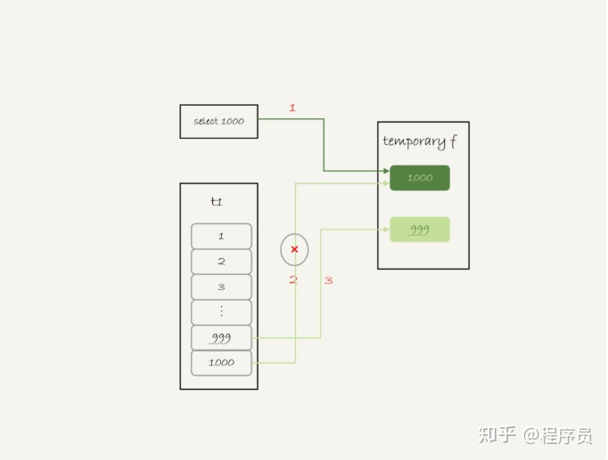
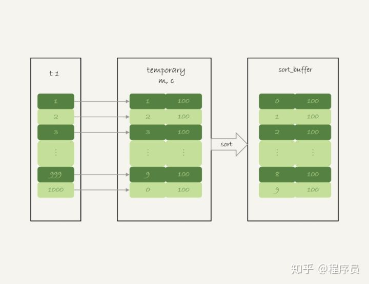

----
title: MySQL什么时候会使用内部临时表?
date: 2020-09-13
description: 

tags:
- MySQL
- 临时表
- 优化

nav:
- 数据库

categories:
- MySQL

image: images/MySQL.png

----
1.union执行过程

首先我们创建一个表t1

    create table t1(id int primary key, a int, b int, index(a));
    delimiter ;;
    create procedure idata()
    begin
      declare i int;
      set i=1;
      while(i<=1000)do
        insert into t1 values(i, i, i);
        set i=i+1;
      end while;
    end;;
    delimiter ;
    call idata();

然后我们执行一下这条语句

    explain select 1000 as f union (select id from t1 order by id desc limit 2)

首先说下union的语义，union的语义是取两个结果的并集，重复的保留一行,然后我们来看下explain的结果，第二行的key=PRIMARY，说明用到了主键索引。

第三行的Extra的Using temporary说明用到了临时表

下面我们看下这条语句的执行流程：

1.创建一个临时表，只有f一个字段，且为主键

2.将1000这个数据插入临时表

3.子查询中步骤:

           1.插入1000进入临时表,因为主键冲突，插入失败

           2.插入第二行900，插入成功

4.将临时表数据作为结果返回，并删除临时表

这个过程的流程图如下：

如果我们把union改成union all，就不需要使用临时表了，因为union all是重复的也保留，

大家可以看到extra这一列已经没有了Using temporary

    explain select 1000 as f union all (select id from t1 order by id desc limit 2)

2.group by执行过程

我们来看下面这条语句:

    explain select id%10 as m, count(*) as c from t1 group by m;

可以看到explain结果

Using index(使用到了覆盖索引a，不需要回表); Using temporary(用到了临时表); Using filesort(对数据进行了排序)

这条语句的意思是将id%10进行分组统计，并按照m进行排序

执行流程如下:

1.创建临时表，增加m,c字段，m是主键

2.计算id%10的结果记为x

3.如果临时表里面没有主键为x的行，则插入(x,1)，如果有的话，就将该行的c值加1

4.遍历完成后，按照m字段排序返回结果给客户端

流程图如下

接下来我们看下这条语句的执行结果

    explain select id%10 as m, count(*) as c from t1 group by m

其实，如果我们不需要对查询结果进行排序，我们可以加一个order by null

我们执行一下这条语句

    explain select id%10 as m, count(*) as c from t1 group by m order by null

可以看到这里没有进行排序，由于扫描是从表t的id是从1开始的，所以第一行是1

如果我们执行下列语句，会发生什么呢？

我们上面说的临时表，其实是内存临时表，如果我们把内存临时表的容量改的比我们要查询的数据的容量小，那么就会使用到磁盘临时表，磁盘临时表的默认引擎是innodb

    set tmp_table_size=1024;
    select id%100 as m, count(*) as c from t1 group by m order by null limit 10

group by 优化方法--直接排序

其实在上面的关于从内存临时表转化成磁盘临时表是很浪费时间的，也就是说mysql，在执行过程中发现空间不够了，在转成磁盘临时表，但是如果我们直接告诉mysql，我要查询的数据很大，那么mysql优化器就会想到，既然你告诉我数据很大，那么我就直接用sort_buffer进行排序，如果sort_buffer内存不够大，会用到磁盘临时表辅助排序。

    select SQL_BIG_RESULT id%100 as m, count(*) as c from t1 group by m;

小结一下:

1.如果我们不需要对统计结果进行排序，可以加上order by null省去排序流程。

2.尽量让排序过程用上内存临时表，可以通过适当调大tmp_table_size的值来避免用到磁盘临时表。

3.如果数据量实在太大，使用SQL_BIG_RESULT告诉优化器，直接使用排序算法。

原文：https://zhuanlan.zhihu.com/p/66847189