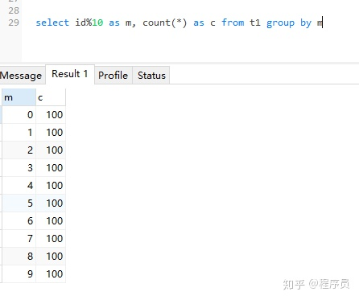
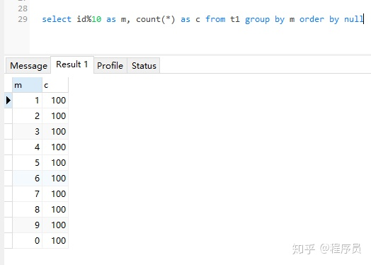

---

title: MySQL什么时候会使用内部临时表?
date: 2020-09-13
description:
{: id="20201220214147-wc04fqq"}

tags:
{: id="20201220214147-bwxqfnu"}

- {: id="20201220214147-8hmo73c"}MySQL
- {: id="20201220214147-lghnklu"}临时表
- {: id="20201220214147-4v1dp4r"}优化
{: id="20201220214147-7448ll5"}

nav:
{: id="20201220214147-utasnnh"}

- {: id="20201220214147-x6k6ylc"}数据库
{: id="20201220214147-ci5oxig"}

categories:
{: id="20201220214147-yzus751"}

- {: id="20201220214147-u72o9v9"}MySQL
{: id="20201220214147-rrld08d"}

image: images/MySQL.png
{: id="20201220214147-ktfhdkr"}

---

1.union执行过程
{: id="20201220214147-a79jbxb"}

首先我们创建一个表t1
{: id="20201220214147-fm4xmy6"}

```
create table t1(id int primary key, a int, b int, index(a));
delimiter ;;
create procedure idata()
begin
  declare i int;
  set i=1;
  while(i<=1000)do
    insert into t1 values(i, i, i);
    set i=i+1;
  end while;
end;;
delimiter ;
call idata();
```
{: id="20201220214147-vvu3edb"}

然后我们执行一下这条语句
{: id="20201220214147-wrl3n9b"}

```
explain select 1000 as f union (select id from t1 order by id desc limit 2)
```
{: id="20201220214147-afcvaak"}

首先说下union的语义，union的语义是取两个结果的并集，重复的保留一行,然后我们来看下explain的结果，第二行的key=PRIMARY，说明用到了主键索引。
{: id="20201220214147-ehs8b3b"}

第三行的Extra的Using temporary说明用到了临时表
{: id="20201220214147-54ruimn"}


{: id="20201220214147-wtcpn4i"}

下面我们看下这条语句的执行流程：
{: id="20201220214147-xop4uqa"}

1.创建一个临时表，只有f一个字段，且为主键
{: id="20201220214147-a0bpyj1"}

2.将1000这个数据插入临时表
{: id="20201220214147-i39xq7k"}

3.子查询中步骤:
{: id="20201220214147-23icwk9"}

```
       1.插入1000进入临时表,因为主键冲突，插入失败

       2.插入第二行900，插入成功
```
{: id="20201220214147-8vl4sxm"}

4.将临时表数据作为结果返回，并删除临时表
{: id="20201220214147-yumryj8"}

这个过程的流程图如下：

{: id="20201220214147-40uqw2l"}

如果我们把union改成union all，就不需要使用临时表了，因为union all是重复的也保留，
{: id="20201220214147-twyhkm7"}

大家可以看到extra这一列已经没有了Using temporary
{: id="20201220214147-2q6pf5x"}

```
explain select 1000 as f union all (select id from t1 order by id desc limit 2)
```
{: id="20201220214147-dm0tq6y"}


{: id="20201220214147-fgua30q"}

2.group by执行过程
{: id="20201220214147-rjlvyfo"}

我们来看下面这条语句:
{: id="20201220214147-q73rbzy"}

```
explain select id%10 as m, count(*) as c from t1 group by m;
```
{: id="20201220214147-x7cg8yr"}


可以看到explain结果
{: id="20201220214147-6x649pn"}

Using index(使用到了覆盖索引a，不需要回表); Using temporary(用到了临时表); Using filesort(对数据进行了排序)
{: id="20201220214147-n8m1a4s"}

这条语句的意思是将id%10进行分组统计，并按照m进行排序
{: id="20201220214147-jf0mvjw"}

执行流程如下:
{: id="20201220214147-dpomkl1"}

1.创建临时表，增加m,c字段，m是主键
{: id="20201220214147-hoais7y"}

2.计算id%10的结果记为x
{: id="20201220214147-6j4rdyw"}

3.如果临时表里面没有主键为x的行，则插入(x,1)，如果有的话，就将该行的c值加1
{: id="20201220214147-mbc5v57"}

4.遍历完成后，按照m字段排序返回结果给客户端
{: id="20201220214147-wyl7wwi"}

流程图如下
{: id="20201220214147-azv8gq1"}


接下来我们看下这条语句的执行结果
{: id="20201220214147-0lcgpam"}

```
explain select id%10 as m, count(*) as c from t1 group by m
```
{: id="20201220214147-1zadr0h"}


其实，如果我们不需要对查询结果进行排序，我们可以加一个order by null
{: id="20201220214147-zalkdig"}

我们执行一下这条语句
{: id="20201220214147-nql0zzk"}

```
explain select id%10 as m, count(*) as c from t1 group by m order by null
```
{: id="20201220214147-gl2pqre"}


可以看到这里没有进行排序，由于扫描是从表t的id是从1开始的，所以第一行是1
{: id="20201220214147-qamz263"}

如果我们执行下列语句，会发生什么呢？
{: id="20201220214147-mt2woud"}

我们上面说的临时表，其实是内存临时表，如果我们把内存临时表的容量改的比我们要查询的数据的容量小，那么就会使用到磁盘临时表，磁盘临时表的默认引擎是innodb
{: id="20201220214147-iz9u2cd"}

```
set tmp_table_size=1024;
select id%100 as m, count(*) as c from t1 group by m order by null limit 10
```
{: id="20201220214147-xv2pzws"}

group by 优化方法--直接排序
{: id="20201220214147-cuqcza9"}

其实在上面的关于从内存临时表转化成磁盘临时表是很浪费时间的，也就是说mysql，在执行过程中发现空间不够了，在转成磁盘临时表，但是如果我们直接告诉mysql，我要查询的数据很大，那么mysql优化器就会想到，既然你告诉我数据很大，那么我就直接用sort_buffer进行排序，如果sort_buffer内存不够大，会用到磁盘临时表辅助排序。
{: id="20201220214147-5gluykq"}

```
select SQL_BIG_RESULT id%100 as m, count(*) as c from t1 group by m;
```
{: id="20201220214147-61r4pe8"}


小结一下:
{: id="20201220214147-ub56gi4"}

1.如果我们不需要对统计结果进行排序，可以加上order by null省去排序流程。
{: id="20201220214147-d8spofu"}

2.尽量让排序过程用上内存临时表，可以通过适当调大tmp_table_size的值来避免用到磁盘临时表。
{: id="20201220214147-8oals4v"}

3.如果数据量实在太大，使用SQL_BIG_RESULT告诉优化器，直接使用排序算法。
{: id="20201220214147-2e4vop8"}

原文：https://zhuanlan.zhihu.com/p/66847189
{: id="20201220214147-4kzmh92"}


{: id="20201220214147-sceq8bh" type="doc"}
