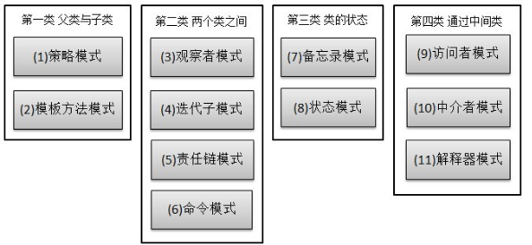

----
title: Java 经典设计模式（1）：五大创建型模式
date: 2019-01-03
description: 

tags:
- 创建型模式
- 设计模式

nav:
- 设计模式

categories:
- 设计模式

image: images/idea_logo.png

----
----
## 一、概况

### 总体来说设计模式分为三大类：

（1）创建型模式，共五种：工厂方法模式、抽象工厂模式、单例模式、建造者模式、原型模式。

（2）结构型模式，共七种：适配器模式、装饰器模式、代理模式、外观模式、桥接模式、组合模式、享元模式。

（3）行为型模式，共十一种：策略模式、模板方法模式、观察者模式、迭代子模式、责任链模式、命令模式、备忘录模式、状态模式、访问者模式、中介者模式、解释器模式。



## 二、设计模式的六大原则

### 1、开闭原则（Open Close Principle）

开闭原则就是说对扩展开放，对修改关闭。在程序需要进行拓展的时候，不能去修改原有的代码，实现一个热插拔的效果。

### 2、里氏代换原则（Liskov Substitution Principle）

其官方描述比较抽象，可自行百度。实际上可以这样理解：
（1）子类的能力必须大于等于父类，即父类可以使用的方法，子类都可以使用。
（2）返回值也是同样的道理。假设一个父类方法返回一个List，子类返回一个ArrayList，这当然可以。如果父类方法返回一个ArrayList，子类返回一个List，就说不通了。这里子类返回值的能力是比父类小的。
（3）还有抛出异常的情况。任何子类方法可以声明抛出父类方法声明异常的子类。

而不能声明抛出父类没有声明的异常。

### 3、依赖倒转原则（Dependence Inversion Principle）

这个是开闭原则的基础，具体内容：面向接口编程，依赖于抽象而不依赖于具体。

### 4、接口隔离原则（Interface Segregation Principle）

这个原则的意思是：使用多个隔离的接口，比使用单个接口要好。还是一个降低类之间的耦合度的意思，从这儿我们看出，其实设计模式就是一个软件的设计思想，从大型软件架构出发，为了升级和维护方便。所以上文中多次出现：降低依赖，降低耦合。

### 5、迪米特法则（最少知道原则）（Demeter Principle）

为什么叫最少知道原则，就是说：一个实体应当尽量少的与其他实体之间发生相互作用，使得系统功能模块相对独立。

### 6、合成复用原则（Composite Reuse Principle）

原则是尽量使用合成/聚合的方式，而不是使用继承。

## 三、创建型模式

创建型模式，共五种：工厂方法模式、抽象工厂模式、单例模式、建造者模式、原型模式。

### 3.1、工厂方法模式

工厂方法模式分为三种：普通工厂模式、多个工厂方法模式和静态工厂方法模式。

### 3.1.1、普通工厂模式

普通工厂模式就是建立一个工厂类，对实现了同一接口的一些类进行实例的创建。

``` java
package com.mode.create;
 
public interface MyInterface {
    public void print();
}
```

``` java
package com.mode.create;
 
public class MyClassOne implements MyInterface {
    @Override
    public void print() {
        System.out.println("MyClassOne");
    }
}
```
``` java
package com.mode.create;
 
public class MyClassTwo implements MyInterface {
    @Override
    public void print() {
        System.out.println("MyClassTwo");
    }
}
```

``` java
package com.mode.create;
 
public class MyFactory {
    public MyInterface produce(String type) {  
        if ("One".equals(type)) {  
            return new MyClassOne();  
        } else if ("Two".equals(type)) {  
            return new MyClassTwo();  
        } else {  
            System.out.println("没有要找的类型");  
            return null;  
        }  
    }
}
```
```java
package com.mode.create;
 
public class FactoryTest {
    public static void main(String[] args){
        MyFactory factory = new MyFactory();  
        MyInterface myi = factory.produce("One");  
        myi.print();
    }
}
```

再回头来理解这句话：普通工厂模式就是建立一个工厂类，对实现了同一接口的一些类进行实例的创建。

### 3.1.2、多个工厂方法模式

多个工厂方法模式，是对普通工厂方法模式的改进，多个工厂方法模式就是提供多个工厂方法，分别创建对象。

直接看代码吧，我们修改MyFactory和FactoryTest如下：

``` java 
package com.mode.create;
 
public class MyFactory {
    public MyInterface produceOne() {
        return new MyClassOne();
    }
 
    public MyInterface produceTwo() {
        return new MyClassTwo();
    }
}
```

``` java
package com.mode.create;
 
public class FactoryTest {
    public static void main(String[] args){
        MyFactory factory = new MyFactory();  
        MyInterface myi = factory.produceOne();
        myi.print();
    }
}
```

再回头来理解这句话：多个工厂方法模式，是对普通工厂方法模式的改进，多个工厂方法模式就是提供多个工厂方法，分别创建对象。

### 3.1.3、静态工厂方法模式

静态工厂方法模式，将上面的多个工厂方法模式里的方法置为静态的，不需要创建实例，直接调用即可。

直接看代码吧，我们修改MyFactory和FactoryTest如下：

``` java
package com.mode.create;
 
public class MyFactory {
    public static MyInterface produceOne() {
        return new MyClassOne();
    }
 
    public static MyInterface produceTwo() {
        return new MyClassTwo();
    }
}
```

``` java
package com.mode.create;
 
public class FactoryTest {
    public static void main(String[] args){ 
        MyInterface myi = MyFactory.produceOne();
        myi.print();
    }
}
```

再回顾：静态工厂方法模式，将上面的多个工厂方法模式里的方法置为静态的，不需要创建实例，直接调用即可。

### 3.2、抽象工厂模式

工厂方法模式有一个问题就是，类的创建依赖工厂类，也就是说，如果想要拓展程序，必须对工厂类进行修改，这违背了闭包原则。

为解决这个问题，我们来看看抽象工厂模式：创建多个工厂类，这样一旦需要增加新的功能，直接增加新的工厂类就可以了，不需要修改之前的代码。

这样就符合闭包原则了。

下面来看看代码：

MyInterface、MyClassOne、MyClassTwo不变。

新增如下接口和类：

``` java
package com.mode.create;
 
public interface Provider {
    public MyInterface produce(); 
}
```

``` java
package com.mode.create;
 
public class MyFactoryOne implements Provider {
    @Override
    public MyInterface produce() {
        return new MyClassOne();
    }
}
```

``` java
package com.mode.create;
 
public class MyFactoryTwo implements Provider {
    @Override
    public MyInterface produce() {
        return new MyClassTwo();
    }
}
```

修改测试类FactoryTest如下：

``` java
package com.mode.create;
 
public class FactoryTest {
    public static void main(String[] args){ 
        Provider provider = new MyFactoryOne();
        MyInterface myi = provider.produce();
        myi.print();
}
```

再回顾：抽象工厂模式就是创建多个工厂类，这样一旦需要增加新的功能，直接增加新的工厂类就可以了，不需要修改之前的代码。

### 3.3、单例模式

单例模式，不需要过多的解释。

直接看代码吧：


``` java
package test;
 
public class MyObject {
    private static MyObject myObject;
 
    private MyObject() {
    }
 
    public static MyObject getInstance() {
        if (myObject != null) {
        } else {
            myObject = new MyObject();
        }
        return myObject;
    }
}
```

但是这样会引发多线程问题，详细解说可以看《Java多线程编程核心技术》书中的第六章。博主之前推荐过这本书，里面有电子完整版下载地址：http://blog.csdn.net/u013142781/article/details/50805655

### 3.4、建造者模式

建造者模式：是将一个复杂的对象的构建与它的表示分离，使得同样的构建过程可以创建不同的表示。

字面看来非常抽象，实际上它也十分抽象！！！！

建造者模式通常包括下面几个角色：

（1）Builder：给出一个抽象接口，以规范产品对象的各个组成成分的建造。这个接口规定要实现复杂对象的哪些部分的创建，并不涉及具体的对象部件的创建。

（2）ConcreteBuilder：实现Builder接口，针对不同的商业逻辑，具体化复杂对象的各部分的创建。 在建造过程完成后，提供产品的实例。

（3）Director：调用具体建造者来创建复杂对象的各个部分，在指导者中不涉及具体产品的信息，只负责保证对象各部分完整创建或按某种顺序创建。

（4）Product：要创建的复杂对象。

在游戏开发中建造小人是经常的事了，要求是：小人必须包括头，身体和脚。

下面我们看看如下代码：

Product（要创建的复杂对象。）：

``` java
package com.mode.create;
 
public class Person {
 
    private String head;
    private String body;
    private String foot;
 
    public String getHead() {
        return head;
    }
 
    public void setHead(String head) {
        this.head = head;
    }
 
    public String getBody() {
        return body;
    }
 
    public void setBody(String body) {
        this.body = body;
    }
 
    public String getFoot() {
        return foot;
    }
 
    public void setFoot(String foot) {
        this.foot = foot;
    }
}
```

Builder（给出一个抽象接口，以规范产品对象的各个组成成分的建造。这个接口规定要实现复杂对象的哪些部分的创建，并不涉及具体的对象部件的创建。）：

``` java
package com.mode.create;
 
public interface PersonBuilder {
    void buildHead();
    void buildBody();
    void buildFoot();
    Person buildPerson();
}
```

ConcreteBuilder（实现Builder接口，针对不同的商业逻辑，具体化复杂对象的各部分的创建。 在建造过程完成后，提供产品的实例。）：

``` java
package com.mode.create;
 
public class ManBuilder implements PersonBuilder {
    Person person;
 
    public ManBuilder() {
        person = new Person();
    }
 
    public void buildBody() {
        person.setBody("建造男人的身体");
    }
 
    public void buildFoot() {
        person.setFoot("建造男人的脚");
    }
 
    public void buildHead() {
        person.setHead("建造男人的头");
    }
 
    public Person buildPerson() {
        return person;
    }
}
```

Director（调用具体建造者来创建复杂对象的各个部分，在指导者中不涉及具体产品的信息，只负责保证对象各部分完整创建或按某种顺序创建。）：

``` java
package com.mode.create;
 
public class PersonDirector {
    public Person constructPerson(PersonBuilder pb) {
        pb.buildHead();
        pb.buildBody();
        pb.buildFoot();
        return pb.buildPerson();
    }
}
```

测试类：

``` java
package com.mode.create;
 
public class Test {
    public static void main(String[] args) {
        PersonDirector pd = new PersonDirector();
        Person person = pd.constructPerson(new ManBuilder());
        System.out.println(person.getBody());
        System.out.println(person.getFoot());
        System.out.println(person.getHead());
    }
}
```

回顾：建造者模式：是将一个复杂的对象的构建与它的表示分离，使得同样的构建过程可以创建不同的表示。

### 3.5、原型模式

该模式的思想就是将一个对象作为原型，对其进行复制、克隆，产生一个和原对象类似的新对象。

说道复制对象，我将结合对象的浅复制和深复制来说一下，首先需要了解对象深、浅复制的概念：

浅复制：将一个对象复制后，基本数据类型的变量都会重新创建，而引用类型，指向的还是原对象所指向的。

深复制：将一个对象复制后，不论是基本数据类型还有引用类型，都是重新创建的。简单来说，就是深复制进行了完全彻底的复制，而浅复制不彻底。

写一个深浅复制的例子：

``` java
package com.mode.create;
 
import java.io.ByteArrayInputStream;
import java.io.ByteArrayOutputStream;
import java.io.IOException;
import java.io.ObjectInputStream;
import java.io.ObjectOutputStream;
import java.io.Serializable;
 
public class Prototype implements Cloneable, Serializable {
    private static final long serialVersionUID = 1L;
 
    private int base;
 
    private Integer obj;
 
     /* 浅复制 */  
    public Object clone() throws CloneNotSupportedException {
        // 因为Cloneable接口是个空接口，你可以任意定义实现类的方法名
        // 如cloneA或者cloneB，因为此处的重点是super.clone()这句话
        // super.clone()调用的是Object的clone()方法
        // 而在Object类中，clone()是native（本地方法）的
        Prototype proto = (Prototype) super.clone();
        return proto;
    }
 
    /* 深复制 */
    public Object deepClone() throws IOException, ClassNotFoundException {
 
        /* 写入当前对象的二进制流 */
        ByteArrayOutputStream bos = new ByteArrayOutputStream();
        ObjectOutputStream oos = new ObjectOutputStream(bos);
        oos.writeObject(this);
 
        /* 读出二进制流产生的新对象 */
        ByteArrayInputStream bis = new ByteArrayInputStream(bos.toByteArray());
        ObjectInputStream ois = new ObjectInputStream(bis);
        return ois.readObject();
    }
 
    public int getBase() {
        return base;
    }
 
    public void setBase(int base) {
        this.base = base;
    }
 
    public Integer getObj() {
        return obj;
    }
 
    public void setObj(Integer obj) {
        this.obj = obj;
    }
}
```

测试类：

``` java
package com.mode.create;
 
import java.io.IOException;
 
public class Test {
    public static void main(String[] args) throws CloneNotSupportedException,
            ClassNotFoundException, IOException {
        Prototype prototype = new Prototype();
        prototype.setBase(1);
        prototype.setObj(new Integer(2));
        /* 浅复制 */ 
        Prototype prototype1 = (Prototype) prototype.clone();
        /* 深复制 */
        Prototype prototype2 = (Prototype) prototype.deepClone();
        System.out.println(prototype1.getObj()==prototype1.getObj());
        System.out.println(prototype1.getObj()==prototype2.getObj());
    }
}
```

原文：http://blog.csdn.net/u013142781/article/details/50816245