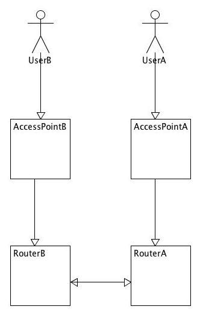

----
title: Zookeeper是如何解决脑裂问题
date: 2019-08-12
description: 

tags:
- 分布式
- 脑裂
- 概念

nav:
- 分布式

categories:
- zookeeper

image: images/zookeeper.jpeg

----
# 前言

这是分布式系统中一个很实际的问题，书上说的不是很详细，整理总结一下。

# 1、脑裂和假死

## 1.1 脑裂

官方定义：当一个集群的不同部分在同一时间都认为自己是活动的时候，我们就可以将这个现象称为脑裂症状。通俗的说，就是比如当你的 cluster 里面有两个结点，它们都知道在这个 cluster 里需要选举出一个 master。那么当它们两之间的通信完全没有问题的时候，就会达成共识，选出其中一个作为 master。但是如果它们之间的通信出了问题，那么两个结点都会觉得现在没有 master，所以每个都把自己选举成 master。于是 cluster 里面就会有两个 master。举例：

UserA和UserB分别将自己的信息注册在RouterA和RouterB中。RouterA和RouterB使用数据同步（2PC），来同步信息。那么当UserA想要向UserB发送一个消息的时候，需要现在RouterA中查询出UserA到UserB的消息路由路径，然后再交付给相应的路径进行路由。

当脑裂发生的时候，相当RouterA和RouterB直接的联系丢失了，RouterA认为整个系统中只有它一个Router，RouterB也是这样认为的。那么相当于RouterA中没有UserB的信息，RouterB中没有UserA的信息了，此时UserA再发送消息给UserB的时候，RouterA会认为UserB已经离线了，然后将该信息进行离线持久化，这样整个网络的路由是不是就乱掉了。

对于Zookeeper来说有一个很重要的问题，就是到底是根据一个什么样的情况来判断一个节点死亡down掉了。 在分布式系统中这些都是有监控者来判断的，但是监控者也很难判定其他的节点的状态，唯一一个可靠的途径就是心跳，Zookeeper也是使用心跳来判断客户端是否仍然活着，但是使用心跳机制来判断节点的存活状态也带来了假死问题。

## 1.2 假死

ZooKeeper每个节点都尝试注册一个象征master的临时节点，其他没有注册成功的则成为slaver，并且通过watch机制监控着master所创建的临时节点，Zookeeper通过内部心跳机制来确定master的状态，一旦master出现意外Zookeeper能很快获悉并且通知其他的slaver，其他slaver在之后作出相关反应。这样就完成了一个切换。

这种模式也是比较通用的模式，基本大部分都是这样实现的，但是这里面有个很严重的问题，如果注意不到会导致短暂的时间内系统出现脑裂，因为心跳出现超时可能是master挂了，但是也可能是master，zookeeper之间网络出现了问题，也同样可能导致。这种情况就是假死，master并未死掉，但是与ZooKeeper之间的网络出现问题导致Zookeeper认为其挂掉了然后通知其他节点进行切换，这样slaver中就有一个成为了master，但是原本的master并未死掉，这时候client也获得master切换的消息，但是仍然会有一些延时，zookeeper需要通讯需要一个一个通知，这时候整个系统就很混乱可能有一部分client已经通知到了连接到新的master上去了，有的client仍然连接在老的master上如果同时有两个client需要对master的同一个数据更新并且刚好这两个client此刻分别连接在新老的master上，就会出现很严重问题。

## 1.3 总结

假死：由于心跳超时（网络原因导致的）认为master死了，但其实master还存活着。

脑裂：由于假死会发起新的master选举，选举出一个新的master，但旧的master网络又通了，导致出现了两个master ，有的客户端连接到老的master 有的客户端链接到新的master。

# 2、Zookeeper的解决方案

要解决Split-Brain的问题，一般有3种方式:

- Quorums（ˈkwôrəm 法定人数） ：比如3个节点的集群，Quorums = 2, 也就是说集群可以容忍1个节点失效，这时候还能选举出1个lead，集群还可用。比如4个节点的集群，它的Quorums = 3，Quorums要超过3，相当于集群的容忍度还是1，如果2个节点失效，那么整个集群还是无效的
- Redundant communications：冗余通信的方式，集群中采用多种通信方式，防止一种通信方式失效导致集群中的节点无法通信。
- Fencing, 共享资源的方式：比如能看到共享资源就表示在集群中，能够获得共享资源的锁的就是Leader，看不到共享资源的，就不在集群中。

ZooKeeper默认采用了Quorums这种方式，即只有集群中超过半数节点投票才能选举出Leader。这样的方式可以确保leader的唯一性,要么选出唯一的一个leader,要么选举失败。在ZooKeeper中Quorums有2个作用：

- 集群中最少的节点数用来选举Leader保证集群可用：通知客户端数据已经安全保存前集群中最少数量的节点数已经保存了该数据。一旦这些节点保存了该数据，客户端将被通知已经安全保存了，可以继续其他任务。而集群中剩余的节点将会最终也保存了该数据。
- 假设某个leader假死，其余的followers选举出了一个新的leader。这时，旧的leader复活并且仍然认为自己是leader，这个时候它向其他followers发出写请求也是会被拒绝的。因为每当新leader产生时，会生成一个epoch，这个epoch是递增的，followers如果确认了新的leader存在，知道其epoch，就会拒绝epoch小于现任leader epoch的所有请求。那有没有follower不知道新的leader存在呢，有可能，但肯定不是大多数，否则新leader无法产生。Zookeeper的写也遵循quorum机制，因此，得不到大多数支持的写是无效的，旧leader即使各种认为自己是leader，依然没有什么作用。

# 3、总结

总结一下就是，通过Quorums机制来防止脑裂和假死，当leader挂掉之后，可以重新选举出新的leader节点使整个集群达成一致；当出现假死现象时，通过epoch大小来拒绝旧的leader发起的请求，在前面也已经讲到过，这个时候，重新恢复通信的老的leader节点会进入恢复模式，与新的leader节点做数据同步，perfect。

原文: https://blog.csdn.net/u013374645/article/details/93140148