---

title: 技术面试要了解的算法和数据结构知识
date: 2018-10-26
description:
{: id="20201220214147-mdnp2j6"}

tags:
{: id="20201220214147-u0xf6x2"}

- {: id="20201220214147-tzsuhvw"}Java
- {: id="20201220214147-tb9rlst"}面试
- {: id="20201220214147-c7xbpdv"}数据结构
- {: id="20201220214147-wml9g4a"}算法
{: id="20201220214147-minxktz"}

nav:
{: id="20201220214147-cpns78u"}

- {: id="20201220214147-f0z3rmy"}Java
{: id="20201220214147-2hnsq5l"}

categories:
{: id="20201220214147-ro5ms6y"}

- {: id="20201220214147-d1shmla"}Java 面试
{: id="20201220214147-dj0dwkk"}

image: images/java/basic/java_logo.png
{: id="20201220214147-296772k"}

---

#### 在线练习
{: id="20201220214147-957epjz"}

* {: id="20201220214147-hhp28me"}[LeetCode](https://leetcode.com/)
* {: id="20201220214147-ax5ek82"}[Virtual Judge](https://vjudge.net/)
* {: id="20201220214147-9lelegu"}[CareerCup](https://www.careercup.com/)
* {: id="20201220214147-nc52sav"}[HackerRank](https://www.hackerrank.com/)
* {: id="20201220214147-4rqy2ko"}[CodeFights](https://codefights.com/)
* {: id="20201220214147-d5fe2b2"}[Kattis](https://open.kattis.com/)
* {: id="20201220214147-3q31rdu"}[HackerEarth](https://www.hackerearth.com/)
* {: id="20201220214147-k5ohyus"}[Codility](https://codility.com/programmers/lessons/1-iterations/)
* {: id="20201220214147-vroc42r"}[Code Forces](http://codeforces.com/)
* {: id="20201220214147-ywan7zy"}[Code Chef](https://www.codechef.com/)
* {: id="20201220214147-aanxn7p"}[Sphere Online Judge – SPOJ](http://www.spoj.com/)
{: id="20201220214147-ddfowtd"}

#### 在线编程面试
{: id="20201220214147-63ht860"}

* {: id="20201220214147-u745jlf"}[Gainlo](http://www.gainlo.co/#!/)
* {: id="20201220214147-x309d20"}[Refdash](https://refdash.com/)
{: id="20201220214147-eqf6bd2"}

#### 数据结构
{: id="20201220214147-xpo81y0"}

#### 链表
{: id="20201220214147-barndt2"}

* {: id="20201220214147-yvv3bsa"}链表是一种由节点（Node）组成的线性数据集合，每个节点通过指针指向下一个节点。它是一种由节点组成，并能用于表示序列的数据结构。
* {: id="20201220214147-pncpf6i"}**单链表** ：每个节点仅指向下一个节点，最后一个节点指向空（null）。
* {: id="20201220214147-xigqm0x"}**双链表** ：每个节点有两个指针p，n。p指向前一个节点，n指向下一个节点；最后一个节点指向空。
* {: id="20201220214147-6d6xm2a"}**循环链表** ：每个节点指向下一个节点，最后一个节点指向第一个节点。
* {: id="20201220214147-3maos80"}时间复杂度：
  * {: id="20201220214147-oeg4wi7"}索引：O(n)
  * {: id="20201220214147-y89sou5"}查找：O(n)
  * {: id="20201220214147-ml9aqhs"}插入：O(1)
  * {: id="20201220214147-oxfscmh"}删除：O(1)
  {: id="20201220214147-7epar4o"}
{: id="20201220214147-edr1hnu"}

#### 栈
{: id="20201220214147-qy3hu9h"}

* {: id="20201220214147-bqfiix0"}栈是一个元素集合，支持两个基本操作：push用于将元素压入栈，pop用于删除栈顶元素。
* {: id="20201220214147-velj8tc"}后进先出的数据结构（Last In First Out, LIFO）
* {: id="20201220214147-qf1qpom"}时间复杂度
  * {: id="20201220214147-9b27zu3"}索引：O(n)
  * {: id="20201220214147-y8xlhf5"}查找：O(n)
  * {: id="20201220214147-333mrfw"}插入：O(1)
  * {: id="20201220214147-miqp7tc"}删除：O(1)
  {: id="20201220214147-3iqn6bh"}
{: id="20201220214147-yc90oyr"}

#### 队列
{: id="20201220214147-2cgvdyb"}

* {: id="20201220214147-03te94w"}队列是一个元素集合，支持两种基本操作：enqueue 用于添加一个元素到队列，dequeue 用于删除队列中的一个元素。
* {: id="20201220214147-hsxc0n6"}先进先出的数据结构（First In First Out, FIFO）。
* {: id="20201220214147-ziw6fa6"}时间复杂度
  * {: id="20201220214147-8dp50qw"}索引：O(n)
  * {: id="20201220214147-uf2kiwn"}查找：O(n)
  * {: id="20201220214147-2ik5lby"}插入：O(1)
  * {: id="20201220214147-ypejipx"}删除：O(1)
  {: id="20201220214147-62modcm"}
{: id="20201220214147-zvfsboj"}

#### 树
{: id="20201220214147-jj8wzb0"}

* {: id="20201220214147-0cy37s7"}树是无向、联通的无环图。
{: id="20201220214147-qyr8k4j"}

#### 二叉树
{: id="20201220214147-1wsu71c"}

* {: id="20201220214147-raoe75y"}二叉树是一个树形数据结构，每个节点最多可以有两个子节点，称为左子节点和右子节点。
* {: id="20201220214147-aw24y6b"}**满二叉树（Full Tree）** ：二叉树中的每个节点有 0 或者 2 个子节点。
{: id="20201220214147-tzn5kbc"}

{: id="20201220214147-qfkqnmc"}

* {: id="20201220214147-6n4hmy4"}**完美二叉树（Perfect Binary）** ：二叉树中的每个节点有两个子节点，并且所有的叶子节点的深度是一样的。
* {: id="20201220214147-f7cat4e"}**完全二叉树** ：二叉树中除最后一层外其他各层的节点数均达到最大值，最后一层的节点都连续集中在最左边。
{: id="20201220214147-uyavwst"}

#### 二叉查找树
{: id="20201220214147-kq328ax"}

* {: id="20201220214147-5rfh7ya"}二叉查找树（BST）是一种二叉树。其任何节点的值都大于等于左子树中的值，小于等于右子树中的值。
* {: id="20201220214147-kpv8lfu"}时间复杂度
  * {: id="20201220214147-ewq7xxj"}索引：O(log(n))
  * {: id="20201220214147-v9tzauc"}查找：O(log(n))
  * {: id="20201220214147-2aa4ee4"}插入：O(log(n))
  * {: id="20201220214147-5i0bks3"}删除：O(log(n))
  {: id="20201220214147-3037im0"}
{: id="20201220214147-4jb8dlb"}

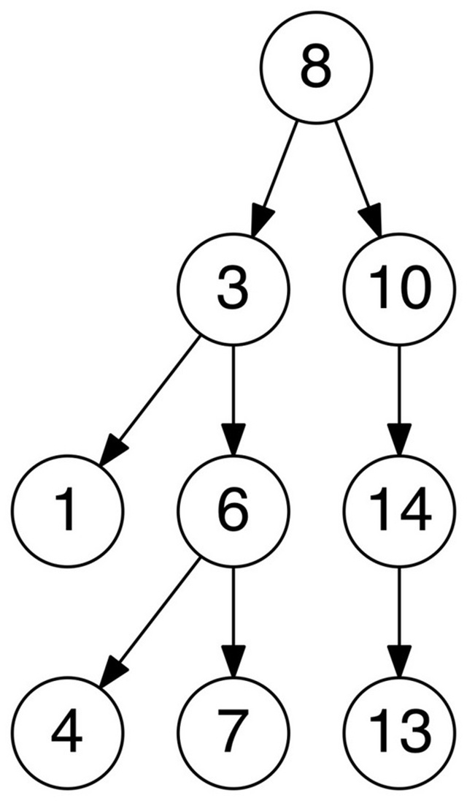
{: id="20201220214147-dwaa5cn"}

#### 字典树
{: id="20201220214147-wbmh48o"}

* {: id="20201220214147-3aagm9c"}字典树，又称为基数树或前缀树，是一种用于存储键值为字符串的动态集合或关联数组的查找树。树中的节点并不直接存储关联键值，而是该节点在树中的位置决定了其关联键值。一个节点的所有子节点都有相同的前缀，根节点则是空字符串。
{: id="20201220214147-g92nylw"}

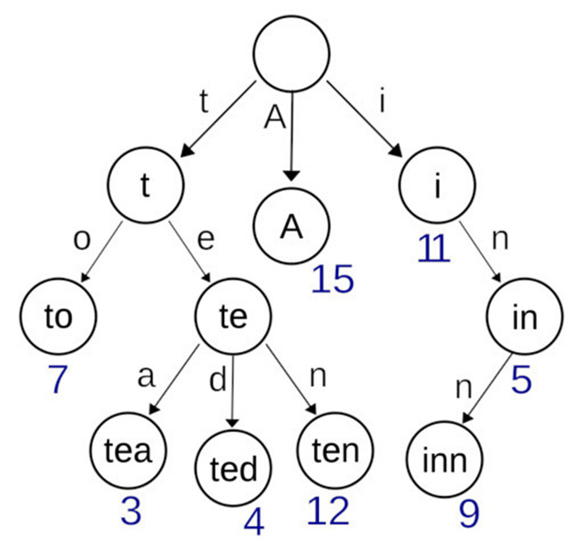
{: id="20201220214147-q3nbz45"}

#### 树状数组
{: id="20201220214147-2ecq5tt"}

* {: id="20201220214147-jkf5bxu"}树状数组，又称为二进制索引树（Binary Indexed Tree，BIT），其概念上是树，但以数组实现。数组中的下标代表树中的节点，每个节点的父节点或子节点的下标可以通过位运算获得。数组中的每个元素都包含了预计算的区间值之和，在整个树更新的过程中，这些计算的值也同样会被更新。
* {: id="20201220214147-9jm9tw4"}时间复杂度
  * {: id="20201220214147-sut7cx6"}区间求和：O(log(n))
  * {: id="20201220214147-dm990q2"}更新：O(log(n))
  {: id="20201220214147-ur36uhq"}
{: id="20201220214147-wt46je7"}

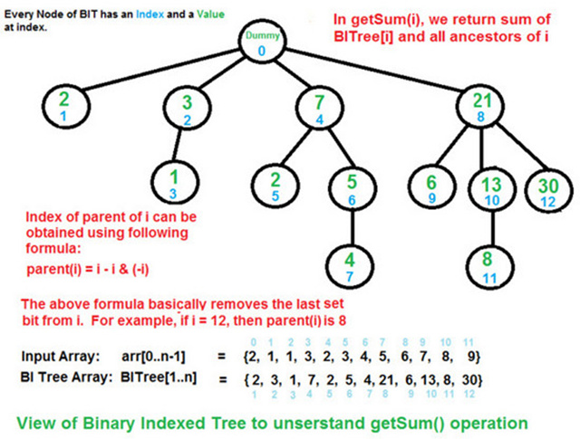
{: id="20201220214147-71eo5ll"}

#### 线段树
{: id="20201220214147-vbe3kev"}

* {: id="20201220214147-qk2h0zc"}线段树是用于存储区间和线段的树形数据结构。它允许查找一个节点在若干条线段中出现的次数。
* {: id="20201220214147-7dzssvy"}时间复杂度
  * {: id="20201220214147-34h3mdk"}区间查找：O(log(n))
  * {: id="20201220214147-ec7okrn"}更新：O(log(n))
  {: id="20201220214147-g2zubf2"}
{: id="20201220214147-c68f3wt"}

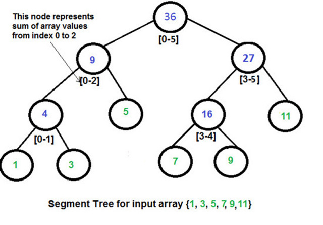
{: id="20201220214147-13hnc3u"}

#### 堆
{: id="20201220214147-l43as5a"}

* {: id="20201220214147-pnvffun"}堆是一种基于树的满足某些特性的数据结构：整个堆中的所有父子节点的键值都满足相同的排序条件。堆分为最大堆和最小堆。在最大堆中，父节点的键值永远大于等于所有子节点的键值，根节点的键值是最大的。最小堆中，父节点的键值永远小于等于所有子节点的键值，根节点的键值是最小的。
* {: id="20201220214147-cvhwzyv"}时间复杂度
  * {: id="20201220214147-5n8ql7u"}索引：O(log(n))
  * {: id="20201220214147-8044dgw"}查找：O(log(n))
  * {: id="20201220214147-nh26af4"}插入：O(log(n))
  * {: id="20201220214147-tu678go"}删除：O(log(n))
  * {: id="20201220214147-79izevt"}删除最大值/最小值：O(1)
  {: id="20201220214147-3nk7jg7"}
{: id="20201220214147-x5bbsvt"}

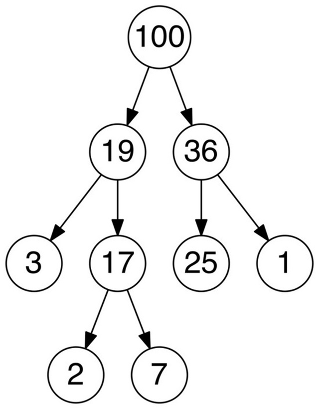
{: id="20201220214147-avdbllo"}

#### 哈希
{: id="20201220214147-zmosc23"}

* {: id="20201220214147-ifbw9n1"}哈希用于将任意长度的数据映射到固定长度的数据。哈希函数的返回值被称为哈希值、哈希码或者哈希。如果不同的主键得到相同的哈希值，则发生了冲突。
* {: id="20201220214147-bptrqi3"}**Hash Map** ： _hash map_  是一个存储键值间关系的数据结构。HashMap 通过哈希函数将键转化为桶或者槽中的下标，从而便于指定值的查找。
* {: id="20201220214147-c1hsbiy"}冲突解决
  * {: id="20201220214147-oymo8wc"}**链地址法（** **Separate Chaining** **）** ：在链地址法中，每个桶（bucket）是相互独立的，每一个索引对应一个元素列表。处理HashMap 的时间就是查找桶的时间（常量）与遍历列表元素的时间之和。
  * {: id="20201220214147-0d20t9q"}**开放地址法（** **Open Addressing** **）** ：在开放地址方法中，当插入新值时，会判断该值对应的哈希桶是否存在，如果存在则根据某种算法依次选择下一个可能的位置，直到找到一个未被占用的地址。开放地址即某个元素的位置并不永远由其哈希值决定。
  {: id="20201220214147-4kc2u9i"}
{: id="20201220214147-q4zhcjp"}

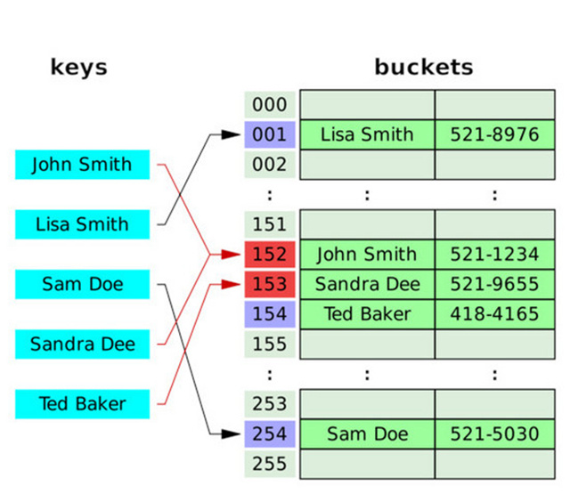
{: id="20201220214147-tee94ih"}

#### 图
{: id="20201220214147-wokmoj1"}

* {: id="20201220214147-dxpzc84"}图是G =（V，E）的有序对，其包括顶点或节点的集合 V 以及边或弧的集合E，其中E包括了两个来自V的元素（即边与两个顶点相关联 ，并且该关联为这两个顶点的无序对）。
* {: id="20201220214147-2d7q065"}**无向图** ：图的邻接矩阵是对称的，因此如果存在节点 u 到节点 v 的边，那节点 v 到节点 u 的边也一定存在。
* {: id="20201220214147-b90dhsu"}**有向图** ：图的邻接矩阵不是对称的。因此如果存在节点 u 到节点 v 的边并不意味着一定存在节点 v 到节点 u 的边。
{: id="20201220214147-ibrq1ox"}

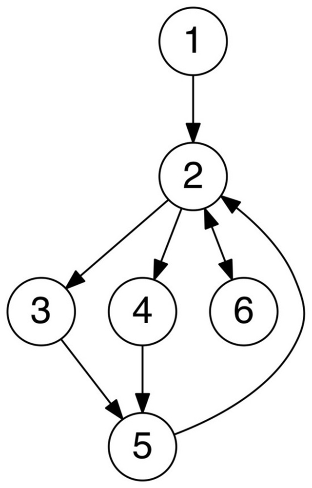
{: id="20201220214147-ojxxjei"}

#### 算法
{: id="20201220214147-j668gk6"}

#### 排序
{: id="20201220214147-9yxuryn"}

#### 快速排序
{: id="20201220214147-d21uijr"}

* {: id="20201220214147-fxajhe9"}稳定：否
* {: id="20201220214147-borl7uc"}时间复杂度
  * {: id="20201220214147-uwp2w95"}最优：O(nlog(n))
  * {: id="20201220214147-05xdf77"}最差：O(n^2)
  * {: id="20201220214147-xyxttok"}平均：O(nlog(n))
  {: id="20201220214147-53yzxkr"}
{: id="20201220214147-4wo9368"}

{: id="20201220214147-q6183im"}

#### 合并排序
{: id="20201220214147-0bpjtyg"}

* {: id="20201220214147-87an5vy"}合并排序是一种分治算法。这个算法不断地将一个数组分为两部分，分别对左子数组和右子数组排序，然后将两个数组合并为新的有序数组。
* {: id="20201220214147-zhxc4sm"}稳定：是
* {: id="20201220214147-hizxs8r"}时间复杂度：
  * {: id="20201220214147-bet9wpv"}最优：O(nlog(n))
  * {: id="20201220214147-vyksqb9"}最差：O(nlog(n))
  * {: id="20201220214147-tqdzh55"}平均：O(nlog(n))
  {: id="20201220214147-sq7t1z0"}
{: id="20201220214147-17xyfrs"}

#### 桶排序
{: id="20201220214147-m37ogbs"}

* {: id="20201220214147-w3gyc3g"}桶排序是一种将元素分到一定数量的桶中的排序算法。每个桶内部采用其他算法排序，或递归调用桶排序。
* {: id="20201220214147-8wq2old"}时间复杂度
  * {: id="20201220214147-59cchjb"}最优：Ω(n + k)
  * {: id="20201220214147-r9z9b46"}最差: O(n^2)
  * {: id="20201220214147-m6m382r"}平均：Θ(n + k)
  {: id="20201220214147-chfavz4"}
{: id="20201220214147-r9hhxmq"}

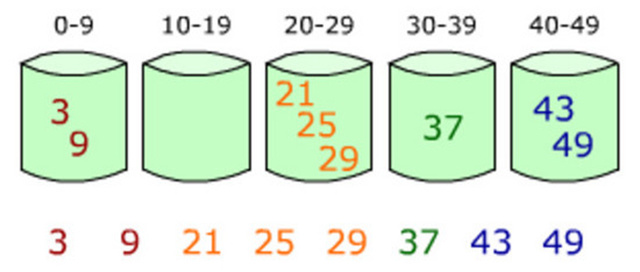
{: id="20201220214147-s23auvr"}

#### 基数排序
{: id="20201220214147-yr47pfw"}

* {: id="20201220214147-um1hw3f"}基数排序类似于桶排序，将元素分发到一定数目的桶中。不同的是，基数排序在分割元素之后没有让每个桶单独进行排序，而是直接做了合并操作。
* {: id="20201220214147-acy1ldy"}时间复杂度
  * {: id="20201220214147-4q3c1y4"}最优：Ω(nk)
  * {: id="20201220214147-7uec3cq"}最差: O(nk)
  * {: id="20201220214147-irue9r5"}平均：Θ(nk)
  {: id="20201220214147-1vyqpaw"}
{: id="20201220214147-qy5id69"}

#### 图算法
{: id="20201220214147-vfhdk0b"}

深度优先 **搜索**
{: id="20201220214147-4tiiuqr"}

* {: id="20201220214147-pztd5lo"}深度优先搜索是一种先遍历子节点而不回溯的图遍历算法。
* {: id="20201220214147-6ac9w5r"}时间复杂度：O(|V| + |E|)
{: id="20201220214147-pow7a4t"}

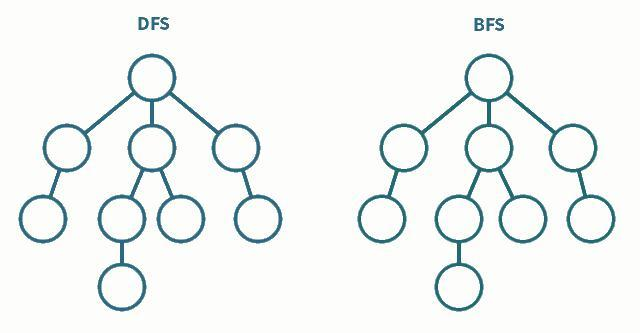
{: id="20201220214147-wackpz9"}

广度优先 **搜索**
{: id="20201220214147-f42z0b2"}

* {: id="20201220214147-o0tzg6r"}广度优先搜索是一种先遍历邻居节点而不是子节点的图遍历算法。
* {: id="20201220214147-49y69ig"}时间复杂度：O(|V| + |E|)
{: id="20201220214147-p5gf3mx"}

{: id="20201220214147-mgy1fnw"}

#### 拓扑排序
{: id="20201220214147-pxwg4o2"}

* {: id="20201220214147-j87nqh9"}拓扑排序是有向图节点的线性排序。对于任何一条节点 u 到节点 v 的边，u 的下标先于 v。
* {: id="20201220214147-gmoe84j"}时间复杂度：O(|V| + |E|)
{: id="20201220214147-j21v0g6"}

#### Dijkstra算法
{: id="20201220214147-tm5zww0"}

* {: id="20201220214147-g3tjb52"}Dijkstra 算法是一种在有向图中查找单源最短路径的算法。
* {: id="20201220214147-kddj4cj"}时间复杂度：O(|V|^2)
{: id="20201220214147-kr7xqbi"}

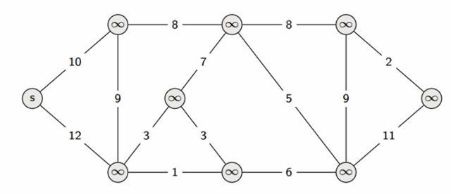
{: id="20201220214147-hcsblv4"}

#### Bellman-Ford算法
{: id="20201220214147-ly1eilk"}

* {: id="20201220214147-0yhlu32"}_Bellman-Ford _ 是一种在带权图中查找单一源点到其他节点最短路径的算法。
* {: id="20201220214147-znjrxy0"}虽然时间复杂度大于 Dijkstra 算法，但它可以处理包含了负值边的图。
* {: id="20201220214147-5jets6r"}时间复杂度：
  * {: id="20201220214147-y2la926"}最优：O(|E|)
  * {: id="20201220214147-sc1h2t5"}最差：O(|V||E|)
  {: id="20201220214147-9x9o806"}
{: id="20201220214147-10528an"}

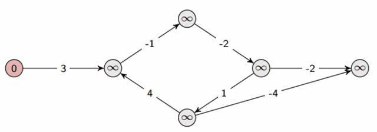
{: id="20201220214147-2nogofz"}

#### Floyd-Warshall 算法
{: id="20201220214147-12xh8hy"}

* {: id="20201220214147-63lc0fw"}_Floyd-Warshall _ 算法是一种在无环带权图中寻找任意节点间最短路径的算法。
* {: id="20201220214147-nbk5r38"}该算法执行一次即可找到所有节点间的最短路径（路径权重和）。
* {: id="20201220214147-irligk1"}时间复杂度：
  * {: id="20201220214147-wu0iz7r"}最优：O(|V|^3)
  * {: id="20201220214147-axllgm9"}最差：O(|V|^3)
  * {: id="20201220214147-oxd6bu6"}平均：O(|V|^3)
  {: id="20201220214147-edad0ja"}
{: id="20201220214147-mwmxg9z"}

#### 最小生成树算法
{: id="20201220214147-18r2i9c"}

* {: id="20201220214147-mm3ii4v"}最小生成树算法是一种在无向带权图中查找最小生成树的贪心算法。换言之，最小生成树算法能在一个图中找到连接所有节点的边的最小子集。
* {: id="20201220214147-22vtsuc"}时间复杂度：O(|V|^2)
{: id="20201220214147-2ximoul"}

#### Kruskal 算法
{: id="20201220214147-i5sslk8"}

* {: id="20201220214147-n2ruwoq"}_Kruskal _ 算法也是一个计算最小生成树的贪心算法，但在 Kruskal 算法中，图不一定是连通的。
* {: id="20201220214147-dlutof5"}时间复杂度：O(|E|log|V|)
{: id="20201220214147-bpnhjr5"}

#### 贪心算法
{: id="20201220214147-5vzuxv0"}

* {: id="20201220214147-utm5ud5"}贪心算法总是做出在当前看来最优的选择，并希望最后整体也是最优的。
* {: id="20201220214147-q4omoc9"}使用贪心算法可以解决的问题必须具有如下两种特性：
  * {: id="20201220214147-73jkekf"}最优子结构
    * {: id="20201220214147-vlibm97"}问题的最优解包含其子问题的最优解。
    {: id="20201220214147-rsfc8cb"}
  * {: id="20201220214147-tvsjvyu"}贪心选择
    * {: id="20201220214147-k9wa9p4"}每一步的贪心选择可以得到问题的整体最优解。
    {: id="20201220214147-124h9ns"}
  {: id="20201220214147-mcj6hnr"}
* {: id="20201220214147-g6zy02v"}实例-硬币选择问题
* {: id="20201220214147-4wx8yzs"}给定期望的硬币总和为 V 分，以及 n 种硬币，即类型是 i 的硬币共有 coinValue[i] 分，i的范围是 [0…n – 1]。假设每种类型的硬币都有无限个，求解为使和为 V 分最少需要多少硬币？
* {: id="20201220214147-pi1882g"}硬币：便士（1美分），镍（5美分），一角（10美分），四分之一（25美分）。
* {: id="20201220214147-9yzrkho"}假设总和 V 为41,。我们可以使用贪心算法查找小于或者等于 V 的面值最大的硬币，然后从 V 中减掉该硬币的值，如此重复进行。
  * {: id="20201220214147-3b58fwy"}V = 41 | 使用了0个硬币
  * {: id="20201220214147-5xpuhwz"}V = 16 | 使用了1个硬币(41 – 25 = 16)
  * {: id="20201220214147-cfknk8u"}V = 6 | 使用了2个硬币(16 – 10 = 6)
  * {: id="20201220214147-46j9q0m"}V = 1 | 使用了3个硬币(6 – 5 = 1)
  * {: id="20201220214147-qbtm9bp"}V = 0 | 使用了4个硬币(1 – 1 = 0)
  {: id="20201220214147-vohaguf"}
{: id="20201220214147-1hzwr7q"}

位 **运算**
{: id="20201220214147-1nbvpg3"}

* {: id="20201220214147-6mats28"}位运算即在比特级别进行操作的技术。使用位运算技术可以带来更快的运行速度与更小的内存使用。
* {: id="20201220214147-4hsdjxw"}测试第 k 位：s & (1 << k);
* {: id="20201220214147-aj7ho6i"}设置第k位：s |= (1 << k);
* {: id="20201220214147-4f4b2yn"}关闭第k位：s &= ~(1 << k);
* {: id="20201220214147-u6ooj2x"}切换第k位：s ^= (1 << k);
* {: id="20201220214147-hu2na36"}乘以2n：s << n;
* {: id="20201220214147-dg8bi4p"}除以2n：s >> n;
* {: id="20201220214147-ewugo7j"}交集：s & t;
* {: id="20201220214147-eipv0s4"}并集：s | t;
* {: id="20201220214147-bejo6yi"}减法：s & ~t;
* {: id="20201220214147-hjy44lj"}提取最小非0位：s & (-s);
* {: id="20201220214147-xqzqsuo"}提取最小0位：~s & (s + 1);
* {: id="20201220214147-ptf2rla"}交换值：x ^= y; y ^= x; x ^= y;
{: id="20201220214147-r1ej81u"}

## **运行时分析**
{: id="20201220214147-fxf07zq"}

#### 大 O 表示
{: id="20201220214147-binbzi6"}

* {: id="20201220214147-9dtwu3h"}大 O 表示用于表示某个算法的上界，用于描述最坏的情况。
{: id="20201220214147-no1hit6"}

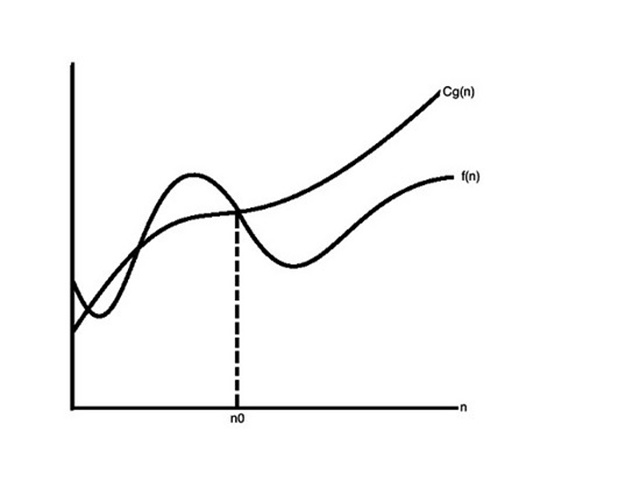
{: id="20201220214147-m1etn9w"}

#### 小 O 表示
{: id="20201220214147-iwwvv85"}

* {: id="20201220214147-8az0g3w"}小 O 表示用于描述某个算法的渐进上界，二者逐渐趋近。
{: id="20201220214147-ys82lsn"}

#### 大 Ω 表示
{: id="20201220214147-67fb9gv"}

* {: id="20201220214147-yweg2vh"}大 Ω 表示用于描述某个算法的渐进下界。
{: id="20201220214147-u8i85zr"}

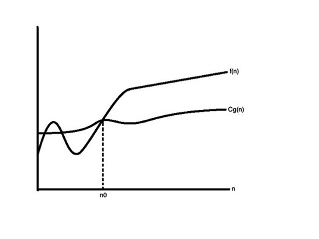
{: id="20201220214147-m1jl4u6"}

#### 小 ω 表示
{: id="20201220214147-noxax2i"}

* {: id="20201220214147-4if7muh"}小 ω 表示用于描述某个算法的渐进下界，二者逐渐趋近。
{: id="20201220214147-jy36qk3"}

#### Theta Θ 表示
{: id="20201220214147-9n311eg"}

* {: id="20201220214147-105xxrn"}Theta Θ 表示用于描述某个算法的确界，包括最小上界和最大下界。
{: id="20201220214147-rovmhrp"}

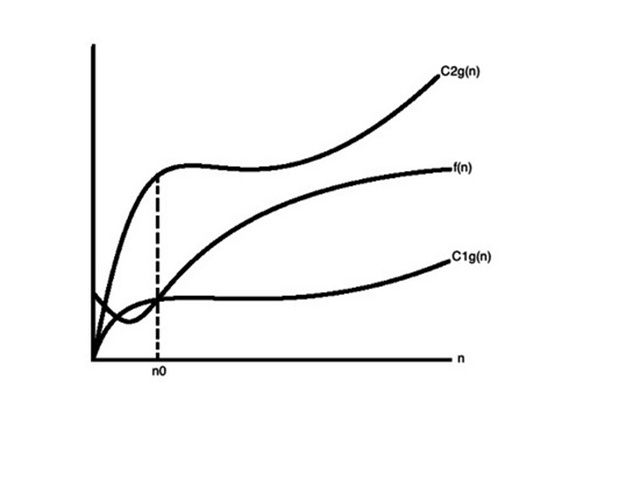
{: id="20201220214147-s1yhghs"}

#### 视频教程
{: id="20201220214147-iw3i5va"}

* {: id="20201220214147-93go8uo"}数据结构
  * {: id="20201220214147-t04ozis"}[UC Berkeley Data Structures](https://www.youtube.com/watch?v=mFPmKGIrQs4&index=1&list=PL-XXv-cvA_iAlnI-BQr9hjqADPBtujFJd)
  * {: id="20201220214147-jo2hjss"}[MIT Advanced Data Structures](https://www.youtube.com/watch?v=T0yzrZL1py0&list=PLUl4u3cNGP61hsJNdULdudlRL493b-XZf&index=1)
  {: id="20201220214147-3w05zbq"}
* {: id="20201220214147-z52uy9l"}算法
  * {: id="20201220214147-ctsnb3p"}[MIT Introduction to Algorithms](https://www.youtube.com/watch?v=HtSuA80QTyo&list=PLUl4u3cNGP61Oq3tWYp6V_F-5jb5L2iHb&index=1)
  * {: id="20201220214147-k0v5f2r"}[MIT Advanced Algorithms](https://www.youtube.com/playlist?list=PL6ogFv-ieghdoGKGg2Bik3Gl1glBTEu8c)
  {: id="20201220214147-1v8a6sc"}
{: id="20201220214147-h2chnmx"}

#### 面试宝典
{: id="20201220214147-9fm80er"}

* {: id="20201220214147-8v1f62o"}[Competitive Programming 3 – Steven Halim & Felix Halim](https://www.amazon.com/Competitive-Programming-3rd-Steven-Halim/dp/B00FG8MNN8)
* {: id="20201220214147-k3haew3"}[Cracking The Coding Interview – Gayle Laakmann McDowell](https://www.amazon.com/Cracking-Coding-Interview-Programming-Questions/dp/0984782850/ref=sr_1_1?s=books&ie=UTF8)
* {: id="20201220214147-tio1teb"}[Cracking The PM Interview – Gayle Laakmann McDowell & Jackie Bavaro](https://www.amazon.com/Cracking-PM-Interview-Product-Technology-ebook/dp/B00ISYMUR6/ref=sr_1_1?s=books&ie=UTF8)
* {: id="20201220214147-i5o34lr"}[Introduction to Algorithms – Thomas H. Cormen, Charles E. Leiserson, Ronald L. Rivest & Clifford Stein](https://www.amazon.com/Introduction-Algorithms-3rd-MIT-Press/dp/0262033844/ref=sr_1_1?ie=UTF8&qid=1490295989&sr=8-1&keywords=Introduction+to+Algorithms)
{: id="20201220214147-a12vg66"}

[技术面试要了解的算法和数据结构知识](http://www.36dsj.com/archives/80717)
{: id="20201220214147-4164bvc"}

{: id="20201220214147-lxupayj" type="doc"}
