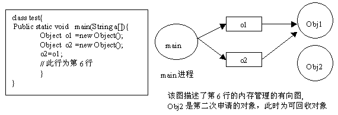
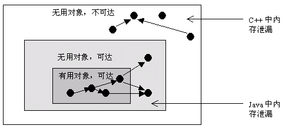

---

title: Java 内存分配和泄露
date: 2016-11-03 13:29:24
description:
{: id="20201220214147-k0owp50"}

tags:
{: id="20201220214147-q5exufa"}

- {: id="20201220214147-vj91sqq"}内存分配
- {: id="20201220214147-9vu2s9b"}内存泄露
- {: id="20201220214147-aktitig"}Java
{: id="20201220214147-laswvxs"}

nav:
{: id="20201220214147-xhxoerx"}

- {: id="20201220214147-jutszz4"}Java
{: id="20201220214147-uwougvk"}

categories:
{: id="20201220214147-g431b97"}

- {: id="20201220214147-g6g5e7b"}Java 进阶
{: id="20201220214147-dar3v4d"}

image: images/java/basic/java_logo.png
{: id="20201220214147-ay4x8jz"}

---

### Java 内存分配策略
{: id="20201220214147-d65bxfs"}

Java 程序运行时的内存分配策略有三种, 分别是静态分配, 栈式分配, 和堆式分配，对应的，三种存储策略使用的内存空间主要分别是静态存储区（也称方法区）、栈区和堆区。
{: id="20201220214147-8e6kwb3"}

静态存储区（方法区）：主要存放静态数据、全局 static 数据和常量。这块内存在程序编译时就已经分配好，并且在程序整个运行期间都存在。
{: id="20201220214147-er16clc"}

栈区 ：当方法被执行时，方法体内的局部变量（其中包括基础数据类型、对象的引用）都在栈上创建，并在方法执行结束时这些局部变量所持有的内存将会自动被释放。因为栈内存分配运算内置于处理器的指令集中，效率很高，但是分配的内存容量有限。
{: id="20201220214147-cal4bmd"}

堆区 ： 又称动态内存分配，通常就是指在程序运行时直接 new 出来的内存，也就是对象的实例。这部分内存在不使用时将会由 Java 垃圾回收器来负责回收。
{: id="20201220214147-d5uj9tp"}

### 栈与堆的区别
{: id="20201220214147-kf05tfa"}

在方法体内定义的（局部变量）一些基本类型的变量和对象的引用变量都是在方法的栈内存中分配的。当在一段方法块中定义一个变量时，Java 就会在栈中为该变量分配内存空间，当超过该变量的作用域后，该变量也就无效了，分配给它的内存空间也将被释放掉，该内存空间可以被重新使用。
堆内存用来存放所有由 new 创建的对象（包括该对象其中的所有成员变量）和数组。在堆中分配的内存，将由 Java 垃圾回收器来自动管理。在堆中产生了一个数组或者对象后，还可以在栈中定义一个特殊的变量，这个变量的取值等于数组或者对象在堆内存中的首地址，这个特殊的变量就是我们上面说的引用变量。我们可以通过这个引用变量来访问堆中的对象或者数组。
{: id="20201220214147-1893vlz"}

举个例子:
{: id="20201220214147-7qpak2v"}

```
public class Sample { 
    int s1 = 0; 
    Sample mSample1 = new Sample();  
    public void method() { 
        int s2 = 1; 
        Sample mSample2 = new Sample(); 
    } 
}  

Sample mSample3 = new Sample(); 
```
{: id="20201220214147-wbpbp9k"}

Sample 类的局部变量 s2 和引用变量 mSample2 都是存在于栈中，但 mSample2 指向的对象是存在于堆上的。mSample3 指向的对象实体存放在堆上，包括这个对象的所有成员变量 s1 和 mSample1，而它自己存在于栈中。
{: id="20201220214147-3j8pf76"}

局部变量的基本数据类型和引用存储于栈中，引用的对象实体存储于堆中。—— 因为它们属于方法中的变量，生命周期随方法而结束。
{: id="20201220214147-qk4j683"}

成员变量全部存储于堆中（包括基本数据类型，引用和引用的对象实体）—— 因为它们属于类，类对象终究是要被new出来使用的。
{: id="20201220214147-p385knj"}

了解了 Java 的内存分配之后，我们再来看看 Java 是怎么管理内存的。
{: id="20201220214147-763afus"}

### Java是如何管理内存
{: id="20201220214147-z9xbjsb"}

Java的内存管理就是对象的分配和释放问题。在 Java 中，程序员需要通过关键字 new 为每个对象申请内存空间 (基本类型除外)，所有的对象都在堆 (Heap)中分配空间。另外，对象的释放是由 GC 决定和执行的。在 Java 中，内存的分配是由程序完成的，而内存的释放是由 GC 完成的，这种收支两条线的方法确实简化了程序员的工作。但同时，它也加重了JVM的工作。这也是 Java 程序运行速度较慢的原因之一。因为，GC 为了能够正确释放对象，GC 必须监控每一个对象的运行状态，包括对象的申请、引用、被引用、赋值等，GC 都需要进行监控。
监视对象状态是为了更加准确地、及时地释放对象，而释放对象的根本原则就是该对象不再被引用。
{: id="20201220214147-417isc8"}

为了更好理解 GC 的工作原理，我们可以将对象考虑为有向图的顶点，将引用关系考虑为图的有向边，有向边从引用者指向被引对象。另外，每个线程对象可以作为一个图的起始顶点，例如大多程序从 main 进程开始执行，那么该图就是以 main 进程顶点开始的一棵根树。在这个有向图中，根顶点可达的对象都是有效对象，GC将不回收这些对象。如果某个对象 (连通子图)与这个根顶点不可达(注意，该图为有向图)，那么我们认为这个(这些)对象不再被引用，可以被 GC 回收。以下，我们举一个例子说明如何用有向图表示内存管理。对于程序的每一个时刻，我们都有一个有向图表示JVM的内存分配情况。以下右图，就是左边程序运行到第6行的示意图。
{: id="20201220214147-gby7pla"}


{: id="20201220214147-txol0gg"}

Java使用有向图的方式进行内存管理，可以消除引用循环的问题，例如有三个对象，相互引用，只要它们和根进程不可达的，那么GC也是可以回收它们的。这种方式的优点是管理内存的精度很高，但是效率较低。另外一种常用的内存管理技术是使用计数器，例如COM模型采用计数器方式管理构件，它与有向图相比，精度行低(很难处理循环引用的问题)，但执行效率很高。
{: id="20201220214147-ifmeeci"}

### Java 内存回收机制
{: id="20201220214147-oxlveku"}

不论哪种语言的内存分配方式，都需要返回所分配内存的真实地址，也就是返回一个指针到内存块的首地址。Java 中对象是采用 new 或者反射的方法创建的，这些对象的创建都是在堆（Heap）中分配的，所有对象的回收都是由 Java 虚拟机通过垃圾回收机制完成的。GC 为了能够正确释放对象，会监控每个对象的运行状况，对他们的申请、引用、被引用、赋值等状况进行监控，Java 会使用有向图的方法进行管理内存，实时监控对象是否可以达到，如果不可到达，则就将其回收，这样也可以消除引用循环的问题。在 Java 语言中，判断一个内存空间是否符合垃圾收集标准有两个：一个是给对象赋予了空值 null，以下再没有调用过，另一个是给对象赋予了新值，这样重新分配了内存空间。
{: id="20201220214147-oncaklm"}

### 什么是Java中的内存泄露
{: id="20201220214147-7nm3sh6"}

在Java中，内存泄漏就是存在一些被分配的对象，这些对象有下面两个特点，首先，这些对象是可达的，即在有向图中，存在通路可以与其相连；其次，这些对象是无用的，即程序以后不会再使用这些对象。如果对象满足这两个条件，这些对象就可以判定为Java中的内存泄漏，这些对象不会被GC所回收，然而它却占用内存。
{: id="20201220214147-7pruua5"}

在C++中，内存泄漏的范围更大一些。有些对象被分配了内存空间，然后却不可达，由于C++中没有GC，这些内存将永远收不回来。在Java中，这些不可达的对象都由GC负责回收，因此程序员不需要考虑这部分的内存泄露。
{: id="20201220214147-om3nwhg"}

通过分析，我们得知，对于C++，程序员需要自己管理边和顶点，而对于Java程序员只需要管理边就可以了(不需要管理顶点的释放)。通过这种方式，Java提高了编程的效率。
{: id="20201220214147-fa6jscb"}


{: id="20201220214147-jru6llf"}

因此，通过以上分析，我们知道在Java中也有内存泄漏，但范围比C++要小一些。因为Java从语言上保证，任何对象都是可达的，所有的不可达对象都由GC管理。
{: id="20201220214147-afsago4"}

对于程序员来说，GC基本是透明的，不可见的。虽然，我们只有几个函数可以访问GC，例如运行GC的函数System.gc()，但是根据Java语言规范定义， 该函数不保证JVM的垃圾收集器一定会执行。因为，不同的JVM实现者可能使用不同的算法管理GC。通常，GC的线程的优先级别较低。JVM调用GC的策略也有很多种，有的是内存使用到达一定程度时，GC才开始工作，也有定时执行的，有的是平缓执行GC，有的是中断式执行GC。但通常来说，我们不需要关心这些。除非在一些特定的场合，GC的执行影响应用程序的性能，例如对于基于Web的实时系统，如网络游戏等，用户不希望GC突然中断应用程序执行而进行垃圾回收，那么我们需要调整GC的参数，让GC能够通过平缓的方式释放内存，例如将垃圾回收分解为一系列的小步骤执行，Sun提供的HotSpot JVM就支持这一特性。
{: id="20201220214147-jg1u870"}

### Java 内存泄露引起原因
{: id="20201220214147-9ivqp51"}

那么，Java 内存泄露根本原因是什么呢？长生命周期的对象持有短生命周期对象的引用就很可能发生内存泄露，尽管短生命周期对象已经不再需要，但是因为长生命周期对象持有它的引用而导致不能被回收，这就是 java 中内存泄露的发生场景。具体主要有如下几大类：
{: id="20201220214147-6md5ccx"}

**1、静态集合类引起内存泄露：**
{: id="20201220214147-nxfm96i"}

像 HashMap、Vector 等的使用最容易出现内存泄露，这些静态变量的生命周期和应用程序一致，他们所引用的所有的对象 Object 也不能被释放，因为他们也将一直被 Vector 等引用着。
例:
{: id="20201220214147-2w1yo8c"}

```
static Vector v = new Vector(10); 
for (int i = 1; i<100; i++)  { 
    Object o = new Object(); 
    v.add(o); 
    o = null; 
}
```
{: id="20201220214147-25pansq"}

在这个例子中，循环申请 Object 对象，并将所申请的对象放入一个 Vector 中，如果仅仅释放引用本身（o = null），那么 Vector 仍然引用该对象，所以这个对象对 GC 来说是不可回收的。因此，如果对象加入到 Vector 后，还必须从 Vector 中删除，最简单的方法就是将 Vector 对象设置为 null。
{: id="20201220214147-5hhq7q6"}

**2、当集合里面的对象属性被修改后，再调用 remove（）方法时不起作用：**
{: id="20201220214147-o3oyyjg"}

例：
{: id="20201220214147-e3o3xub"}

```
public static void main(String[] args)  { 
    Set<Person> set = new HashSet<Person>(); 
    Person p1 = new Person("唐僧","pwd1",25); 
    Person p2 = new Person("孙悟空","pwd2",26); 
    Person p3 = new Person("猪八戒","pwd3",27); 
    set.add(p1); 
    set.add(p2); 
    set.add(p3); 
    System.out.println("总共有:"+set.size()+"个元素!"); // 结果：总共有: 3 个元素! 
    p3.setAge(2); // 修改 p3 的年龄, 此时 p3 元素对应的 hashcode 值发生改变 
    set.remove(p3); // 此时 remove 不掉，造成内存泄漏

    set.add(p3); // 重新添加，居然添加成功 
    System.out.println("总共有:"+set.size()+"个元素!"); // 结果：总共有: 4 个元素! 
    for (Person person : set) { 
        System.out.println(person); 
    } 
}
```
{: id="20201220214147-cy42t7z"}

**3、监听器**
{: id="20201220214147-sbp87i5"}

在 java 编程中，我们都需要和监听器打交道，通常一个应用当中会用到很多监听器，我们会调用一个控件的诸如 addXXXListener() 等方法来增加监听器，但往往在释放对象的时候却没有记住去删除这些监听器，从而增加了内存泄漏的机会。
{: id="20201220214147-3wtdqzj"}

**4、各种连接**
{: id="20201220214147-ihtsto5"}

比如数据库连接（dataSourse.getConnection()），网络连接 (socket) 和 io 连接，除非其显式的调用了其 close（）方法将其连接关闭，否则是不会自动被 GC 回收的。对于 Resultset 和 Statement 对象可以不进行显式回收，但 Connection 一定要显式回收，因为 Connection 在任何时候都无法自动回收，而 Connection 一旦回收，Resultset 和 Statement 对象就会立即为 NULL。但是如果使用连接池，情况就不一样了，除了要显式地关闭连接，还必须显式地关闭 Resultset Statement 对象（关闭其中一个，另外一个也会关闭），否则就会造成大量的 Statement 对象无法释放，从而引起内存泄漏。这种情况下一般都会在 try 里面去的连接，在 finally 里面释放连接。
{: id="20201220214147-om02dn4"}

**5、内部类和外部模块等的引用**
{: id="20201220214147-bds9c09"}

内部类的引用是比较容易遗忘的一种，而且一旦没释放可能导致一系列的后继类对象没有释放。此外程序员还要小心外部模块不经意的引用，例如程序员 A 负责 A 模块，调用了 B 模块的一个方法如：
{: id="20201220214147-scqkc4r"}

```
public void registerMsg(Object b); 
```
{: id="20201220214147-siileww"}

这种调用就要非常小心了，传入了一个对象，很可能模块 B 就保持了对该对象的引用，这时候就需要注意模块 B 是否提供相应的操作去除引用。
{: id="20201220214147-q5p7zq5"}

**6、单例模式**
{: id="20201220214147-hhsxgdh"}

不正确使用单例模式是引起内存泄露的一个常见问题，单例对象在被初始化后将在 JVM 的整个生命周期中存在（以静态变量的方式），如果单例对象持有外部对象的引用，那么这个外部对象将不能被 jvm 正常回收，导致内存泄露，考虑下面的例子：
{: id="20201220214147-oa5uhm0"}

```
class A{ 
    public A(){ 
        B.getInstance().setA(this); 
    } 
    .... 
} 

//B 类采用单例模式 
class B{ 
    private A a; 
    private static B instance=new B(); 
    public B(){} 
    public static B getInstance(){ 
        return instance; 
    } 
    public void setA(A a){ 
        this.a=a; 
    } 
    //getter... 
} 
```
{: id="20201220214147-v1fsih7"}

显然 B 采用 singleton 模式，它持有一个 A 对象的引用，而这个 A 类的对象将不能被回收。想象下如果 A 是个比较复杂的对象或者集合类型会发生什么情况。
{: id="20201220214147-9n2fq75"}


{: id="20201220214147-2u3aphj" type="doc"}
