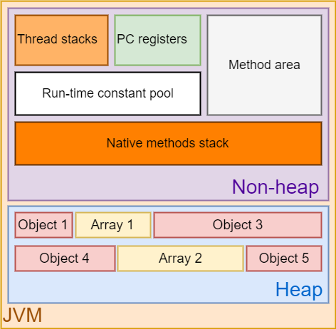

---

title: Java 中单例模式DCL的缺陷及单例的正确写法
date: 2020-05-21
description:
{: id="20201220214147-t8jdmen"}

tags:
{: id="20201220214147-mi83jro"}

- {: id="20201220214147-yir7nav"}单例
- {: id="20201220214147-u5x94pb"}DCL
- {: id="20201220214147-d5ck4o0"}Java
{: id="20201220214147-5px19gx"}

nav:
{: id="20201220214147-9hr8xef"}

- {: id="20201220214147-ffbw3md"}Java
{: id="20201220214147-9ao48qe"}

categories:
{: id="20201220214147-jppka8d"}

- {: id="20201220214147-bykf0cx"}Java 进阶
{: id="20201220214147-agiu5t3"}

image: images/java/basic/java_logo.png
{: id="20201220214147-59cccv6"}

---

首先在说明单例设计模式中的 DCL 问题之前我们首先看看实现单例设计模式的两种方式：饿汉式和懒汉式。
{: id="20201220214147-nlxu3au"}

## 什么是饿汉式？
{: id="20201220214147-u0a8xd2"}

饿汉式就是不管你是否用的上，一开始就先初始化对象（也叫做提前初始化）
{: id="20201220214147-2iru9mn"}

**代码示例：**
{: id="20201220214147-wfcz95f"}

```
public class EagerInitialization{
    private EagerInitialization() {}
    private static Resource resource = new Resource();
    public static Resource getResource(){
        return resource;
    }
}
```
{: id="20201220214147-ib60hgn"}

### 什么是懒汉式？
{: id="20201220214147-q8jmuoo"}

懒汉式就是当你真正需要使用时才创建对象。
{: id="20201220214147-bzfgw1i"}

于是，关于懒汉式的问题也就随之产生了～～～
{: id="20201220214147-nu3r2l6"}

我们先看一下有问题的代码：
{: id="20201220214147-884oxaz"}

**代码示例：**
{: id="20201220214147-k7s75cs"}

```
public class LazyInitialization{
    private static Resource resource;
    public static Resource getResource(){
        if (resource == null)
            resource = new Resource();//不安全！
        return resource;
    }
}
```
{: id="20201220214147-3b2yw9b"}

我们都知道上面的这个代码在单线程中运行是没有问题的，但是在平时的开发中常常会使用多线程，此时这个方法就会出现问题，假设有两个线程 A、B，当 A 线程满足判断还未来得及执行到 resource = new Resource() 时，线程执行资格被 B 拿走，此时线程 B 进入 getResource(), 而此时它也满足 resource 的值为 null, 于是导致最后产生两个实例。
{: id="20201220214147-ccgztjy"}

针对上面的问题，于是有了相应的解决方案，即线程安全的延迟初始化，可以解决懒汉式出现的上述问题：
{: id="20201220214147-jy0ll12"}

**代码示例：**
{: id="20201220214147-ms2k4mw"}

```
public class LazyInitialization{
    private static Resource resource;
    public synchronized static Resource getResource(){
        if (resource == null)
            resource = new Resource();
        return resource;
    }
}
```
{: id="20201220214147-f4ffi5g"}

上面代码通过使用 synchronized 关键字将 getResource 变成同步函数来保证方法的原子性，从而保证了线程安全而防止最后多个线程产生多个实例的现象。
{: id="20201220214147-9pssvo5"}

我们都知道，在上述例子当中，每次在调用 getResource() 时都需要进行同步，而且在大多数时这种同步是没有必要的，并且大量无用的同步会对性能造成极大的影响。为什么呢？因为在第一次调用 getResource() 方法时就已经创建了 resource 实例了，之后 resource 就不再为空，然而之后再调用 getResource 时都需要进行同步，从而对性能造成了很大的影响。基于这些问题，一个新的方法也就产生了，这也是我们需要着重讨论的一个方法——双重检查加锁 (Double Check Locking) DCL。
{: id="20201220214147-30ru8sw"}

## 双重检查加锁 DCL (Double Check Locking)
{: id="20201220214147-4tzcho3"}

首先我们看看 DCL 的代码：
{: id="20201220214147-tvfvyi9"}

**示例代码：**
{: id="20201220214147-t0108go"}

```
public class DoubleCheckedLocking{
    private static Resource resource;
    public static Resource getResource(){
        if (resource == null) {
            synchronized (DoubleCheckedLocking.class) {
                if (resource == null)
                    resource = new Resource();
            }
        }
        return resource;
    }
}
```
{: id="20201220214147-qibijlf"}

你可能会疑惑，这样做不是挺好么，这样就可以解决刚刚说的那些问题了么，当 resource 被实例化后再调用 getResource() 方法不就不会再进行同步，这样不就节约了资源，提升了性能么？
{: id="20201220214147-1d3tloc"}

说的对，DCL 确实存在着这些优点，但是与此同时，这个方法也会带来相应的问题，因为这个方法是含有缺陷的。再次之前，先了解一下JVM内存模型。
{: id="20201220214147-71qsdoh"}

## JVM内存模型
{: id="20201220214147-l7zzun1"}

JVM模型如下图：

{: id="20201220214147-s2qa3bv"}

Thread Stack 是线程私有的区域。他是java方法执行时的字典：它里面记录了局部变量表、 操作数栈、 动态链接、 方法出口等信息。
{: id="20201220214147-5cdn9gm"}

在《java虚拟机规范》一书中对这部分的描述如下：
{: id="20201220214147-lb5nyk9"}

栈帧（ Frame）是用来存储数据和部分过程结果的数据结构，同时也被用来处理动态链接 (Dynamic Linking)、 方法返回值和异常分派（ Dispatch Exception）。
{: id="20201220214147-5smzdfi"}

栈帧随着方法调用而创建，随着方法结束而销毁——无论方法是正常完成还是异常完成（抛出了在方法内未被捕获的异常）都算作方法结束。
{: id="20201220214147-9o2byek"}

栈帧的存储空间分配在 Java 虚拟机栈（ §2.5.5）之中，每一个栈帧都有自己的局部变量表（ Local Variables， §2.6.1）、操作数栈（ OperandStack， §2.6.2）和指向当前方法所属的类的运行时常量池（ §2.5.5）的引用。
{: id="20201220214147-0u7akh5"}

Java 中某个线程在访问堆中的线程共享变量时，为了加快访问速度，提升效率，会把该变量临时拷贝一份到自己的 Thread Stack 中，并保持和堆中数据的同步。
{: id="20201220214147-zk2nc0s"}

## 缺陷
{: id="20201220214147-cw9ha99"}

首先我们看到，DCL 方法包含了层判断语句，第一层判断语句用于判断 resource 对象是否为空，也就是是否被实例化，如果为空时就进入同步代码块进一步判断，问题就出在了 resource 的实例化语句 `resource = new Resource() ` 上，因为这个语句实际上不是原子性的。这句话可以大致分解为如下步骤：
{: id="20201220214147-ylkvo4m"}

```
1. 给 Resource 的实例分配内存
2. 初始化 Resource 构造器
3. 将 resource 实例指向分配的内存空间，此时 resource 实例就不再为空
```
{: id="20201220214147-jfdruts"}

我们都希望这条语句的执行顺序是上述的 1——>2——>3，但是，由于 Java 编译器允许处理器乱序执行，以及 JDK1.5 之前 JMM（Java Memory Medel，即 Java 内存模型）中 Cache、寄存器到主内存回写顺序的规定，上面的第二点和第三点的顺序是无法保证的，也就是说，执行顺序可能是 1——>2——>3 也可能是 1——>3——>2。
{: id="20201220214147-88afwe4"}

如果有两个线程 A 和 B，如果 A 线程执行完 1 后先执行 3 然后执行 2，并且在 3 执行完毕、2 未执行之前，被切换到线程 B 上，这时候 resource 因为已经在线程 A 内执行过了第三点（jvm将未完成 Resource 构造器的值拷贝回堆中），resource 已经是非空了，所以线程 B 直接拿走 resource，然后使用，然后顺理成章地报错，而且这种难以跟踪难以重现的错误很可能会隐藏很久。
{: id="20201220214147-0v7qmuc"}

好了，关于 DCL 的问题阐述完了，那么这个方法既然有问题，那么该如何修改呢？
{: id="20201220214147-3y23obk"}

## Happen-Before 原则
{: id="20201220214147-5ijlwgq"}

通过遵守 Happen-Before 原则，解决并发顺序问题。
{: id="20201220214147-d7cg6gf"}

```
1. 同一个线程中，书写在前面的操作happen-before书写在后面的操作。这条规则是说，在单线程中操作间happen-before关系完全是由源代码的顺序决定的，这里的前提“在同一个线程中”是很重要的，这条规则也称为单线程规则 。这个规则多少说得有些简单了，考虑到控制结构和循环结构，书写在后面的操作可能happen-before书写在前面的操作，不过我想读者应该明白我的意思。

2. 对锁的unlock操作happen-before后续的对同一个锁的lock操作。这里的“后续”指的是时间上的先后关系，unlock操作发生在退出同步块之后，lock操作发生在进入同步块之前。这是条最关键性的规则，线程安全性主要依赖于这条规则。但是仅仅是这条规则仍然不起任何作用，它必须和下面这条规则联合起来使用才显得意义重大。这里关键条件是必须对“同一个锁”的lock和unlock。
如果操作A happen-before操作B，操作B happen-before操作C，那么操作A happen-before操作C。这条规则也称为传递规。

```
{: id="20201220214147-2psyeto"}

## 通过 volatile 防止指令重排序
{: id="20201220214147-qrt0z41"}

在 JMM 的后续版本（Java 5.0 及以上）中，如果把 resource 声明为 volatile 类型，因为 volatile 可以防止指令的重排序（对 volatile 字段的写操作 happen-before 后续的对同一个字段的读操作），那么这样就可以启用 DCL，并且这种方式对性能的影响很小，因为 volatile 变量读取操作的性能通常只是略高于非 volatile 变量读取操作的性能。改进后的 DCL 方法如下代码所示
{: id="20201220214147-f0g1fei"}

**代码示例：**
{: id="20201220214147-uma3eem"}

```
public class DoubleCheckedLocking{
    private static volatile Resource resource;
    public static Resource getResource{
        if (resource == null) {
            synchronized (DoubleCheckedLocking.class) {
                if (resource == null)
                    resource = new Resource();
            }
        }
        return resource;
    }
}
```
{: id="20201220214147-3yhdycw"}

但是，DCL 的这种方法已经被广泛地遗弃了，因为促使该模式出现的驱动力（无竞争同步的执行速度很慢，以及 JVM 启动时很慢）已经不复存在，因为它不是一种高效的优化措施。延迟初始化占位类模式能带来同样的优势，并且更容易理解，延迟初始化占位类模式代码如下：
{: id="20201220214147-048elvm"}

**代码示例：**
{: id="20201220214147-ade2yc2"}

```
public class ResourceFactory{
    private static class ResourceHolder {
        public static Resource resource = new Resource();
    }
    public static Resource getResource(){
        return ResourceHolder.resource;
    }
}
```
{: id="20201220214147-hk12rx7"}

关于单例和 DCL 问题就分析到这里了，在实际开发当中由于经常要考虑到代码的效率和安全性，一般使用饿汉式和延长初始化占位类模式，而延迟占位类模式更是优势明显并且容易使用和理解，是良好的单例设计模式的实现方法。
{: id="20201220214147-n8k2snd"}

参考资料：
{: id="20201220214147-b9wwuwd"}

《java 并发编程实战》
{: id="20201220214147-i5mlu47"}

关于 volatile 的问题可以参考：
http://blog.csdn.net/wxwzy738/article/details/43238089
{: id="20201220214147-y9ng9hw"}

关于 DCL 的其他问题可以参考：
http://blog.csdn.net/ns_code/article/details/17359719
https://blog.csdn.net/qiyei2009/article/details/71813069
https://blog.csdn.net/u013393958/article/details/70941579
{: id="20201220214147-wm3x4bv"}


{: id="20201220214147-qe9rpbd" type="doc"}
