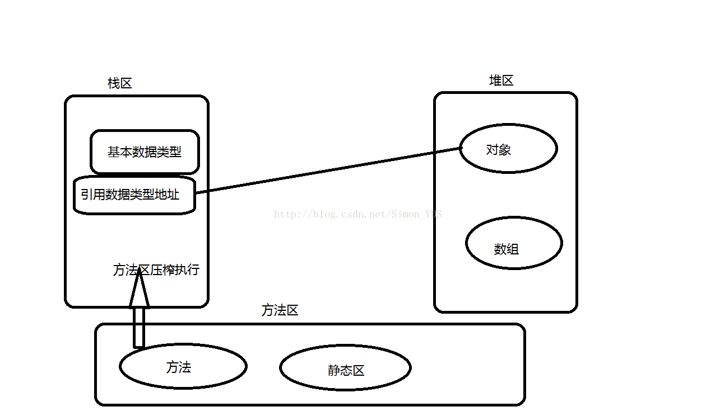

---

title: JVM内存结构：堆、栈、方法区
date: 2019-07-22
description:
{: id="20201220214147-3obciya"}

tags:
{: id="20201220214147-bp97vun"}

- {: id="20201220214147-fz1fp9p"}内存模型
- {: id="20201220214147-kphgeqx"}jvm
- {: id="20201220214147-jn1spj9"}Java
{: id="20201220214147-69x0kf7"}

nav:
{: id="20201220214147-6l6oem6"}

- {: id="20201220214147-5mbln6h"}Java
{: id="20201220214147-7ekzplw"}

categories:
{: id="20201220214147-ll9u9ry"}

- {: id="20201220214147-x62yvma"}Java 进阶
{: id="20201220214147-wucnjvu"}

image: images/java/basic/java_logo.png
{: id="20201220214147-ppodkcl"}

---

一、定义
{: id="20201220214147-l10p2wz"}

1. {: id="20201220214147-3g7jq9n"}堆：FIFO队列优先，先进先出。jvm只有一个堆区被所有线程所共享！堆存放在二级缓存中，调用对象的速度相对慢一些，生命周期由虚拟机的垃圾回收机制定。
   {: id="20201220214147-smjxqqy"}
2. {: id="20201220214147-n3y708o"}栈：FILO先进后出，暂存数据的地方。每个线程都包含一个栈区！栈存放在一级缓存中，存取速度较快，“栈是限定仅在表头进行插入和删除操作的线性表”。
   {: id="20201220214147-fei6yy7"}
3. {: id="20201220214147-np9l6qw"}方法区：用来存放方法和static变量。
   {: id="20201220214147-7q5wzdi"}
{: id="20201220214147-id2pm3s"}

二、存储的数据类型
{: id="20201220214147-qf0v060"}

1. {: id="20201220214147-8qjskkf"}堆用来存储new出来的对象和数组
   {: id="20201220214147-vk5hs0a"}
2. {: id="20201220214147-5ontwwk"}栈用来存储基本类型变量和对象的引用变量的地址
   {: id="20201220214147-82oeq39"}
3. {: id="20201220214147-cfkmldz"}方法区存储方法和static变量
   {: id="20201220214147-9wp0j07"}
{: id="20201220214147-i8bl27g"}

三、优缺点
{: id="20201220214147-50aph1c"}

1. {: id="20201220214147-yep18tq"}堆的优点-可以动态的分配内存大小，生命周期不确定。缺点-速度略慢
   {: id="20201220214147-75s5esm"}
2. {: id="20201220214147-pqnnph4"}栈的优点-速度快，缺点-存在栈中的数据大小和生命周期必须是明确的，缺少灵活性。
   {: id="20201220214147-zupcfgk"}
{: id="20201220214147-weotpbs"}


{: id="20201220214147-j3a42wf"}

四、直接内存
{: id="20201220214147-g9n8m31"}

直接内存并不是虚拟机运行时数据区的一部分，也不是Java 虚拟机规范中农定义的内存区域。在JDK1.4 中新加入了NIO(New Input/Output)类，引入了一种基于通道(Channel)与缓冲区（Buffer）的I/O 方式，它可以使用native 函数库直接分配堆外内存，然后通脱一个存储在Java堆中的DirectByteBuffer 对象作为这块内存的引用进行操作。这样能在一些场景中显著提高性能，因为避免了在Java堆和Native堆中来回复制数据。
{: id="20201220214147-zs29pjd"}

- {: id="20201220214147-dgcqcfz"}本机直接内存的分配不会受到Java 堆大小的限制，受到本机总内存大小限制
  {: id="20201220214147-wwce3no"}
- {: id="20201220214147-frpsxul"}配置虚拟机参数时，不要忽略直接内存 防止出现OutOfMemoryError异常
  {: id="20201220214147-qdpgfzm"}
{: id="20201220214147-03p8ds2"}

直接内存（堆外内存）与堆内存比较
{: id="20201220214147-inczdzy"}

1. {: id="20201220214147-tq5xivu"}直接内存申请空间耗费更高的性能，当频繁申请到一定量时尤为明显
2. {: id="20201220214147-xqbqiev"}直接内存IO读写的性能要优于普通的堆内存，在多次读写操作的情况下差异明显
{: id="20201220214147-bbo7rmb"}

代码验证：
{: id="20201220214147-xw5xpss"}

```
package com.youyuan.web.controller.user;

import java.nio.ByteBuffer;

/**
 * 直接内存 与 堆内存的比较
 */
public class ByteBufferCompare {

    public static void main(String[] args) {
        allocateCompare(); //分配比较
        operateCompare(); //读写比较
    }

    /**
     * 直接内存 和 堆内存的 分配空间比较
     * <p>
     * 结论： 在数据量提升时，直接内存相比非直接内的申请，有很严重的性能问题
     */
    public static void allocateCompare() {
        int time = 10000000; //操作次数

        long st = System.currentTimeMillis();
        for (int i = 0; i < time; i++) {
			//ByteBuffer.allocate(int capacity) 分配一个新的字节缓冲区。
            ByteBuffer buffer = ByteBuffer.allocate(2); //非直接内存分配申请
        }
        long et = System.currentTimeMillis();
        System.out.println("在进行" + time + "次分配操作时，堆内存 分配耗时:" + (et - st) + "ms");
        long st_heap = System.currentTimeMillis();
        for (int i = 0; i < time; i++) {
			//ByteBuffer.allocateDirect(int capacity) 分配新的直接字节缓冲区。
            ByteBuffer buffer = ByteBuffer.allocateDirect(2); //直接内存分配申请
        }
        long et_direct = System.currentTimeMillis();
        System.out.println("在进行" + time + "次分配操作时，直接内存 分配耗时:" + (et_direct - st_heap) + "ms");
    }

    /**
     * 直接内存 和 堆内存的 读写性能比较
     * <p>
     * 结论：直接内存在直接的IO 操作上，在频繁的读写时 会有显著的性能提升
     */
    public static void operateCompare() {
        int time = 1000000000;
        ByteBuffer buffer = ByteBuffer.allocate(2 * time);
        long st = System.currentTimeMillis();
        for (int i = 0; i < time; i++) {
			// putChar(char value) 用来写入 char 值的相对 put 方法
            buffer.putChar('a');
        }
        buffer.flip();
        for (int i = 0; i < time; i++) {
            buffer.getChar();
        }
        long et = System.currentTimeMillis();
        System.out.println("在进行" + time + "次读写操作时，非直接内存读写耗时：" + (et - st) + "ms");
        ByteBuffer buffer_d = ByteBuffer.allocateDirect(2 * time);
        long st_direct = System.currentTimeMillis();
        for (int i = 0; i < time; i++) {
			// putChar(char value) 用来写入 char 值的相对 put 方法
            buffer_d.putChar('a');
        }
        buffer_d.flip();
        for (int i = 0; i < time; i++) {
            buffer_d.getChar();
        }
        long et_direct = System.currentTimeMillis();
        System.out.println("在进行" + time + "次读写操作时，直接内存读写耗时:" + (et_direct - st_direct) + "ms");
    }
}
```
{: id="20201220214147-76xpvqd"}

输出：
在进行10000000次分配操作时，堆内存 分配耗时:12ms
在进行10000000次分配操作时，直接内存 分配耗时:8233ms
在进行1000000000次读写操作时，非直接内存读写耗时：4055ms
在进行1000000000次读写操作时，直接内存读写耗时:745ms
{: id="20201220214147-etxhu50"}

可以自己设置不同的time 值进行比较
{: id="20201220214147-u71gyxu"}

分析
{: id="20201220214147-fsw7uc6"}

从数据流的角度，来看
{: id="20201220214147-7m5eivq"}

非直接内存作用链:
本地IO –>直接内存–>非直接内存–>直接内存–>本地IO
直接内存作用链:
本地IO–>直接内存–>本地IO
{: id="20201220214147-qk0wgz1"}

直接内存使用场景
{: id="20201220214147-l4guvgr"}

- {: id="20201220214147-311mojl"}有很大的数据需要存储，它的生命周期很长
- {: id="20201220214147-l3jk5h0"}适合频繁的IO操作，例如网络并发场景
{: id="20201220214147-l6bc9op"}

参考
{: id="20201220214147-jp2mrly"}

《深入理解Java虚拟机》 –周志明
{: id="20201220214147-q35is4k"}

博文：[https://www.cnblogs.com/xing901022/p/5243657.html](https://www.cnblogs.com/xing901022/p/5243657.html) (rel=undefined)
{: id="20201220214147-2t4lg2y"}


{: id="20201220214147-3x1mjvn" type="doc"}
