---

title: 深入理解JVM-内存模型（jmm）和GC
date: 2020-06-28
description:
{: id="20201220214147-ky2cgwm"}

tags:
{: id="20201220214147-k2f4ouv"}

- {: id="20201220214147-1e2fqk6"}垃圾回收
- {: id="20201220214147-4y3o6y4"}jvm
- {: id="20201220214147-msr74l7"}Java
{: id="20201220214147-rngv5v6"}

nav:
{: id="20201220214147-dq0vkby"}

- {: id="20201220214147-5oh8fn9"}Java
{: id="20201220214147-6ixyvmo"}

categories:
{: id="20201220214147-0a16pc3"}

- {: id="20201220214147-7hbw79m"}Java 进阶
{: id="20201220214147-v9b46m0"}

image: images/java/basic/java_logo.png
{: id="20201220214147-hey45kq"}

---

转载：https://www.jianshu.com/p/76959115d486
{: id="20201220214147-k3wmgjd"}

## 1 CPU和内存的交互
{: id="20201220214147-w4teqro"}

了解jvm内存模型前，了解下cpu和计算机内存的交互情况。【因为Java虚拟机内存模型定义的访问操作与计算机十分相似】
{: id="20201220214147-rwomz7e"}

有篇很棒的文章，从cpu讲到内存模型:[什么是java内存模型](https://www.jianshu.com/p/bf158fbb2432)
{: id="20201220214147-xxravtq"}

---

在计算机中，cpu和内存的交互最为频繁，相比内存，磁盘读写太慢，内存相当于高速的缓冲区。
{: id="20201220214147-dz746d8"}

但是随着cpu的发展，内存的读写速度也远远赶不上cpu。因此cpu厂商在每颗cpu上加上高速缓存，用于缓解这种情况。现在cpu和内存的交互大致如下。
{: id="20201220214147-t9ot7r6"}

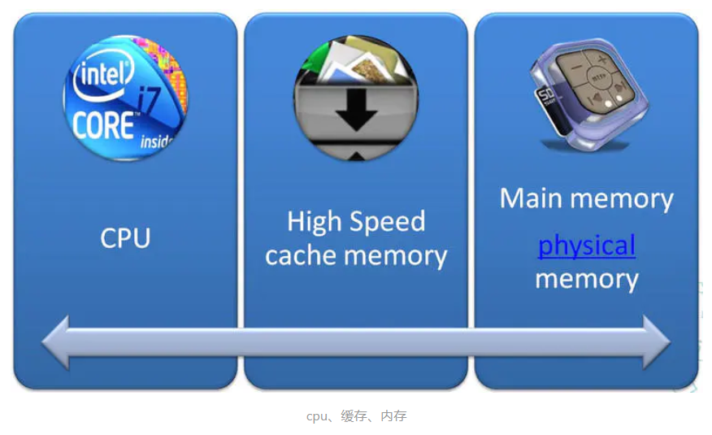
{: id="20201220214147-pzrme7r"}

cpu上加入了高速缓存这样做解决了处理器和内存的矛盾(一快一慢)，但是引来的新的问题
{: id="20201220214147-0e78u7e"}

**缓存一致性**
{: id="20201220214147-2wnmvfy"}

在多核cpu中，每个处理器都有各自的高速缓存(L1,L2,L3)，而主内存确只有一个 。
{: id="20201220214147-pomxwd5"}

以我的pc为例,因为cpu成本高，缓存区一般也很小。
{: id="20201220214147-94c6k0x"}

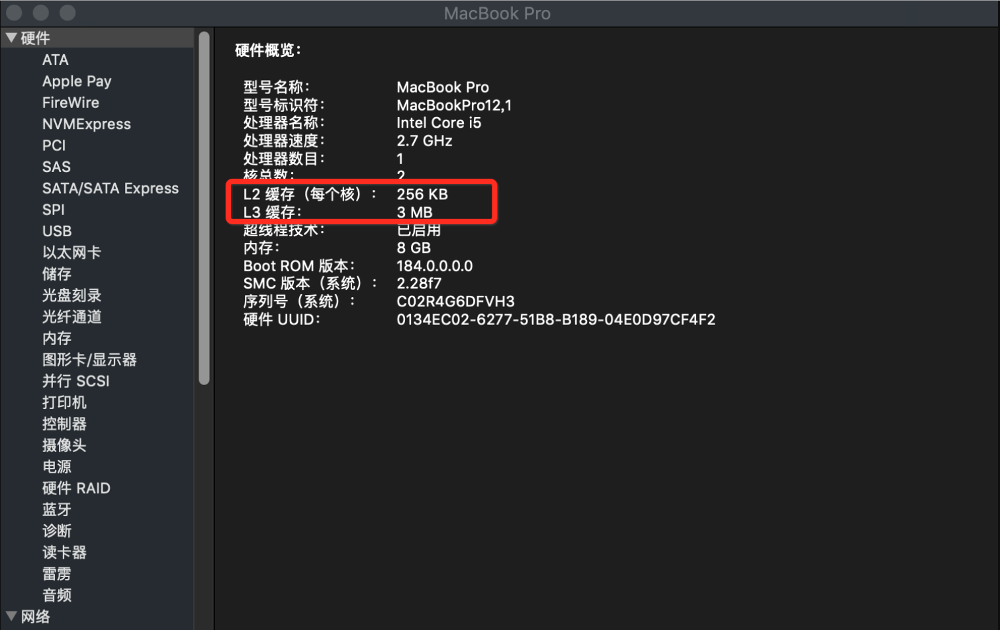
{: id="20201220214147-fdsk35f"}

```
CPU要读取一个数据时，首先从一级缓存中查找，如果没有找到再从二级缓存中查找，如果还是没有就从三级缓存或内存中查找，每个cpu有且只有一套自己的缓存。
```
{: id="20201220214147-s4jkcpv"}

> 如何保证多个处理器运算涉及到同一个内存区域时，多线程场景下会存在缓存一致性问题，那么运行时保证数据一致性？
> {: id="20201220214147-yilo3so"}
>
> 为了解决这个问题，各个处理器需遵循一些协议保证一致性。【如MSI，MESI啥啥的协议。。】
> {: id="20201220214147-75jt1f4"}
{: id="20201220214147-by3ah8p"}

大概如下
{: id="20201220214147-is2glhr"}

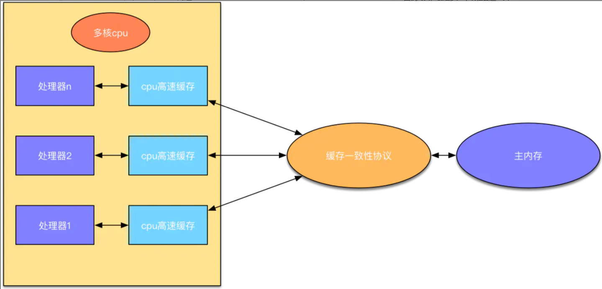
{: id="20201220214147-divm86i"}

|-cpu与内存-|
{: id="20201220214147-3l1rp3k"}

在CPU层面，内存屏障提供了个充分必要条件
{: id="20201220214147-u9lbyxl"}

### 1.1.1 内存屏障(Memory Barrier)
{: id="20201220214147-g498kj1"}

CPU中，每个CPU又有多级缓存【上图统一定义为高速缓存】，一般分为L1,L2,L3，因为这些缓存的出现，提高了数据访问性能，避免每次都向内存索取，但是弊端也很明显，不能实时的和内存发生信息交换，分**在不同CPU执行的不同线程对同一个变量的缓存值不同。**
{: id="20201220214147-yc3loie"}

- {: id="20201220214147-npns89a"}硬件层的内存屏障分为两种：`Load Barrier` 和 `Store Barrier`即读屏障和写屏障。【内存屏障是硬件层的】
{: id="20201220214147-nryes8q"}

##### 为什么需要内存屏障
{: id="20201220214147-4w0x67a"}

```
由于现代操作系统都是多处理器操作系统，每个处理器都会有自己的缓存，可能存再不同处理器缓存不一致的问题，而且由于操作系统可能存在重排序，导致读取到错误的数据，因此，操作系统提供了一些内存屏障以解决这种问题.
简单来说:1.在不同CPU执行的不同线程对同一个变量的缓存值不同，为了解决这个问题。
2.用volatile可以解决上面的问题，不同硬件对内存屏障的实现方式不一样。java屏蔽掉这些差异，通过jvm生成内存屏障的指令。
对于读屏障:在指令前插入读屏障，可以让高速缓存中的数据失效，强制从主内存取。
```
{: id="20201220214147-apai3m6"}

##### 内存屏障的作用
{: id="20201220214147-xk4731r"}

```
cpu执行指令可能是无序的，它有两个比较重要的作用
1.阻止屏障两侧指令重排序
2.强制把写缓冲区/高速缓存中的脏数据等写回主内存，让缓存中相应的数据失效。
```
{: id="20201220214147-hfuc6o8"}

#### volatile型变量
{: id="20201220214147-yk54zm3"}

当我们声明某个变量为volatile修饰时，这个变量就有了线程可见性，volatile通过在读写操作前后添加内存屏障。
{: id="20201220214147-n24gx3u"}

用代码可以这么理解
{: id="20201220214147-wt0ta9w"}

```
//相当于读写时加锁，保证及时可见性，并发时不被随意修改。publicclassSynchronizedInteger{privatelong value;publicsynchronizedintget(){return value;}publicsynchronizedvoidset(long value){this.value = value;}}
```
{: id="20201220214147-kwwdfrm"}

volatile型变量拥有如下特性
{: id="20201220214147-vbnklk8"}

```
可见性，对于一个该变量的读，一定能看到读之前最后的写入。
防止指令重排序，执行代码时,为了提高执行效率,会在不影响最后结果的前提下对指令进行重新排序,使用volatile可以防止，比如单例模式双重校验锁的创建中有使用到，如(https://www.jianshu.com/p/b30a4d568be4)

注意的是volatile不具有原子性，如volatile++这样的复合操作,这里感谢大家的指正。
```
{: id="20201220214147-hsblcgj"}

至于volatile底层是怎么实现保证不同线程可见性的，这里涉及到的就是硬件上的，被volatile修饰的变量在进行写操作时，会生成一个特殊的汇编指令，该指令会触发mesi协议，会存在一个总线嗅探机制的东西，简单来说就是这个cpu会不停检测总线中该变量的变化，如果该变量一旦变化了，由于这个嗅探机制，其它cpu会立马将该变量的cpu缓存数据清空掉，重新的去从主内存拿到这个数据。简单画了个图。
{: id="20201220214147-422wtnu"}

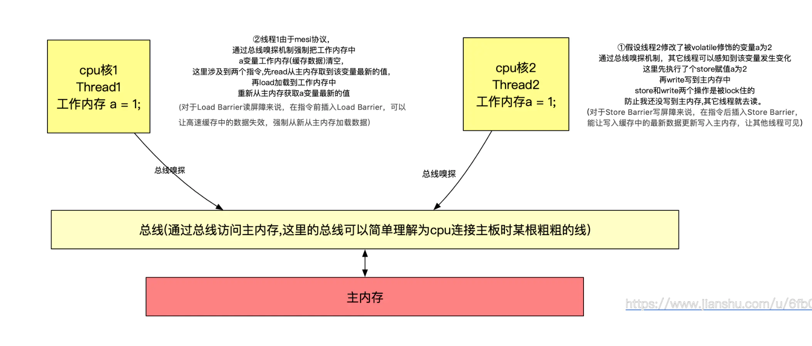
{: id="20201220214147-pyhclll"}

## 2. Java内存区域
{: id="20201220214147-75btn1p"}

> 前提:本文讲的基本都是以Sun HotSpot虚拟机为基础的，Oracle收购了Sun后目前得到了两个【Sun的HotSpot和JRockit(以后可能合并这两个),还有一个是IBM的IBMJVM】
> {: id="20201220214147-fm7byc9"}
{: id="20201220214147-eni73ft"}

之所以扯了那么多计算机内存模型，是因为java内存模型的设定符合了计算机的规范。
{: id="20201220214147-r0dlvzu"}

**Java程序内存的分配是在JVM虚拟机内存分配机制下完成**。
{: id="20201220214147-n0h73po"}

**Java内存模型（Java Memory Model ,JMM）就是一种符合内存模型规范的，屏蔽了各种硬件和操作系统的访问差异的，保证了Java程序在各种平台下对内存的访问都能保证效果一致的机制及规范。**
{: id="20201220214147-dvzcow2"}

> 简要言之，jmm是jvm的一种规范，定义了jvm的内存模型。它屏蔽了各种硬件和操作系统的访问差异，不像c那样直接访问硬件内存，相对安全很多，它的主要目的是解决由于多线程通过共享内存进行通信时，存在的本地内存数据不一致、编译器会对代码指令重排序、处理器会对代码乱序执行等带来的问题。可以保证并发编程场景中的原子性、可见性和有序性。
> {: id="20201220214147-2io7suq"}
{: id="20201220214147-fufs49c"}

从下面这张图可以看出来，Java数据区域分为五大数据区域。这些区域各有各的用途，创建及销毁时间。
{: id="20201220214147-bsxlsk4"}

```
其中方法区和堆是所有线程共享的，栈，本地方法栈和程序虚拟机则为线程私有的。
```
{: id="20201220214147-su1ghel"}

根据java虚拟机规范，java虚拟机管理的内存将分为下面五大区域。
{: id="20201220214147-gwb89aa"}

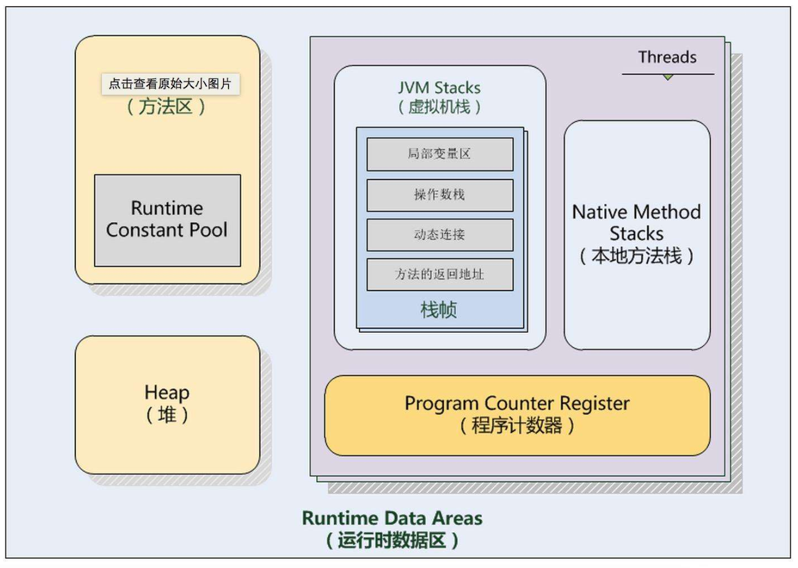
{: id="20201220214147-eq9cqqt"}

|-jmm-|
{: id="20201220214147-f0sxrpv"}

### 2.1 五大内存区域
{: id="20201220214147-v8wrazf"}

#### 2.1.1 程序计数器
{: id="20201220214147-ma35q0o"}

```
程序计数器是一块很小的内存空间，它是线程私有的，可以认作为当前线程的行号指示器。
```
{: id="20201220214147-64p6p9n"}

**为什么需要程序计数器**
{: id="20201220214147-ioc5pss"}

> 我们知道对于一个处理器(如果是多核cpu那就是一核)，在一个确定的时刻都只会执行一条线程中的指令，一条线程中有多个指令，为了线程切换可以恢复到正确执行位置，每个线程都需有独立的一个程序计数器，不同线程之间的程序计数器互不影响，独立存储。
> {: id="20201220214147-ocy9qcl"}
>
> 注意：如果线程执行的是个java方法，那么计数器记录虚拟机字节码指令的地址。如果为native【底层方法】，那么计数器为空。**这块内存区域是虚拟机规范中唯一没有OutOfMemoryError的区域**。
> {: id="20201220214147-hgbprnj"}
{: id="20201220214147-botqoy0"}

#### 2.1.2 Java栈（虚拟机栈）
{: id="20201220214147-626flru"}

同计数器也为线程私有，生命周期与相同，就是我们平时说的栈，**栈描述的是Java方法执行的内存模型**。
{: id="20201220214147-q5zt3it"}

**每个方法被执行的时候都会创建一个栈帧用于存储局部变量表，操作栈，动态链接，方法出口等信息。每一个方法被调用的过程就对应一个栈帧在虚拟机栈中从入栈到出栈的过程。【栈先进后出，下图栈1先进最后出来】**
{: id="20201220214147-st1ruth"}

对于栈帧的解释参考 [Java虚拟机运行时栈帧结构](https://links.jianshu.com/go?to=https%3A%2F%2Fwww.cnblogs.com%2FnoKing%2Fp%2F8167700.html)
{: id="20201220214147-oulr4ca"}

```
栈帧: 是用来存储数据和部分过程结果的数据结构。
栈帧的位置:  内存 -> 运行时数据区 -> 某个线程对应的虚拟机栈 -> here[在这里]
栈帧大小确定时间: 编译期确定，不受运行期数据影响。
```
{: id="20201220214147-i5wzwsk"}

通常有人将java内存区分为栈和堆，实际上java内存比这复杂，这么区分可能是因为我们最关注，与对象内存分配关系最密切的是这两个。
{: id="20201220214147-5vh487y"}

**平时说的栈一般指局部变量表部分。**
{: id="20201220214147-d3a75re"}

> 局部变量表:一片连续的内存空间，用来存放方法参数，以及方法内定义的局部变量，存放着编译期间已知的数据类型(八大基本类型和对象引用(reference类型),returnAddress类型。它的最小的局部变量表空间单位为Slot，虚拟机没有指明Slot的大小，但在jvm中，long和double类型数据明确规定为64位，这两个类型占2个Slot，其它基本类型固定占用1个Slot。
> {: id="20201220214147-yzrfscm"}
>
> reference类型:与基本类型不同的是它不等同本身，即使是String，内部也是char数组组成，它可能是指向一个对象起始位置指针，也可能指向一个代表对象的句柄或其他与该对象有关的位置。
> {: id="20201220214147-h6np7pi"}
>
> returnAddress类型:指向一条字节码指令的地址【深入理解Java虚拟机】[怎么理解returnAddress](https://links.jianshu.com/go?to=https%3A%2F%2Fwww.zhihu.com%2Fquestion%2F29056872)
> {: id="20201220214147-rlg39nx"}
{: id="20201220214147-tecs71v"}

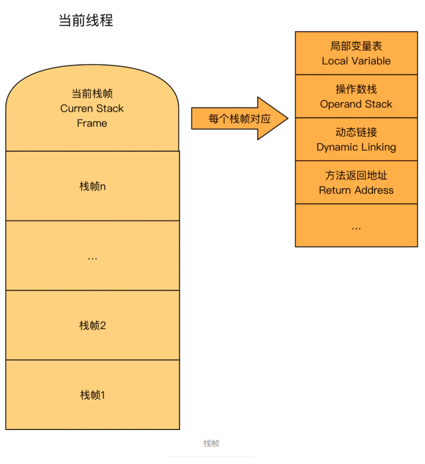
{: id="20201220214147-l6nmj1j"}

**需要注意的是，局部变量表所需要的内存空间在编译期完成分配，当进入一个方法时，这个方法在栈中需要分配多大的局部变量空间是完全确定的，在方法运行期间不会改变局部变量表大小。**
{: id="20201220214147-1otkpl8"}

> Java虚拟机栈可能出现两种类型的异常：
> {: id="20201220214147-4ixhoxh"}
>
> 1. {: id="20201220214147-fbiqg7g"}线程请求的栈深度大于虚拟机允许的栈深度，将抛出StackOverflowError。
> 2. {: id="20201220214147-nwiywez"}虚拟机栈空间可以动态扩展，当动态扩展是无法申请到足够的空间时，抛出OutOfMemory异常。
> {: id="20201220214147-x4nplyi"}
{: id="20201220214147-py910ps"}

#### 2.1.3 本地方法栈
{: id="20201220214147-h0oyybt"}

本地方法栈是与虚拟机栈发挥的作用十分相似,区别是虚拟机栈执行的是Java方法(也就是字节码)服务，而本地方法栈则为虚拟机使用到的native方法服务，可能底层调用的c或者c++,我们打开jdk安装目录可以看到也有很多用c编写的文件，可能就是native方法所调用的c代码。
{: id="20201220214147-sgpt9i2"}

#### 2.1.4 堆
{: id="20201220214147-kpu806y"}

对于大多数应用来说，**堆是java虚拟机管理内存最大的一块内存区域，因为堆存放的对象是线程共享的，所以多线程的时候也需要同步机制**。因此需要重点了解下。
{: id="20201220214147-7s4mb6x"}

java虚拟机规范对这块的描述是:所有对象实例及数组都要在堆上分配内存，但随着JIT编译器的发展和逃逸分析技术的成熟，这个说法也不是那么绝对，但是大多数情况都是这样的。
{: id="20201220214147-0upp5rc"}

> 即时编译器:可以把把Java的字节码，包括需要被解释的指令的程序）转换成可以直接发送给处理器的指令的程序)
> {: id="20201220214147-4gqdt9b"}
>
> 逃逸分析:通过逃逸分析来决定某些实例或者变量是否要在堆中进行分配，如果开启了逃逸分析，即可将这些变量直接在栈上进行分配，而非堆上进行分配。这些变量的指针可以被全局所引用，或者其其它线程所引用。
> {: id="20201220214147-jy1lj5r"}
>
> [参考逃逸分析](https://www.jianshu.com/p/20bd2e9b1f03)
> {: id="20201220214147-aht0s17"}
{: id="20201220214147-4xsy09k"}

> 注意:它是所有线程共享的，它的目的是存放对象实例。同时它也是GC所管理的主要区域，因此常被称为GC堆，又由于现在收集器常使用分代算法，Java堆中还可以细分为新生代和老年代，再细致点还有Eden(伊甸园)空间之类的不做深究。
> {: id="20201220214147-upes8b8"}
>
> 根据虚拟机规范，Java堆可以存在物理上不连续的内存空间，就像磁盘空间只要逻辑是连续的即可。它的内存大小可以设为固定大小，也可以扩展。
> {: id="20201220214147-xi871xu"}
>
> 当前主流的虚拟机如HotPot都能按扩展实现(通过设置 -Xmx和-Xms)，如果堆中没有内存内存完成实例分配，而且堆无法扩展将报OOM错误(OutOfMemoryError)
> {: id="20201220214147-3l52712"}
{: id="20201220214147-i4dnl6k"}

#### 2.1.5 方法区
{: id="20201220214147-hcznasp"}

方法区同堆一样，是所有线程共享的内存区域，为了区分堆，又被称为非堆。
{: id="20201220214147-fstppx1"}

用于存储已被虚拟机加载的类信息、常量、静态变量，如static修饰的变量加载类的时候就被加载到方法区中。
{: id="20201220214147-1m82boc"}

> 运行时常量池
> {: id="20201220214147-vzoo3sr"}
>
> 是方法区的一部分，class文件除了有类的字段、接口、方法等描述信息之外，还有常量池用于存放编译期间生成的各种字面量和符号引用。
> {: id="20201220214147-p7r7kd5"}
{: id="20201220214147-n4rpmcc"}

在老版jdk，方法区也被称为永久代【因为没有强制要求方法区必须实现垃圾回收，HotSpot虚拟机以永久代来实现方法区，从而JVM的垃圾收集器可以像管理堆区一样管理这部分区域，从而不需要专门为这部分设计垃圾回收机制。不过自从JDK7之后，Hotspot虚拟机便将运行时常量池从永久代移除了。】
{: id="20201220214147-5426oiq"}

```
jdk1.7开始逐步去永久代。从String.interns()方法可以看出来
String.interns()native方法:作用是如果字符串常量池已经包含一个等于这个String对象的字符串，则返回代表池中的这个字符串的String对象，在jdk1.6及以前常量池分配在永久代中。可通过 -XX:PermSize和-XX:MaxPermSize限制方法区大小。


publicclassStringIntern{//运行如下代码探究运行时常量池的位置publicstaticvoidmain(String[] args)throwsThrowable{//用list保持着引用 防止full gc回收常量池List<String> list =newArrayList<String>();int i =0;while(true){
            list.add(String.valueOf(i++).intern());}}}//如果在jdk1.6环境下运行 同时限制方法区大小 将报OOM后面跟着PermGen space说明方法区OOM，即常量池在永久代//如果是jdk1.7或1.8环境下运行 同时限制堆的大小  将报heap space 即常量池在堆中
```
{: id="20201220214147-fev3wf5"}

[idea设置相关内存大小设置](https://links.jianshu.com/go?to=https%3A%2F%2Fwww.cnblogs.com%2Fyingsong%2Fp%2F5896207.html)
{: id="20201220214147-zerkam8"}

这边不用全局的方式，设置main方法的vm参数。
{: id="20201220214147-is1xzx4"}

做相关设置，比如说这边设定堆大小。（-Xmx5m -Xms5m -XX:-UseGCOverheadLimit）
{: id="20201220214147-apbiifl"}

```
这边如果不设置UseGCOverheadLimit将报java.lang.OutOfMemoryError: GC overhead limit exceeded，
这个错是因为GC占用了多余98%（默认值）的CPU时间却只回收了少于2%（默认值）的堆空间。目的是为了让应用终止，给开发者机会去诊断问题。一般是应用程序在有限的内存上创建了大量的临时对象或者弱引用对象，从而导致该异常。虽然加大内存可以暂时解决这个问题，但是还是强烈建议去优化代码，后者更加有效，也可通过UseGCOverheadLimit避免[不推荐，这里是因为测试用，并不能解决根本问题]
```
{: id="20201220214147-mlv3qul"}


{: id="20201220214147-7gzex9o"}

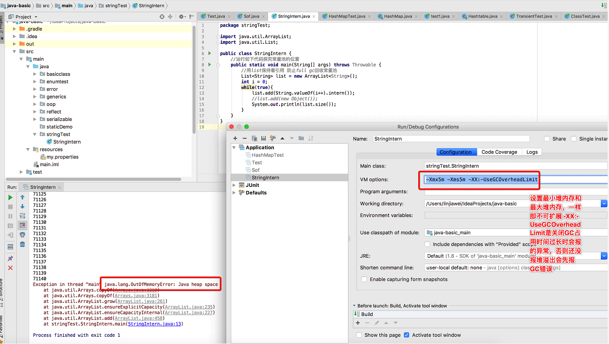
{: id="20201220214147-fv4inv7"}

**jdk8真正开始废弃永久代，而使用元空间(Metaspace)**
{: id="20201220214147-pi36k5a"}

> java虚拟机对方法区比较宽松，除了跟堆一样可以不存在连续的内存空间，定义空间和可扩展空间，还可以选择不实现垃圾收集。
> {: id="20201220214147-652mqva"}
{: id="20201220214147-2xkdhpt"}

#### 2.2 对象的内存布局
{: id="20201220214147-iylmvzu"}

在HotSpot虚拟机中。对象在内存中存储的布局分为
{: id="20201220214147-iicwznc"}

```
1.对象头
2.实例数据
3.对齐填充
```
{: id="20201220214147-cncpbod"}

##### 2.2.1 对象头【markword】
{: id="20201220214147-1m39w9b"}

在32位系统下，对象头8字节，64位则是16个字节【未开启压缩指针，开启后12字节】。
{: id="20201220214147-j93ak2a"}

```
markword很像网络协议报文头，划分为多个区间，并且会根据对象的状态复用自己的存储空间。
为什么这么做:省空间，对象需要存储的数据很多，32bit/64bit是不够的，它被设计成非固定的数据结构以便在极小的空间存储更多的信息，


假设当前为32bit，在对象未被锁定情况下。25bit为存储对象的哈希码、4bit用于存储分代年龄，2bit用于存储锁标志位，1bit固定为0。
```
{: id="20201220214147-smgw4rw"}

不同状态下存放数据
{: id="20201220214147-rmlo184"}


{: id="20201220214147-6zeognw"}

这其中锁标识位需要特别关注下。**锁标志位与是否为偏向锁对应到唯一的锁状态**。
{: id="20201220214147-n5cqt1a"}

锁的状态分为四种`无锁状态`、`偏向锁`、`轻量级锁`和`重量级锁`
{: id="20201220214147-sdypgjy"}

不同状态时对象头的区间含义，如图所示。
{: id="20201220214147-di1o8nt"}


{: id="20201220214147-f0klak6"}

|-对象头-|
{: id="20201220214147-2e8vw9x"}

HotSpot底层通过markOop实现Mark Word，具体实现位于`markOop.hpp`文件。
{: id="20201220214147-re5ps1f"}

```
markOop中提供了大量方法用于查看当前对象头的状态，以及更新对象头的数据，为synchronized锁的实现提供了基础。[比如说我们知道synchronized锁的是对象而不是代码，而锁的状态保存在对象头中，进而实现锁住对象]。
```
{: id="20201220214147-6hygdul"}

关于对象头和锁之间的转换，网上大神总结
{: id="20201220214147-x7i38ga"}

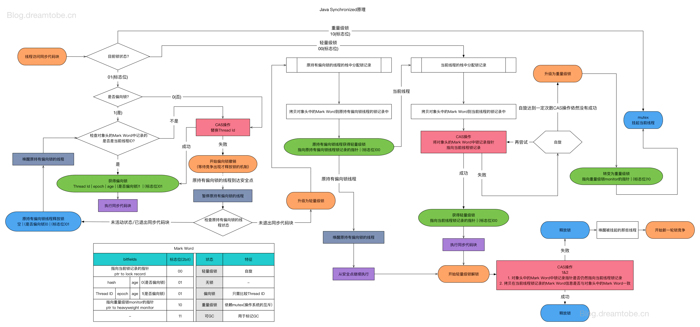
{: id="20201220214147-kpj88f0"}

|-偏向锁轻量级锁重量级锁-|
{: id="20201220214147-ijtetxv"}

##### 2.2.2 实例数据
{: id="20201220214147-q6pyxkv"}

```
存放对象程序中各种类型的字段类型，不管是从父类中继承下来的还是在子类中定义的。
分配策略:相同宽度的字段总是放在一起，比如double和long
```
{: id="20201220214147-cos04f2"}

##### 2.2.3 对齐填充
{: id="20201220214147-mwhtl37"}

这部分没有特殊的含义，仅仅起到占位符的作用满足JVM要求。
{: id="20201220214147-gn956is"}

```
由于HotSpot规定对象的大小必须是8的整数倍，对象头刚好是整数倍，如果实例数据不是的话，就需要占位符对齐填充。
```
{: id="20201220214147-0n0dv5f"}

#### 2.3 对象的访问定位
{: id="20201220214147-26m5j12"}

java程序需要通过引用(ref)数据来操作堆上面的对象，那么如何通过引用定位、访问到对象的具体位置。
{: id="20201220214147-7o35k9c"}

```
对象的访问方式由虚拟机决定，java虚拟机提供两种主流的方式
1.句柄访问对象
2.直接指针访问对象。(Sun HotSpot使用这种方式)
```
{: id="20201220214147-tnmp5kl"}

参考[Java对象访问定位](https://links.jianshu.com/go?to=https%3A%2F%2Fblog.csdn.net%2Fu011080472%2Farticle%2Fdetails%2F51321769)
{: id="20201220214147-aw7ok9p"}

##### 2.3.1 句柄访问
{: id="20201220214147-tipivcq"}

> 简单来说就是java堆划出一块内存作为句柄池,引用中存储对象的句柄地址,句柄中包含对象实例数据、类型数据的地址信息。
> {: id="20201220214147-wsa3d0m"}
>
> ##### 优点:引用中存储的是稳定的句柄地址,在对象被移动【垃圾收集时移动对象是常态】只需改变句柄中实例数据的指针，不需要改动引用【ref】本身。
> {: id="20201220214147-zwo1tre"}
{: id="20201220214147-daaqfos"}

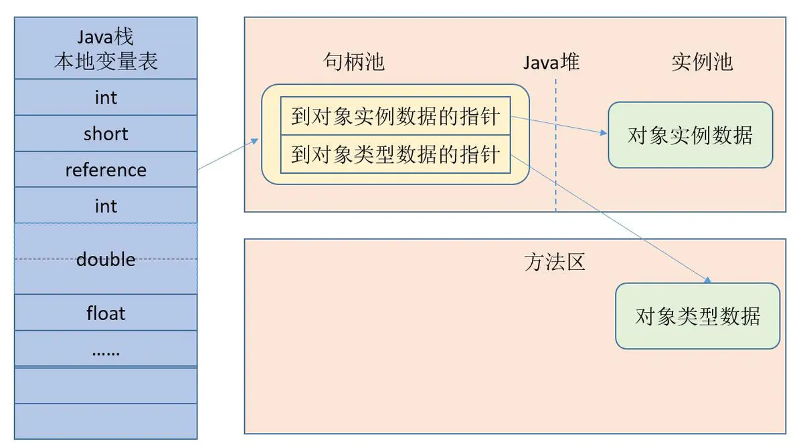
{: id="20201220214147-1wjtlj2"}

|-访问方式2-|
{: id="20201220214147-xnb83r1"}

##### 2.3.2 直接指针
{: id="20201220214147-gwrt5rg"}

> 与句柄访问不同的是，ref中直接存储的就是对象的实例数据,但是类型数据跟句柄访问方式一样。
> {: id="20201220214147-y6jh6dl"}
>
> 优点:优势很明显，就是速度快，**相比于句柄访问少了一次指针定位的开销时间**。【可能是出于Java中对象的访问时十分频繁的,平时我们常用的JVM HotSpot采用此种方式】
> {: id="20201220214147-pyyaqjs"}
{: id="20201220214147-2svdax3"}

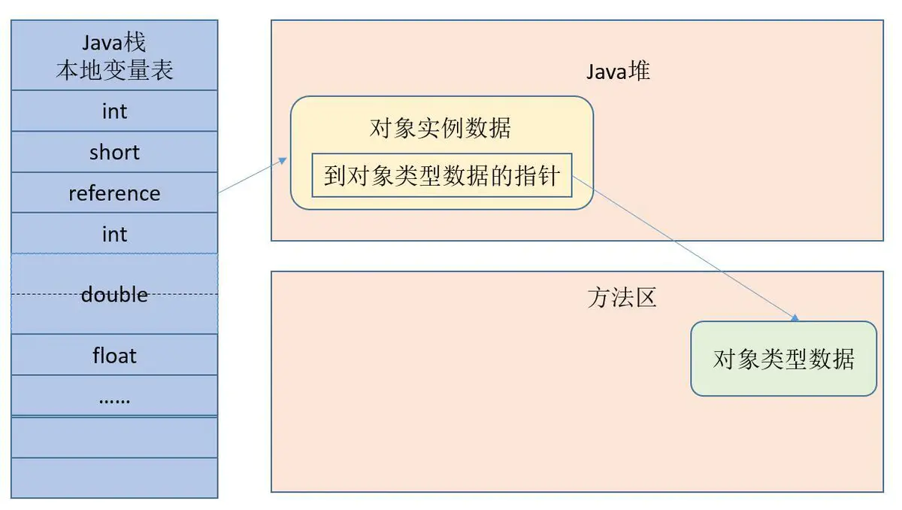
{: id="20201220214147-qw0f9x0"}

|-访问方式1-|
{: id="20201220214147-71kfzr2"}

## 3.内存溢出
{: id="20201220214147-e3djffp"}

```
两种内存溢出异常[注意内存溢出是error级别的]
1.StackOverFlowError:当请求的栈深度大于虚拟机所允许的最大深度
2.OutOfMemoryError:虚拟机在扩展栈时无法申请到足够的内存空间[一般都能设置扩大]
```
{: id="20201220214147-n2llz6w"}

java -verbose:class -version 可以查看刚开始加载的类，可以发现这两个类并不是异常出现的时候才去加载，而是jvm启动的时候就已经加载。这么做的原因是在vm启动过程中我们把类加载起来，并创建几个没有堆栈的对象缓存起来，只需要设置下不同的提示信息即可，当需要抛出特定类型的OutOfMemoryError异常的时候，就直接拿出缓存里的这几个对象就可以了。
{: id="20201220214147-35dpzje"}

比如说OutOfMemoryError对象，jvm预留出4个对象【固定常量】，这就为什么最多出现4次有堆栈的OutOfMemoryError异常及大部分情况下都将看到没有堆栈的OutOfMemoryError对象的原因。
{: id="20201220214147-t3ecxhn"}

[参考OutOfMemoryError解读](https://links.jianshu.com/go?to=http%3A%2F%2Flovestblog.cn%2Fblog%2F2016%2F08%2F29%2Foom%2F)
{: id="20201220214147-6zq8veb"}

Snip20180904_8.png
{: id="20201220214147-gxuttvq"}

两个基本的例子
{: id="20201220214147-rjxmmrp"}

```
publicclassMemErrorTest{publicstaticvoidmain(String[] args){try{List<Object> list =newArrayList<Object>();for(;;){
                list.add(newObject());//创建对象速度可能高于jvm回收速度}}catch(OutOfMemoryError e){
            e.printStackTrace();}try{hi();//递归造成StackOverflowError 这边因为每运行一个方法将创建一个栈帧，栈帧创建太多无法继续申请到内存扩展}catch(StackOverflowError e){
            e.printStackTrace();}}publicstaticvoidhi(){hi();}}
```
{: id="20201220214147-8xrvib1"}

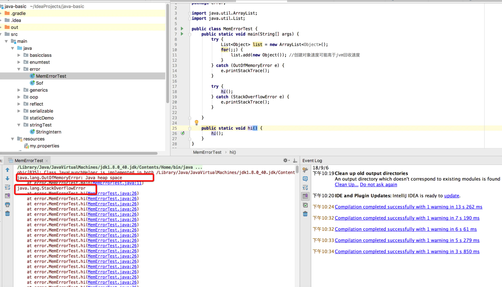
{: id="20201220214147-4qasmom"}

## 4.GC简介
{: id="20201220214147-5tbl40p"}

> GC(Garbage Collection)：即垃圾回收器，诞生于1960年MIT的Lisp语言，主要是用来回收，释放垃圾占用的空间。
> {: id="20201220214147-ts9skrk"}
{: id="20201220214147-zs1ibfp"}

---

java GC泛指java的垃圾回收机制，该机制是java与C/C++的主要区别之一，我们在日常写java代码的时候，一般都不需要编写内存回收或者垃圾清理的代码，也不需要像C/C++那样做类似delete/free的操作。
{: id="20201220214147-15nmvpl"}

## 4.1.为什么需要学习GC
{: id="20201220214147-76vkrwn"}

> 对象的内存分配在java虚拟机的自动内存分配机制下，一般不容易出现内存泄漏问题。但是写代码难免会遇到一些特殊情况，比如OOM神马的。。尽管虚拟机内存的动态分配与内存回收技术很成熟，可万一出现了这样那样的内存溢出问题，那么将难以定位错误的原因所在。
> {: id="20201220214147-qm9sg1c"}
{: id="20201220214147-t4ck1yf"}

对于本人来说，由于水平有限，而且作为小开发，并没必要深入到GC的底层实现，但至少想要说学会看懂gc及定位一些内存泄漏问题。
{: id="20201220214147-86p5fs3"}

从三个角度切入来学习GC
{: id="20201220214147-r7gjjl1"}

> 1.哪些内存要回收
> {: id="20201220214147-r8spd6h"}
>
> 2.什么时候回收
> {: id="20201220214147-7u85p06"}
>
> 3.怎么回收
> {: id="20201220214147-qfbia9d"}
{: id="20201220214147-lvt0w21"}

哪些内存要回收
{: id="20201220214147-gjvvyfj"}

> java内存模型中分为五大区域已经有所了解。我们知道`程序计数器`、`虚拟机栈`、`本地方法栈`，由线程而生，随线程而灭，其中栈中的栈帧随着方法的进入顺序的执行的入栈和出栈的操作，一个栈帧需要分配多少内存取决于具体的虚拟机实现并且在编译期间即确定下来【忽略JIT编译器做的优化，基本当成编译期间可知】，当方法或线程执行完毕后，内存就随着回收，因此无需关心。
> {: id="20201220214147-37nkmi1"}
>
> 而`Java堆`、`方法区`则不一样。方法区存放着类加载信息，但是一个接口中多个实现类需要的内存可能不太一样，一个方法中多个分支需要的内存也可能不一样【只有在运行期间才可知道这个方法创建了哪些对象没需要多少内存】，这部分内存的分配和回收都是动态的，gc关注的也正是这部分的内存。
> {: id="20201220214147-0zb0218"}
{: id="20201220214147-lvt4tb9"}

```
Java堆是GC回收的“重点区域”。堆中基本存放着所有对象实例，gc进行回收前，第一件事就是确认哪些对象存活，哪些死去[即不可能再被引用]
```
{: id="20201220214147-9nqwiik"}

## 4.2 堆的回收区域
{: id="20201220214147-xw1u5wl"}

```
为了高效的回收，jvm将堆分为三个区域
1.新生代（Young Generation）NewSize和MaxNewSize分别可以控制年轻代的初始大小和最大的大小
2.老年代（Old Generation）
3.永久代（Permanent Generation）【1.8以后采用元空间，就不在堆中了】
```
{: id="20201220214147-i9pses1"}

[GC为什么要分代-R大的回答](https://links.jianshu.com/go?to=https%3A%2F%2Fwww.zhihu.com%2Fquestion%2F53613423%2Fanswer%2F135743258)
{: id="20201220214147-aq27xtd"}

[关于元空间](https://links.jianshu.com/go?to=http%3A%2F%2Flovestblog.cn%2Fblog%2F2016%2F10%2F29%2Fmetaspace%2F)
{: id="20201220214147-up1s2fh"}

## 5 判断对象是否存活算法
{: id="20201220214147-6ajr04l"}

```
1.引用计数算法
早期判断对象是否存活大多都是以这种算法，这种算法判断很简单，简单来说就是给对象添加一个引用计数器，每当对象被引用一次就加1，引用失效时就减1。当为0的时候就判断对象不会再被引用。
优点:实现简单效率高，被广泛使用与如python何游戏脚本语言上。
缺点:难以解决循环引用的问题，就是假如两个对象互相引用已经不会再被其它其它引用，导致一直不会为0就无法进行回收。

2.可达性分析算法
目前主流的商用语言[如java、c#]采用的是可达性分析算法判断对象是否存活。这个算法有效解决了循环利用的弊端。
它的基本思路是通过一个称为“GC Roots”的对象为起始点，搜索所经过的路径称为引用链，当一个对象到GC Roots没有任何引用跟它连接则证明对象是不可用的。
```
{: id="20201220214147-g26bvzd"}

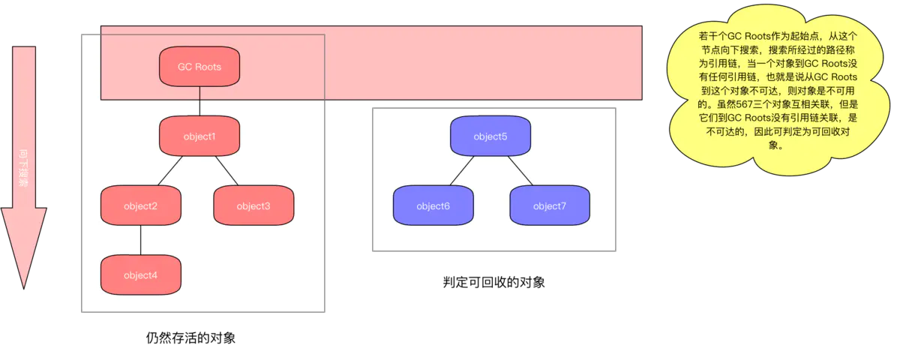
{: id="20201220214147-vp977la"}

|-gc-|
{: id="20201220214147-jonwtjs"}

可作为GC Roots的对象有四种
{: id="20201220214147-s0dz39z"}

```
①虚拟机栈(栈桢中的本地变量表)中的引用的对象，就是平时所指的java对象，存放在堆中。
②方法区中的类静态属性引用的对象，一般指被static修饰引用的对象，加载类的时候就加载到内存中。
③方法区中的常量引用的对象,
④本地方法栈中JNI（native方法)引用的对象
```
{: id="20201220214147-mc8t2v3"}

即使可达性算法中不可达的对象，也不是一定要马上被回收，还有可能被抢救一下。网上例子很多，基本上和深入理解JVM一书讲的一样[对象的生存还是死亡](https://links.jianshu.com/go?to=https%3A%2F%2Fblog.csdn.net%2Flwang_IT%2Farticle%2Fdetails%2F78650168)
{: id="20201220214147-z8v45ik"}

```
要真正宣告对象死亡需经过两个过程。
1.可达性分析后没有发现引用链
2.查看对象是否有finalize方法，如果有重写且在方法内完成自救[比如再建立引用]，还是可以抢救一下，注意这边一个类的finalize只执行一次，这就会出现一样的代码第一次自救成功第二次失败的情况。[如果类重写finalize且还没调用过，会将这个对象放到一个叫做F-Queue的序列里，这边finalize不承诺一定会执行，这么做是因为如果里面死循环的话可能会时F-Queue队列处于等待，严重会导致内存崩溃，这是我们不希望看到的。]
```
{: id="20201220214147-9am1vx6"}

[HotSpot虚拟机如何实现可达性算法](https://links.jianshu.com/go?to=https%3A%2F%2Fwww.cnblogs.com%2Fonlinemf%2Fp%2F7044953.html)
{: id="20201220214147-ctevuoo"}

## 5 垃圾收集算法
{: id="20201220214147-f5b9u7s"}

> jvm中，可达性分析算法帮我们解决了哪些对象可以回收的问题，垃圾收集算法则关心怎么回收。
> {: id="20201220214147-exux8ft"}
{: id="20201220214147-ldluqwp"}

### 5.1 三大垃圾收集算法
{: id="20201220214147-bkd89zd"}

```
1.标记/清除算法【最基础】
2.复制算法
3.标记/整理算法
jvm采用`分代收集算法`对不同区域采用不同的回收算法。
```
{: id="20201220214147-b58f6qf"}

[参考GC算法深度解析](https://links.jianshu.com/go?to=https%3A%2F%2Fwww.cnblogs.com%2Ffangfuhai%2Fp%2F7203468.html%3Futm_source%3Ditdadao%26utm_medium%3Dreferral)
{: id="20201220214147-1f7h20c"}

**新生代采用复制算法**
{: id="20201220214147-z1zb2oc"}

新生代中因为对象都是"朝生夕死的"，【深入理解JVM虚拟机上说98%的对象,不知道是不是这么多，总之就是存活率很低】，适用于复制算法【复制算法比较适合用于存活率低的内存区域】。它优化了标记/清除算法的效率和内存碎片问题，且JVM不以5:5分配内存【由于存活率低，不需要复制保留那么大的区域造成空间上的浪费，因此不需要按1:1【原有区域:保留空间】划分内存区域，而是将内存分为一块Eden空间和From Survivor、To Survivor【保留空间】，三者默认比例为8:1:1，优先使用Eden区，若Eden区满，则将对象复制到第二块内存区上。但是不能保证每次回收都只有不多于10%的对象存货，所以Survivor区不够的话，则会依赖老年代年存进行分配】。
{: id="20201220214147-x3qemdq"}

GC开始时，对象只会存于Eden和From Survivor区域，To Survivor【保留空间】为空。
{: id="20201220214147-w5xqood"}

GC进行时，Eden区所有存活的对象都被复制到To Survivor区，而From Survivor区中，仍存活的对象会根据它们的年龄值决定去向，年龄值达到年龄阈值(默认15是因为对象头中年龄战4bit，新生代每熬过一次垃圾回收，年龄+1)，则移到老年代，没有达到则复制到To Survivor。
{: id="20201220214147-2f7wuh2"}

**老年代采用`标记/清除算法`或`标记/整理算法`**
{: id="20201220214147-cor6ojd"}

由于老年代存活率高，没有额外空间给他做担保，必须使用这两种算法。
{: id="20201220214147-v4amwe1"}

### 5.2 枚举根节点算法
{: id="20201220214147-1m6t7v0"}

`GC Roots` 被虚拟机用来判断对象是否存活
{: id="20201220214147-grm13fr"}

> 可作为GC Roos的节点主要是在一些全局引用【如常量或静态属性】、执行上下文【如栈帧中本地变量表】中。那么如何在这么多全局变量和本地变量表找到【枚举】根节点将是个问题。
> {: id="20201220214147-t1cih6e"}
{: id="20201220214147-2h16reh"}

可达性分析算法需考虑
{: id="20201220214147-9nfqz35"}

1.如果方法区几百兆，一个个检查里面的引用，将耗费大量资源。
{: id="20201220214147-9qfal6p"}

2.在分析时，需保证这个对象引用关系不再变化，否则结果将不准确。【因此GC进行时需停掉其它所有java执行线程(Sun把这种行为称为‘Stop the World’)，即使是号称几乎不会停顿的CMS收集器，枚举根节点时也需停掉线程】
{: id="20201220214147-j363wco"}

解决办法:实际上当系统停下来后JVM不需要一个个检查引用，而是通过OopMap数据结构【HotSpot的叫法】来标记对象引用。
{: id="20201220214147-x58fm8q"}

虚拟机先得知哪些地方存放对象的引用，在类加载完时。HotSpot把对象内什么偏移量什么类型的数据算出来，在jit编译过程中，也会在特定位置记录下栈和寄存器哪些位置是引用，这样GC在扫描时就可以知道这些信息。【目前主流JVM使用准确式GC】
{: id="20201220214147-ogxxe6x"}

OopMap可以帮助HotSpot快速且准确完成GC Roots枚举以及确定相关信息。但是也存在一个问题，可能导致引用关系变化。
{: id="20201220214147-beu23b6"}

这个时候有个safepoint(安全点)的概念。
{: id="20201220214147-phc44en"}

HotSpot中GC不是在任意位置都可以进入，而只能在safepoint处进入。 GC时对一个Java线程来说，它要么处在safepoint,要么不在safepoint。
{: id="20201220214147-s1m729h"}

safepoint不能太少，否则GC等待的时间会很久
{: id="20201220214147-9dal9ah"}

safepoint不能太多，否则将增加运行GC的负担
{: id="20201220214147-97pjjfx"}

安全点主要存放的位置
{: id="20201220214147-s144rf0"}

```
1:循环的末尾 
2:方法临返回前/调用方法的call指令后 
3:可能抛异常的位置
```
{: id="20201220214147-00jem53"}

参考:[关于安全点safepoint](https://links.jianshu.com/go?to=https%3A%2F%2Fblog.csdn.net%2FITer_ZC%2Farticle%2Fdetails%2F41847887)
{: id="20201220214147-ipt0bgq"}

## 6.垃圾收集器
{: id="20201220214147-u0yhk6b"}

```
如果说垃圾回收算法是内存回收的方法论，那么垃圾收集器就是具体实现。jvm会结合针对不同的场景及用户的配置使用不同的收集器。


年轻代收集器
Serial、ParNew、Parallel Scavenge
老年代收集器
Serial Old、Parallel Old、CMS收集器
特殊收集器
G1收集器[新型，不在年轻、老年代范畴内]
```
{: id="20201220214147-wulmmxy"}


{: id="20201220214147-sdgjocs"}

|-收集器，连线代表可结合使用-|
{: id="20201220214147-o0j7q54"}

### 新生代收集器
{: id="20201220214147-vjj74zv"}

### 6.1 Serial
{: id="20201220214147-qf4zjsn"}

最基本、发展最久的收集器，在jdk3以前是gc收集器的唯一选择，Serial是单线程收集器，Serial收集器只能使用一条线程进行收集工作，在收集的时候必须得停掉其它线程，等待收集工作完成其它线程才可以继续工作。
{: id="20201220214147-21awyzk"}

```
虽然Serial看起来很坑，需停掉别的线程以完成自己的gc工作，但是也不是完全没用的，比如说Serial在运行在Client模式下优于其它收集器[简单高效,不过一般都是用Server模式，64bit的jvm甚至没Client模式]
```
{: id="20201220214147-zp0jo43"}

[JVM的Client模式与Server模式](https://links.jianshu.com/go?to=https%3A%2F%2Fwww.cnblogs.com%2Fwxw7blog%2Fp%2F7221756.html)
{: id="20201220214147-akpsnmt"}

优点:对于Client模式下的jvm来说是个好的选择。适用于单核CPU【现在基本都是多核了】
{: id="20201220214147-70etzwr"}

缺点:收集时要暂停其它线程，有点浪费资源，多核下显得。
{: id="20201220214147-452j3u5"}

### 6.2 ParNew收集器
{: id="20201220214147-3rusiis"}

可以认为是Serial的升级版，因为它支持多线程[GC线程]，而且收集算法、Stop The World、回收策略和Serial一样，就是可以有多个GC线程并发运行，它是HotSpot第一个真正意义实现并发的收集器。默认开启线程数和当前cpu数量相同【几核就是几个，超线程cpu的话就不清楚了 - -】，如果cpu核数很多不想用那么多，可以通过*-XX:ParallelGCThreads*来控制垃圾收集线程的数量。
{: id="20201220214147-vgqve8r"}

```
优点:1.支持多线程，多核CPU下可以充分的利用CPU资源
2.运行在Server模式下新生代首选的收集器【重点是因为新生代的这几个收集器只有它和Serial可以配合CMS收集器一起使用】

缺点: 在单核下表现不会比Serial好，由于在单核能利用多核的优势，在线程收集过程中可能会出现频繁上下文切换，导致额外的开销。
```
{: id="20201220214147-xouwjn9"}

### 6.3 Parallel Scavenge
{: id="20201220214147-1dkyy5k"}

采用复制算法的收集器，和ParNew一样支持多线程。
{: id="20201220214147-pgn71xe"}

但是该收集器重点关心的是吞吐量【吞吐量 = 代码运行时间 / (代码运行时间 + 垃圾收集时间)  如果代码运行100min垃圾收集1min，则为99%】
{: id="20201220214147-qnye82j"}

对于用户界面，适合使用GC停顿时间短,不然因为卡顿导致交互界面卡顿将很影响用户体验。
{: id="20201220214147-79wcfik"}

对于后台
{: id="20201220214147-zvjwkim"}

高吞吐量可以高效率的利用cpu尽快完成程序运算任务，适合后台运算
{: id="20201220214147-e6xsgre"}

> Parallel Scavenge注重吞吐量，所以也成为"吞吐量优先"收集器。
> {: id="20201220214147-z6xapar"}
{: id="20201220214147-fjgg827"}

### 老年代收集器
{: id="20201220214147-xl7y9hn"}

## 6.4 Serial Old
{: id="20201220214147-0rl30dh"}

和新生代的Serial一样为单线程，Serial的老年代版本，不过它采用"标记-整理算法"，这个模式主要是给Client模式下的JVM使用。
{: id="20201220214147-ptdo6s5"}

如果是Server模式有两大用途
{: id="20201220214147-bnkzohu"}

1.jdk5前和Parallel Scavenge搭配使用，jdk5前也只有这个老年代收集器可以和它搭配。
{: id="20201220214147-qmslce5"}

2.作为CMS收集器的后备。
{: id="20201220214147-riaghv7"}

## 6.5 Parallel Old
{: id="20201220214147-rbnobbm"}

支持多线程，Parallel Scavenge的老年版本，jdk6开始出现， 采用"标记-整理算法"【老年代的收集器大都采用此算法】
{: id="20201220214147-x4zdd0m"}

在jdk6以前，新生代的Parallel Scavenge只能和Serial Old配合使用【根据图，没有这个的话只剩Serial Old，而Parallel Scavenge又不能和CMS配合使用】，而且Serial Old为单线程Server模式下会拖后腿【多核cpu下无法充分利用】，这种结合并不能让应用的吞吐量最大化。
{: id="20201220214147-2tidq49"}

> Parallel Old的出现结合Parallel Scavenge，真正的形成“吞吐量优先”的收集器组合。
> {: id="20201220214147-rr3tpvg"}
{: id="20201220214147-dpc5xb1"}

### 6.6 CMS
{: id="20201220214147-sz9zl7d"}

CMS收集器(Concurrent Mark Sweep)是以一种获取最短回收停顿时间为目标的收集器。【重视响应，可以带来好的用户体验，被sun称为并发低停顿收集器】
{: id="20201220214147-p8v427u"}

```
启用CMS：-XX:+UseConcMarkSweepGC
```
{: id="20201220214147-fxzubqy"}

正如其名，CMS采用的是"标记-清除"(Mark Sweep)算法，而且是支持并发(Concurrent)的
{: id="20201220214147-c8rxyce"}

它的运作分为4个阶段
{: id="20201220214147-zvmaaio"}

```
1.初始标记:标记一下GC Roots能直接关联到的对象，速度很快
2.并发标记:GC Roots Tarcing过程，即可达性分析
3.重新标记:为了修正因并发标记期间用户程序运作而产生变动的那一部分对象的标记记录，会有些许停顿，时间上一般 初始标记 < 重新标记 < 并发标记
4.并发清除
```
{: id="20201220214147-hl97nwb"}

以上初始标记和重新标记需要stw(停掉其它运行java线程)
{: id="20201220214147-vofw4ck"}

之所以说CMS的用户体验好，是因为CMS收集器的内存回收工作是可以和用户线程一起并发执行。
{: id="20201220214147-yvp7woj"}

总体上CMS是款优秀的收集器，但是它也有些缺点。
{: id="20201220214147-r7fk3m6"}

> 1.cms堆cpu特别敏感，cms运行线程和应用程序并发执行需要多核cpu，如果cpu核数多的话可以发挥它并发执行的优势，但是cms默认配置启动的时候垃圾线程数为 (cpu数量+3)/4，它的性能很容易受cpu核数影响，当cpu的数目少的时候比如说为为2核，如果这个时候cpu运算压力比较大，还要分一半给cms运作，这可能会很大程度的影响到计算机性能。
> {: id="20201220214147-xqsyizo"}
>
> 2.cms无法处理浮动垃圾，可能导致Concurrent Mode Failure（并发模式故障）而触发full GC
> {: id="20201220214147-mhsoawp"}
>
> 3.由于cms是采用"标记-清除“算法,因此就会存在垃圾碎片的问题，为了解决这个问题cms提供了 **-XX:+UseCMSCompactAtFullCollection**选项，这个选项相当于一个开关【默认开启】，用于CMS顶不住要进行full GC时开启内存碎片合并，内存整理的过程是无法并发的，且开启这个选项会影响性能(比如停顿时间变长)
> {: id="20201220214147-am6za7j"}
{: id="20201220214147-hrcghv9"}

```
浮动垃圾:由于cms支持运行的时候用户线程也在运行，程序运行的时候会产生新的垃圾，这里产生的垃圾就是浮动垃圾，cms无法当次处理，得等下次才可以。
```
{: id="20201220214147-unl1w5z"}

### 6.7 G1收集器
{: id="20201220214147-jhtrrnp"}

G1(garbage first:尽可能多收垃圾，避免full gc)收集器是当前最为前沿的收集器之一(1.7以后才开始有)，同cms一样也是关注降低延迟，是用于替代cms功能更为强大的新型收集器，因为它解决了cms产生空间碎片等一系列缺陷。
{: id="20201220214147-zz6y7s7"}

> 摘自甲骨文:适用于 Java HotSpot VM 的低暂停、服务器风格的分代式垃圾回收器。G1 GC 使用并发和并行阶段实现其目标暂停时间，并保持良好的吞吐量。当 G1 GC 确定有必要进行垃圾回收时，它会先收集存活数据最少的区域（垃圾优先)
> {: id="20201220214147-0tghm3o"}
>
> g1的特别之处在于它强化了分区，弱化了分代的概念，是区域化、增量式的收集器，它不属于新生代也不属于老年代收集器。
> {: id="20201220214147-vu36fh5"}
>
> 用到的算法为标记-清理、复制算法
> {: id="20201220214147-bqdl26g"}
{: id="20201220214147-um9duhe"}

```
jdk1.7,1.8的都是默认关闭的，更高版本的还不知道
开启选项 -XX:+UseG1GC 
比如在tomcat的catania.sh启动参数加上
```
{: id="20201220214147-ljex3hn"}

g1是区域化的，它将java堆内存划分为若干个大小相同的区域【region】，jvm可以设置每个region的大小(1-32m,大小得看堆内存大小，必须是2的幂),它会根据当前的堆内存分配合理的region大小。
{: id="20201220214147-4gvsumt"}

> [jdk7中计算region的源码](https://links.jianshu.com/go?to=http%3A%2F%2Fhg.openjdk.java.net%2Fjdk7%2Fjdk7%2Fhotspot%2Ffile%2F9b0ca45cd756%2Fsrc%2Fshare%2Fvm%2Fgc_implementation%2Fg1%2FheapRegion.cpp),这边博主看了下也看不怎么懂，也翻了下openjdk8的看了下关于region的处理似乎不太一样。。
> {: id="20201220214147-k1hfc1k"}
{: id="20201220214147-rhamz1k"}

g1通过并发(并行)标记阶段查找老年代存活对象，通过并行复制压缩存活对象【这样可以省出连续空间供大对象使用】。
{: id="20201220214147-kg4rynh"}

g1将一组或多组区域中存活对象以增量并行的方式复制到不同区域进行压缩，从而减少堆碎片，目标是尽可能多回收堆空间【垃圾优先】，且尽可能不超出暂停目标以达到低延迟的目的。
{: id="20201220214147-v6h6z2h"}

g1提供三种垃圾回收模式 young gc、mixed gc 和 full gc,不像其它的收集器，根据区域而不是分代，新生代老年代的对象它都能回收。
{: id="20201220214147-64x24ma"}

几个重要的默认值，更多的查看官方文档[oracle官方g1中文文档](https://links.jianshu.com/go?to=http%3A%2F%2Fwww.oracle.com%2Ftechnetwork%2Fcn%2Farticles%2Fjava%2Fg1gc-1984535-zhs.html)
{: id="20201220214147-kawg9sh"}

```
g1是自适应的回收器，提供了若干个默认值，无需修改就可高效运作
-XX:G1HeapRegionSize=n  设置g1 region大小，不设置的话自己会根据堆大小算，目标是根据最小堆内存划分2048个区域
-XX:MaxGCPauseMillis=200 最大停顿时间 默认200毫秒
```
{: id="20201220214147-1zn4czz"}

## 7 Minor GC、Major GC、FULL GC、mixed gc
{: id="20201220214147-zxyj5l3"}

### 7.1 Minor GC
{: id="20201220214147-3hmvpid"}

> 在年轻代`Young space`(包括Eden区和Survivor区)中的垃圾回收称之为 Minor GC,Minor GC只会清理年轻代.
> {: id="20201220214147-67lp901"}
{: id="20201220214147-g4tdr4o"}

### 7.2 Major GC
{: id="20201220214147-ufpvl4t"}

> Major GC清理老年代(old GC)，但是通常也可以指和Full GC是等价，因为收集老年代的时候往往也会伴随着升级年轻代，收集整个Java堆。所以有人问的时候需问清楚它指的是full GC还是old GC。
> {: id="20201220214147-u1tmw1w"}
{: id="20201220214147-ox8ckt1"}

### 7.3 Full GC
{: id="20201220214147-2mliyc2"}

> full gc是对新生代、老年代、永久代【jdk1.8后没有这个概念了】统一的回收。
> {: id="20201220214147-kzxfn4o"}
>
> 【知乎R大的回答:收集整个堆，包括young gen、old gen、perm gen（如果存在的话)、元空间(1.8及以上)等所有部分的模式】
> {: id="20201220214147-zw63tr5"}
{: id="20201220214147-qo96nhy"}

### 7.4 mixed GC【g1特有】
{: id="20201220214147-7hig6m8"}

> 混合GC
> {: id="20201220214147-hojte28"}
>
> 收集整个young gen以及部分old gen的GC。只有G1有这个模式
> {: id="20201220214147-bppso60"}
{: id="20201220214147-ltp3n6v"}

## 8 查看GC日志
{: id="20201220214147-v71l4ry"}

#### 8.1 简单日志查看
{: id="20201220214147-zcj97uo"}

要看得懂并理解GC，需要看懂GC日志。
{: id="20201220214147-j4i9t4r"}

这边我在idea上试了个小例子，需要在idea配置参数(-XX:+PrintGCDetails)。
{: id="20201220214147-uip5x4x"}

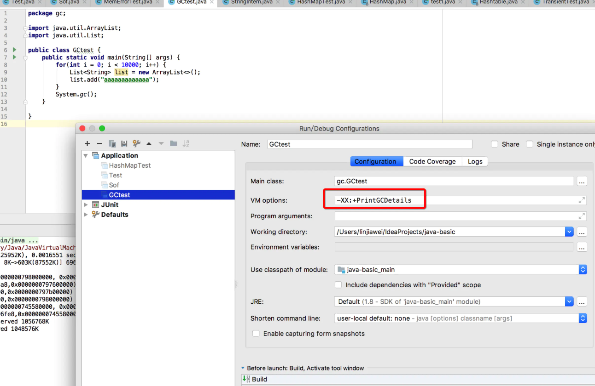
{: id="20201220214147-ap4f4vc"}

```
publicclassGCtest{publicstaticvoidmain(String[] args){for(int i =0; i <10000; i++){List<String> list =newArrayList<>();
            list.add("aaaaaaaaaaaaa");}System.gc();}}

[GC (System.gc()) [PSYoungGen: 3998K->688K(38400K)] 3998K->696K(125952K), 0.0016551 secs[本次回收时间]] [Times: user=0.01 sys=0.00, real=0.00 secs] 
[Full GC (System.gc()) [PSYoungGen: 688K->0K(38400K)] [ParOldGen: 8K->603K(87552K)] 696K->603K(125952K), [Metaspace: 3210K->3210K(1056768K)], 0.0121034 secs] [Times: user=0.01 sys=0.00, real=0.01 secs] 
Heap
 PSYoungGen[年轻代]      total 38400K, used 333K [0x0000000795580000, 0x0000000798000000, 0x00000007c0000000)
  eden space 33280K, 1% used [0x0000000795580000,0x00000007955d34a8,0x0000000797600000)
  from space 5120K, 0% used [0x0000000797600000,0x0000000797600000,0x0000000797b00000)
  to   space 5120K, 0% used [0x0000000797b00000,0x0000000797b00000,0x0000000798000000)
 ParOldGen[老年代]       total 87552K, used 603K [0x0000000740000000, 0x0000000745580000, 0x0000000795580000)
  object space 87552K, 0% used [0x0000000740000000,0x0000000740096fe8,0x0000000745580000)
 Metaspace[元空间]      used 3217K, capacity 4496K, committed 4864K, reserved 1056768K
  class space    used 352K, capacity 388K, committed 512K, reserved 1048576K
```
{: id="20201220214147-e2repym"}

#### 8.2 离线工具查看
{: id="20201220214147-ir2tyeg"}

比如sun的[gchisto](https://links.jianshu.com/go?to=https%3A%2F%2Fjava.net%2Fprojects%2Fgchisto)，[gcviewer](https://links.jianshu.com/go?to=https%3A%2F%2Fgithub.com%2Fchewiebug%2FGCViewer)离线分析工具，做个笔记先了解下还没用过，可视化好像很好用的样子。
{: id="20201220214147-kg340eq"}

### 8.3 自带的jconsole工具、jstat命令
{: id="20201220214147-ksddquf"}

终端输入jconsole就会出现jdk自带的gui监控工具
{: id="20201220214147-3ovxn7f"}

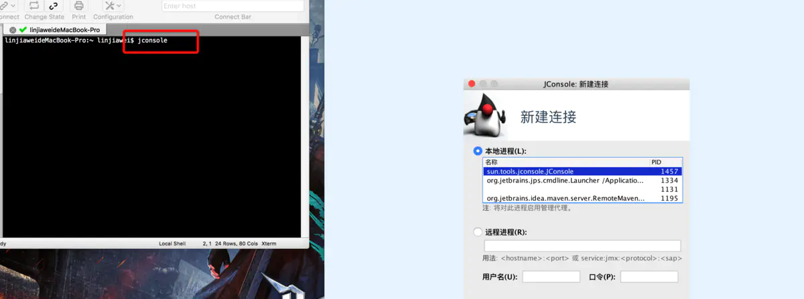
{: id="20201220214147-36xaous"}

|-jconsole-|
{: id="20201220214147-5em1jgi"}

可以根据内存使用情况间接了解内存使用和gc情况
{: id="20201220214147-m2akkif"}

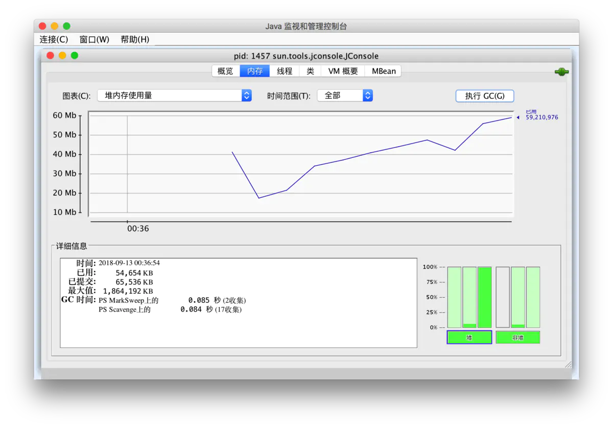
{: id="20201220214147-lrk1pje"}

|-jconsole-|
{: id="20201220214147-03or33l"}

jstat命令
{: id="20201220214147-f93ggqe"}

比如jstat -gcutil pid查看对应java进程gc情况
{: id="20201220214147-42kykbp"}


{: id="20201220214147-y6pxsiu"}

|-jstat-|
{: id="20201220214147-fjbsbya"}

```
s0: 新生代survivor space0简称 就是准备复制的那块 单位为%
s1:指新生代s1已使用百分比，为0的话说明没有存活对象到这边
e:新生代eden(伊甸园)区域(%)o:老年代(%)ygc:新生代  次数
ygct:minor gc耗时
fgct:full gc耗时(秒)GCT: ygct+fgct 耗时
```
{: id="20201220214147-ogttfxd"}

## 几个疑问
{: id="20201220214147-nfqqbvf"}

### 1.GC是怎么判断对象是被标记的
{: id="20201220214147-rm5qnow"}

通过枚举根节点的方式，通过jvm提供的一种oopMap的数据结构，简单来说就是不要再通过去遍历内存里的东西，而是通过OOPMap的数据结构去记录该记录的信息,比如说它可以不用去遍历整个栈，而是扫描栈上面引用的信息并记录下来。
{: id="20201220214147-gv0u6fc"}

总结:通过OOPMap把栈上代表引用的位置全部记录下来，避免全栈扫描，加快枚举根节点的速度，除此之外还有一个极为重要的作用，可以帮HotSpot实现准确式GC【这边的准确关键就是类型，可以根据给定位置的某块数据知道它的准确类型，HotSpot是通过oopMap外部记录下这些信息，存成映射表一样的东西】。
{: id="20201220214147-21xxs6j"}

### 2.什么时候触发GC
{: id="20201220214147-p2mfg0p"}

简单来说，触发的条件就是GC算法区域满了或将满了。
{: id="20201220214147-wfdiue6"}

```
minor GC(young GC):当年轻代中eden区分配满的时候触发[值得一提的是因为young GC后部分存活的对象会已到老年代(比如对象熬过15轮)，所以过后old gen的占用量通常会变高]

full GC:
①手动调用System.gc()方法 [增加了full GC频率，不建议使用而是让jvm自己管理内存，可以设置-XX:+ DisableExplicitGC来禁止RMI调用System.gc]
②发现perm gen（如果存在永久代的话)需分配空间但已经没有足够空间
③老年代空间不足，比如说新生代的大对象大数组晋升到老年代就可能导致老年代空间不足。
④CMS GC时出现Promotion Faield[pf]
⑤统计得到的Minor GC晋升到旧生代的平均大小大于老年代的剩余空间。
这个比较难理解，这是HotSpot为了避免由于新生代晋升到老年代导致老年代空间不足而触发的FUll GC。
比如程序第一次触发Minor GC后，有5m的对象晋升到老年代，姑且现在平均算5m，那么下次Minor GC发生时，先判断现在老年代剩余空间大小是否超过5m，如果小于5m，则HotSpot则会触发full GC(这点挺智能的)

Promotion Faield:minor GC时 survivor space放不下[满了或对象太大]，对象只能放到老年代，而老年代也放不下会导致这个错误。
Concurrent Model Failure:cms时特有的错误，因为cms时垃圾清理和用户线程可以是并发执行的，如果在清理的过程中
可能原因：
1 cms触发太晚，可以把XX:CMSInitiatingOccupancyFraction调小[比如-XX:CMSInitiatingOccupancyFraction=70 是指设定CMS在对内存占用率达到70%的时候开始GC(因为CMS会有浮动垃圾,所以一般都较早启动GC)]
2 垃圾产生速度大于清理速度，可能是晋升阈值设置过小，Survivor空间小导致跑到老年代，eden区太小，存在大对象、数组对象等情况
3.空间碎片过多，可以开启空间碎片整理并合理设置周期时间
```
{: id="20201220214147-l8s51i3"}

> full gc导致了concurrent mode failure，而不是因为concurrent mode failure错误导致触发full gc，真正触发full gc的原因可能是ygc时发生的promotion failure。
> {: id="20201220214147-41z3xop"}
{: id="20201220214147-99qdz62"}

### 3.cms收集器是否会扫描年轻代
{: id="20201220214147-rwvtoza"}

> 会，在初始标记的时候会扫描新生代。
> {: id="20201220214147-pn1zv0e"}
>
> 虽然cms是老年代收集器，但是我们知道年轻代的对象是可以晋升为老年代的，为了空间分配担保，还是有必要去扫描年轻代。
> {: id="20201220214147-3tpeg8g"}
{: id="20201220214147-hnsu9r9"}

### 4.什么是空间分配担保
{: id="20201220214147-vsoyb0o"}

在minor gc前，jvm会先检查老年代最大可用空间是否大于新生代所有对象总空间，如果是的话，则minor gc可以确保是安全的，
{: id="20201220214147-iq3m48y"}

> 如果担保失败,会检查一个配置(HandlePromotionFailire),即是否允许担保失败。
> {: id="20201220214147-j578in4"}
>
> 如果允许:继续检查老年代最大可用可用的连续空间是否大于之前晋升的平均大小，比如说剩10m，之前每次都有9m左右的新生代到老年代，那么将尝试一次minor gc(大于的情况)，这会比较冒险。
> {: id="20201220214147-iv6vsk9"}
>
> 如果不允许，而且还小于的情况，则会触发full gc。【为了避免经常full GC 该参数建议打开】
> {: id="20201220214147-5jqah9u"}
>
> 这边为什么说是冒险是因为minor gc过后如果出现大对象，由于新生代采用复制算法，survivor无法容纳将跑到老年代，所以才会去计算之前的平均值作为一种担保的条件与老年代剩余空间比较，这就是分配担保。
> {: id="20201220214147-1bkswjy"}
>
> 这种担保是动态概率的手段，但是也有可能出现之前平均都比较低，突然有一次minor gc对象变得很多远高于以往的平均值，这个时候就会导致担保失败【Handle Promotion Failure】，这就只好再失败后再触发一次FULL GC，
> {: id="20201220214147-owg37dj"}
{: id="20201220214147-y6w3r20"}

### 5.为什么复制算法要分两个Survivor，而不直接移到老年代
{: id="20201220214147-1z5a1lp"}

这样做的话效率可能会更高，但是old区一般都是熬过多次可达性分析算法过后的存活的对象，要求比较苛刻且空间有限，而不能直接移过去，这将导致一系列问题(比如老年代容易被撑爆)
{: id="20201220214147-4i5q32m"}

分两个Survivor(from/to)，自然是为了保证复制算法运行以提高效率。
{: id="20201220214147-9ewt8qb"}

### 6.各个版本的JVM使用的垃圾收集器是怎么样的
{: id="20201220214147-fczspjp"}

准确来说，垃圾收集器的使用跟当前jvm也有很大的关系，比如说g1是jdk7以后的版本才开始出现。
{: id="20201220214147-7r4amgu"}

并不是所有的垃圾收集器都是默认开启的，有些得通过设置相应的开关参数才会使用。比如说cms，需设置(XX:+UseConcMarkSweepGC)
{: id="20201220214147-24s7ljb"}

这边有几个实用的命令，比如说server模式下
{: id="20201220214147-c8el4hq"}

```
#UnlockExperimentalVMOptions UnlockDiagnosticVMOptions解锁获取jvm参数，PrintFlagsFinal用于输出xx相关参数，以Benchmark类测试，这边会有很多结果 大都看不懂- - 在这边查(usexxxxxxgc会看到jvm不同收集器的开关情况)
java -server -XX:+UnlockExperimentalVMOptions -XX:+UnlockDiagnosticVMOptions -XX:+PrintFlagsFinal Benchmark

#后面跟| grep ":"获取已赋值的参数[加:代表被赋值过]
java -server -XX:+UnlockExperimentalVMOptions -XX:+UnlockDiagnosticVMOptions -XX:+PrintFlagsFinal Benchmark| grep ":"

#获得用户自定义的设置或者jvm设置的详细的xx参数和值
java -server -XX:+PrintCommandLineFlags Benchmark
```
{: id="20201220214147-ilo059a"}

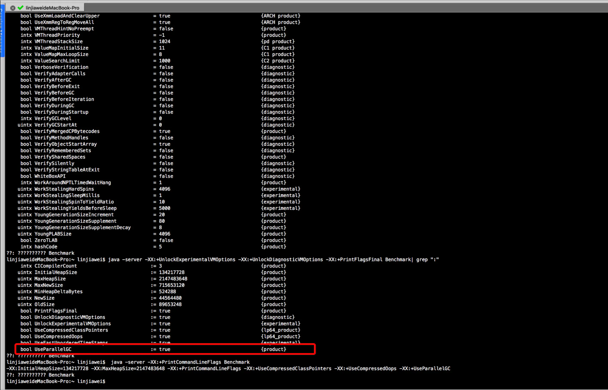
{: id="20201220214147-987tyzt"}

本人用的jdk8，这边UseParallelGC为true，参考深入理解jvm那本书说这个是Parallel Scavenge+Serial old搭配组合的开关，但是网上又说8默认是Parallel Scavenge+Parallel Old,我还是信书的吧 - -。
{: id="20201220214147-kcowsyf"}

更多相关参数[来源](https://links.jianshu.com/go?to=https%3A%2F%2Fupload-images.jianshu.io%2Fupload_images%2F4914401-4503c1ac0196db78.png)
{: id="20201220214147-rskcg6c"}

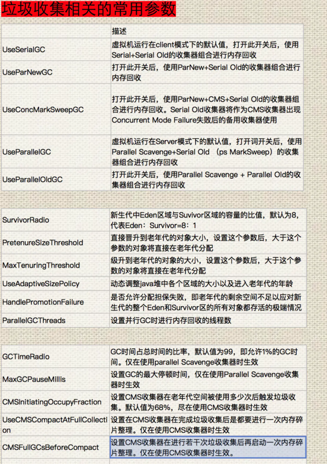
{: id="20201220214147-nd73pnu"}

|-常用参数-|
{: id="20201220214147-i7wghvt"}

> 据说更高版本的jvm默认使用g1
> {: id="20201220214147-grkvuc3"}
{: id="20201220214147-en43wqq"}

### 7 stop the world具体是什么，有没有办法避免
{: id="20201220214147-pec8y72"}

stop the world简单来说就是gc的时候，停掉除gc外的java线程。
{: id="20201220214147-zhs5q30"}

无论什么gc都难以避免停顿，即使是g1也会在初始标记阶段发生，stw并不可怕，可以尽可能的减少停顿时间。
{: id="20201220214147-0k6bdi5"}

### 8 新生代什么样的情况会晋升为老年代
{: id="20201220214147-nzbef1e"}

对象优先分配在eden区，eden区满时会触发一次minor GC
{: id="20201220214147-daxk1ph"}

> 对象晋升规则
> {: id="20201220214147-6d5ayis"}
>
> 1 长期存活的对象进入老年代，对象每熬过一次GC年龄+1(默认年龄阈值15，可配置)。
> {: id="20201220214147-9pf3tbw"}
>
> 2 对象太大新生代无法容纳则会分配到老年代
> {: id="20201220214147-ixyvuvu"}
>
> 3 eden区满了，进行minor gc后，eden和一个survivor区仍然存活的对象无法放到(to survivor区)则会通过分配担保机制放到老年代，这种情况一般是minor gc后新生代存活的对象太多。
> {: id="20201220214147-mlhdb8a"}
>
> 4 动态年龄判定，为了使内存分配更灵活，jvm不一定要求对象年龄达到MaxTenuringThreshold(15)才晋升为老年代，若survior区相同年龄对象总大小大于survior区空间的一半，则大于等于这个年龄的对象将会在minor gc时移到老年代
> {: id="20201220214147-gv959g8"}
{: id="20201220214147-armi1ws"}

### 8.怎么理解g1，适用于什么场景
{: id="20201220214147-yy3xl9l"}

> G1 GC 是区域化、并行-并发、增量式垃圾回收器，相比其他 HotSpot 垃圾回收器，可提供更多可预测的暂停。增量的特性使 G1 GC 适用于更大的堆，在最坏的情况下仍能提供不错的响应。G1 GC 的自适应特性使 JVM 命令行只需要软实时暂停时间目标的最大值以及 Java 堆大小的最大值和最小值，即可开始工作。
> {: id="20201220214147-5vnn9ip"}
{: id="20201220214147-fs01cvl"}

g1不再区分老年代、年轻代这样的内存空间，这是较以往收集器很大的差异，所有的内存空间就是一块划分为不同子区域，每个区域大小为1m-32m，最多支持的内存为64g左右，且由于它为了的特性适用于大内存机器。
{: id="20201220214147-r9gh37k"}

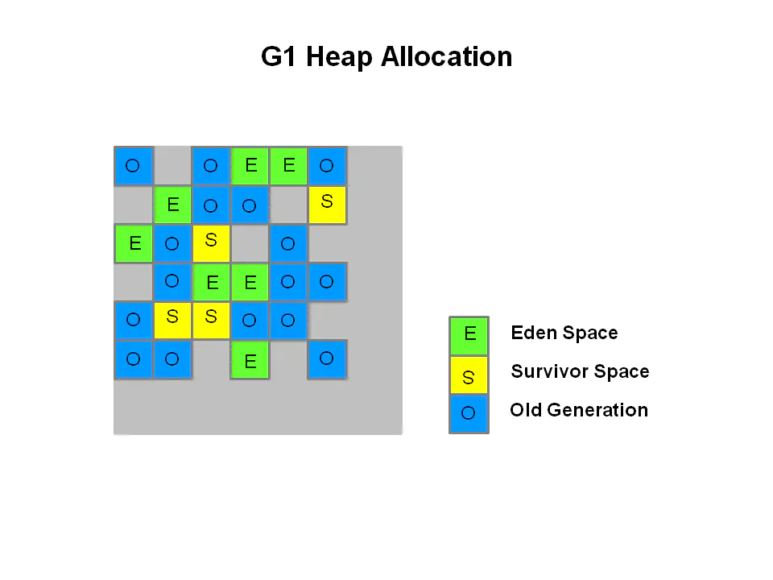
{: id="20201220214147-hnskmdj"}

|-g1回收时堆内存情况-|
{: id="20201220214147-ji095tv"}

适用场景:
{: id="20201220214147-vcjanvs"}

1.像cms能与应用程序并发执行，GC停顿短【短而且可控】，用户体验好的场景。
{: id="20201220214147-iqtylfx"}

2.面向服务端，大内存，高cpu的应用机器。【网上说差不多是6g或更大】
{: id="20201220214147-u06f98p"}

3.应用在运行过程中经常会产生大量内存碎片，需要压缩空间【比cms好的地方之一，g1具备压缩功能】。
{: id="20201220214147-dhx6bfx"}

# 参考
{: id="20201220214147-jmgu8u1"}

深入理解Java虚拟机
{: id="20201220214147-ko7kzbb"}

[JVM内存模型、指令重排、内存屏障概念解析](https://links.jianshu.com/go?to=https%3A%2F%2Fwww.cnblogs.com%2Fchenyangyao%2Fp%2F5269622.html)
{: id="20201220214147-f44lgty"}

[Java对象头](https://www.jianshu.com/p/9c19eb0ea4d8)
{: id="20201220214147-hwzi6wu"}

[GC收集器](https://links.jianshu.com/go?to=https%3A%2F%2Fwww.cnblogs.com%2Fduke2016%2Fp%2F6250766.html)
{: id="20201220214147-rnz0yro"}

[Major GC和Full GC的区别](https://links.jianshu.com/go?to=https%3A%2F%2Fwww.zhihu.com%2Fquestion%2F41922036%2Fanswer%2F93079526)
{: id="20201220214147-6ofqj4y"}

[JVM 垃圾回收 Minor gc vs Major gc vs Full gc](https://links.jianshu.com/go?to=http%3A%2F%2Fm635674608.iteye.com%2Fblog%2F2236137)
{: id="20201220214147-4yc5nb9"}

[关于准确式GC、保守式GC](https://links.jianshu.com/go?to=http%3A%2F%2Frednaxelafx.iteye.com%2Fblog%2F1044951)
{: id="20201220214147-21hm849"}

[关于CMS垃圾收集算法的一些疑惑](https://www.jianshu.com/p/55670407fdb9)
{: id="20201220214147-r4czjl7"}

[图解cms](https://www.jianshu.com/p/2a1b2f17d3e4)
{: id="20201220214147-r69hajo"}

[G1垃圾收集器介绍](https://www.jianshu.com/p/0f1f5adffdc1)
{: id="20201220214147-qxjhued"}

[详解cms回收机制](https://links.jianshu.com/go?to=http%3A%2F%2Fwww.cnblogs.com%2FlittleLord%2Fp%2F5380624.html)
{: id="20201220214147-z75dsoo"}

## 总结
{: id="20201220214147-9coqpy4"}

JMM 是一种规范，是解决由于多线程通过共享内存进行通信时，存在的本地内存数据不一致、编译器会对代码指令重排序、处理器会对代码乱序执行等带来的问题，而且写java代码的时候难免会经常和内存打交道，遇到各种内存溢出问题，有时候又难以定位问题，因此是一定要学习jmm以及GC的。
{: id="20201220214147-7n76j6s"}

由于博主本人水平有限【目前还是小菜鸡】，所以花了点时间，写下这篇博客当做为笔记总结归纳，但是写博客这种事如果全都是照抄别人的成果就很没意思了，吸收别人的成果的同时，也希望自己有能力多写点自己独特的理解和干货后续继续更新，所以如果有哪里写的不好或写错请指出，以便我继续学习和改进。
{: id="20201220214147-yz24s72"}


{: id="20201220214147-krdn9cx" type="doc"}
