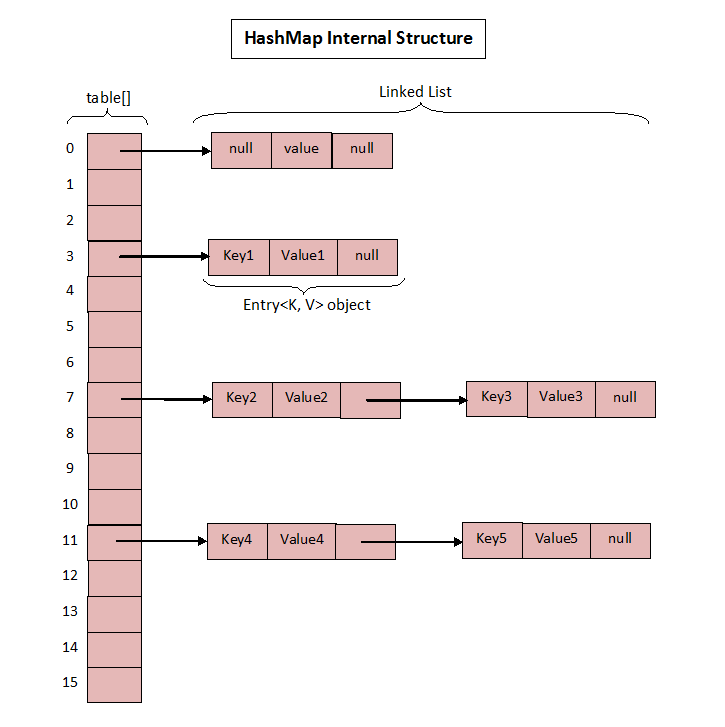

----
title: 关于 HashMap （JDK 1.7）
date: 2016-10-25
description: 

tags:
- HashMap
- Java集合
- Java

nav:
- Java

categories:
-  Java 基础

image: images/java/basic/java_logo.png

----

JDK 1.8 对 HashMap 改进很多，1.8 中已经移除了 Entry 的这种实现方式了，改用了 Node，所以存储结构也发生了很大的变化，代码也从 1k 行膨胀到了 2k 行，这次梳理的是 1.7 的 HashMap 实现。1.8 下次再详细看看。

HashMap 继承 AbstractMap，实现了 Map 接口。

#### 属性
```
static final int DEFAULT_INITIAL_CAPACITY = 1 << 4; // 默认初始化容量值，16，要求 2 的 N 次幂（计算 table index 要求），可以在构造方法指定，如果在构造函数指定 50，那么 Map 会自动选择扩容到 50 以后的 2 次幂，即：64

static final int MAXIMUM_CAPACITY = 1 << 30;// 最大容量

static final float DEFAULT_LOAD_FACTOR = 0.75f;// 默认负载因子，可以在构造方法指定实际值

transient Entry[] table = (Entry[]) EMPTY_TABLE;// 所有 HashMap 实例初始化时，共享该值，表示空集合

transient int size;// Map 中 k-v 个数

int threshold;// 临界值，size >= 该值的时候，进行 resize

final float loadFactor;// 负载因子，用于计算 threshold，threshold = (int)Math.min(capacity* loadFactor, MAXIMUM_CAPACITY + 1);

transient int modCount;// 记录 Map 结构被修改的次数，这里的修改可能是 Map 的 size 改变，比如 put，remove，clear 等；rehash；当 clone 的时候，返回的克隆 Map 对象的 modCout 被为 0

static final int ALTERNATIVE_HASHING_THRESHOLD_DEFAULT = Integer.MAX_VALUE;// 默认替换散列阈值

private static class Holder.ALTERNATIVE_HASHING_THRESHOLD // 替换散列阈值，该值在 VM 启动以后初始化，如果系统属性（system property）数定义了 jdk.map.althashing.threshold >= 0 时，则使用定义的值作为该值；否则使用 Integer.MAX_VALUE。当调用 resize 或者 inflateTable 的时候，如果满足条件 capacity >= 该值，会进行 rehash，rehash 的目的是为了避免 hash 值的碰撞。

transient int hashSeed = 0;// hashSeed 用于计算 key 的 hash 值，它与 key 的 hashCode 进行按位异或运算。这个 hashSeed 是一个与实例相关的随机值，主要用于解决 hash 冲突。上面说到 rehash 其实就是事先改变 hashSeed 的值，以至于计算 key 的新 hash 值与原 hash 值不同
```

#### 构造方法

```
public HashMap(int initialCapacity, float loadFactor)

public HashMap(int initialCapacity)

public HashMap()

public HashMap(Map<? extends K, ? extends V> m)
```

#### 常用方法

```
public V put(K key, V value)

public V get(Object key)

public V remove(Object key)

public boolean containsKey(Object key)
```

#### 内部存储结构（JDK 1.7）

 

（图片来源：http://javaconceptoftheday.com/how-hashmap-works-internally-in-java/）

#### Entry 结构

``` 
static class Entry<K,V> implements Map.Entry<K,V> {
    final K key;
    V value;
    Entry<K,V> next;
    int hash;
}
```
Entry 自身持有另外一个 Entry 对象 next，构成了链表的数据结构。

#### put 方法

算哈希值 –> 算 table index –> 存。

1、检查 table ，如果 == EMPTY_TABLE，先按照指定的容量扩容 table ，即：table = new Entry[capacity]，如果 capacity 的值不是 2 的 N 次幂，则 capacity 值会被修改为比 capacity 大的最近一个 2 的 N 次幂数。

2、检查 key == null ，如果是，则认为 key 的 hashValue 对应的 table index 为 0，否则需要计算 key 的 hashValue ，计算方法：
```
final int hash(Object k) {
    int h = hashSeed;
    if (0 != h && k instanceof String) {
        return sun.misc.Hashing.stringHash32((String) k);
    }
    h ^= k.hashCode();
    // This function ensures that hashCodes that differ only by
    // constant multiples at each bit position have a bounded
    // number of collisions (approximately 8 at default load factor).
    h ^= (h >>> 20) ^ (h >>> 12);
    return h ^ (h >>> 7) ^ (h >>> 4);
}
```
然后，计算 hashValue 对应的 table index ，方法：index = hashValue & (table.length-1);

这个运算相当于 hashValue 对 table.length 的取模运算。因为 table.length 是优化过的，是 2 的 N 次幂，所以可以这样计算。（数学原理参考另外篇文章：http://blog.fenxiangz.com/java-basic/thread-local/ ，ThreadLocalMap 部分）

最后，就算出了这个 key-value 对于的 table[index] 了。

3、put，如果 table[index] == null , 则直接 new Entry，存就好了；

否则，先计算 table[index] 链表上的所有 Entry e，确认是否有 e.hash == hashValue && e.key.equals(key) 的 e，

如果有，则用新的 value 替换旧的 e.value 并返回旧的 e.value；

否则，e1 = new Entry， table[index] = e1 ，并把原有的 table[index] 作为 e1.next。

存的过程，如果 (size>= threshold) && (null != table[index])，会导致 resize 扩容，并且如果满足条件 capacity >= Holder.ALTERNATIVE_HASHING_THRESHOLD 的时候会进行 rehash，rehash 的目的是为了避免 hash 值的碰撞。

rehash 的成本是很高的，所以，如果使用 HashMap 的时候，指定了 capacity ，capacity 应该尽可能的大于业务预期的大小。防止过程中 rehash。