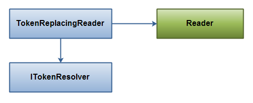

----
title: Java IO(4) 替换流，数组，文件或者大的字符串的一种方式
date: 2017-04-18
description: 

tags:
- IO
- Java

nav:
- Java

categories:
- Java IO

image: images/java/io.png

----
传统的字符替换，我们通常会想到使用 String.replace()，但是这个有些问题。
String.replace()每次替换，都会产生新的字符串，替换5次就产生5个新的字符串。这样空间复杂度就是 O(N*M)。N是字符串大小，M是替换的次数。这种情况下，如果是替换数据量大的字符串就会有内存问题。同样，这种方式也不利于扩展。

这篇文章通过使用自己实现的 TokenReplacingReader 来解决这个问题。

TokenReplacingReader 从标准的 Java.io.Reader 中读取字符数据（继承），所有可以使用 Reader的地方，就都可以使用 TokenReplacingReader 。

接着我们需要一个Token解析接口，用来解析替换字符：ITokenResolver ，整体关系图如下：

 
TokenReplacingReader 字符串替换用法：

	public static void main(String[] args) throws IOException {

	    Map<String, String> tokens = new HashMap<String, String>();
	    tokens.put("token1", "value1");
	    tokens.put("token2", "JJ ROCKS!!!");

	    MapTokenResolver resolver = new MapTokenResolver(tokens);

	    Reader source =
	        new StringReader("1234567890${token1}abcdefg${token2}XYZ$000");

	    Reader reader = new TokenReplacingReader(source, resolver);

	    int data = reader.read();
	    while(data != -1){
	        System.out.print((char) data);
	        data = reader.read();
	    }
	}

TokenReplacingReader 流替换，文件替换，字符数组替换以及字符串替换，就可以改成如下的方式：

	ITokenResolver resolver = ... ; // get ITokenResolver instance.

	Reader reader = new TokenReplacingReader(
	        new InputStreamReader(inputStream), resolver);

	Reader reader = new TokenReplacingReader(
	        new FileReader(new File("c:\\file.txt"), resolver);

	Reader reader = new TokenReplacingReader(
	        new CharArrayReader(charArray), resolver);

	Reader reader = new TokenReplacingReader(
	        new StringReader("biiig string...."), resolver);

ITokenResolver 实现：

    public interface ITokenResolver {
        public String resolveToken(String tokenName);
    }

ITokenResolver 实现： 

    import java.util.HashMap;
    import java.util.Map;

    public class MapTokenResolver implements ITokenResolver {

        protected Map<String, String> tokenMap = new HashMap<String, String>();

        public MapTokenResolver(Map<String, String> tokenMap) {
            this.tokenMap = tokenMap;
        }

        public String resolveToken(String tokenName) {
            return this.tokenMap.get(tokenName);
        }

    }

TokenReplacingReader实现：

    import java.io.IOException;
    import java.io.PushbackReader;
    import java.io.Reader;
    import java.nio.CharBuffer;

    public class TokenReplacingReader extends Reader {

        protected PushbackReader pushbackReader = null;
        protected ITokenResolver tokenResolver = null;
        protected StringBuilder tokenNameBuffer = new StringBuilder();
        protected String tokenValue = null;
        protected int tokenValueIndex = 0;

        public TokenReplacingReader(Reader source, ITokenResolver resolver) {
            this.pushbackReader = new PushbackReader(source, 2);
            this.tokenResolver = resolver;
        }

        public int read(CharBuffer target) throws IOException {
            throw new RuntimeException("Operation Not Supported");
        }

        public int read() throws IOException {
            if (this.tokenValue != null) {
                if (this.tokenValueIndex < this.tokenValue.length()) {
                    return this.tokenValue.charAt(this.tokenValueIndex++);
                }
                if (this.tokenValueIndex == this.tokenValue.length()) {
                    this.tokenValue = null;
                    this.tokenValueIndex = 0;
                }
            }

            int data = this.pushbackReader.read();
            if (data != '$') return data;

            data = this.pushbackReader.read();
            if (data != '{') {
                this.pushbackReader.unread(data);
                return '$';
            }
            this.tokenNameBuffer.delete(0, this.tokenNameBuffer.length());

            data = this.pushbackReader.read();
            while (data != '}') {
                this.tokenNameBuffer.append((char) data);
                data = this.pushbackReader.read();
            }

            this.tokenValue = this.tokenResolver
                    .resolveToken(this.tokenNameBuffer.toString());

            if (this.tokenValue == null) {
                this.tokenValue = "${" + this.tokenNameBuffer.toString() + "}";
            }
            if (this.tokenValue.length() == 0) {
                return read();
            }
            return this.tokenValue.charAt(this.tokenValueIndex++);

        }

        public int read(char cbuf[]) throws IOException {
            return read(cbuf, 0, cbuf.length);
        }

        public int read(char cbuf[], int off, int len) throws IOException {
            int charsRead = 0;
            for (int i = 0; i < len; i++) {
                int nextChar = read();
                if (nextChar == -1) {
                    if (charsRead == 0) {
                        charsRead = -1;
                    }
                    break;
                }
                charsRead = i + 1;
                cbuf[off + i] = (char) nextChar;
            }
            return charsRead;
        }

        public void close() throws IOException {
            this.pushbackReader.close();
        }

        public long skip(long n) throws IOException {
            throw new RuntimeException("Operation Not Supported");
        }

        public boolean ready() throws IOException {
            return this.pushbackReader.ready();
        }

        public boolean markSupported() {
            return false;
        }

        public void mark(int readAheadLimit) throws IOException {
            throw new RuntimeException("Operation Not Supported");
        }

        public void reset() throws IOException {
            throw new RuntimeException("Operation Not Supported");
        }
    }

原文：
http://tutorials.jenkov.com/java-howto/replace-strings-in-streams-arrays-files.html