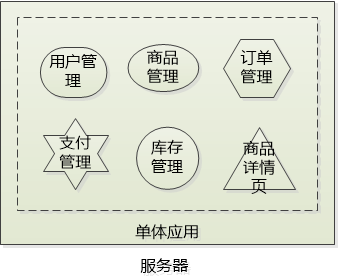
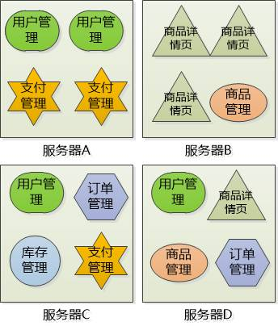
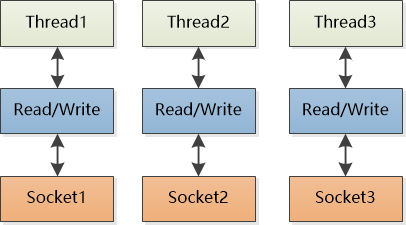
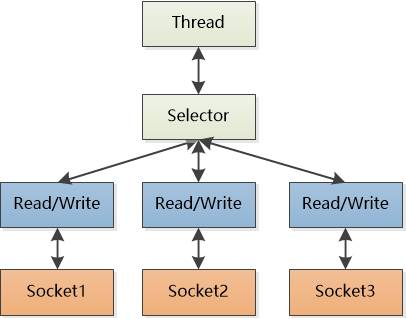

----
title: 小白科普：Netty有什么用？
date: 2019-01-02
description: 

tags:
- Java
- Netty

nav:
- Java 框架

categories:
- Netty

image: images/java/netty-logo.png

----
随着移动互联网的爆发性增长，小明公司的电子商务系统访问量越来越大，由于现有系统是个单体的巨型应用，已经无法满足海量的并发请求，拆分势在必行。

在微服务的大潮之中， 架构师小明把系统拆分成了多个服务，根据需要部署在多个机器上，这些服务非常灵活，可以随着访问量弹性扩展。

世界上没有免费的午餐， 拆分成多个“微服务”以后虽然增加了弹性，但也带来了一个巨大的挑战：服务之间互相调用的开销。

比如说：原来用户下一个订单需要登录，浏览产品详情，加入购物车，支付，扣库存等一系列操作，在单体应用的时候它们都在一台机器的同一个进程中，说白了就是模块之间的函数调用，效率超级高。

现在好了，服务被安置到了不同的服务器上，一个订单流程，几乎每个操作都要越网络，都是远程过程调用(RPC)， 那执行时间、执行效率可远远比不上以前了。

远程过程调用的第一版实现使用了HTTP协议，也就是说各个服务对外提供HTTP接口。 小明发现，HTTP协议虽然简单明了，但是废话太多，仅仅是给服务器发个简单的消息都会附带一大堆无用信息：

*   GET /orders/1 HTTP/1.1
*   Host: order.myshop.com
*   User-Agent: Mozilla/5.0 (Windows NT 6.1; )
*   Accept: text/html;
*   Accept-Language: en-US,en;
*   Accept-Encoding: gzip
*   Connection: keep-alive
*   ......

看看那User-Agent，Accept-Language ，这个协议明显是为浏览器而生的！但是我这里是程序之间的调用，用这个HTTP有点亏。

能不能自定义一个精简的协议？ 在这个协议中我只需要把要调用方法名和参数发给服务器即可，根本不用这么多乱七八糟的额外信息。

但是自定义协议客户端和服务器端就得直接使用“低级”的Socket了，尤其是服务器端，得能够处理高并发的访问请求才行。

小明复习了一下服务器端的socket编程，最早的Java是所谓的阻塞IO(Blocking IO)， 想处理多个socket的连接的话需要创建多个线程， 一个线程对应一个。

这种方式写起来倒是挺简单的，但是连接（socket）多了就受不了了，如果真的有成千上万个线程同时处理成千上万个socket，占用大量的空间不说，光是线程之间的切换就是一个巨大的开销。

更重要的是，虽然有大量的socket，但是真正需要处理的（可以读写数据的socket）却不多，大量的线程处于等待数据状态（这也是为什么叫做阻塞的原因），资源浪费得让人心疼。

后来Java为了解决这个问题，又搞了一个非阻塞IO(NIO：Non-Blocking IO，有人也叫做New IO)， 改变了一下思路：通过多路复用的方式让一个线程去处理多个Socket。

这样一来，只需要使用少量的线程就可以搞定多个socket了，线程只需要通过Selector去查一下它所管理的socket集合，哪个Socket的数据准备好了，就去处理哪个Socket，一点儿都不浪费。

好了，就是Java NIO了！

小明先定义了一套精简的RPC的协议，里边规定了如何去调用一个服务，方法名和参数该如何传递，返回值用什么格式......等等。然后雄心勃勃地要把这个协议用Java NIO给实现了。

可是美好的理想很快被无情的现实给击碎， 小明努力了一周就意识到自己陷入了一个大坑之中，Java NIO虽然看起来简单，但是API还是太“低级”了，有太多的复杂性，没有强悍的、一流的编程能力根本无法驾驭，根本做不到高并发情况下的可靠和高效。

小明不死心，继续向领导要人要资源，一定要把这个坑给填上，挣扎了6个月以后，终于实现了一个自己的NIO框架，可以执行高并发的RPC调用了。

然后又是长达6个月的修修补补，小明经常半夜被叫醒：生产环境的RPC调用无法返回了！ 这样的Bug不知道改了多少个。

在那些不眠之夜中，小明经常仰天长叹：我用NIO做个高并发的RPC框架怎么这么难呐！

一年之后，自研的框架终于稳定，可是小明也从张大胖那里听到了一个让他崩溃的消息： 小明你知道吗?有个叫Netty的开源框架，可以快速地开发高性能的面向协议的服务器和客户端。 易用、健壮、安全、高效，你可以在Netty上轻松实现各种自定义的协议！咱们也试试？

小明赶紧研究，看完后不由得“泪流满面”：这东西怎么不早点出来啊！

好了，这个故事我快编不下去了，要烂尾了。

说说Netty到底是何方神圣， 要解决什么问题吧。

像上面小明的例子，想使用Java NIO来实现一个高性能的RPC框架，调用协议，数据的格式和次序都是自己定义的，现有的HTTP根本玩不转，那使用Netty就是绝佳的选择。

其实游戏领域是个更好的例子，长连接，自定义协议，高并发，Netty就是绝配。

因为Netty本身就是一个基于NIO的网络框架， 封装了Java NIO那些复杂的底层细节，给你提供简单好用的抽象概念来编程。

注意几个关键词，首先它是个框架，是个“半成品”，不能开箱即用，你必须得拿过来做点定制，利用它开发出自己的应用程序，然后才能运行（就像使用Spring那样）。

一个更加知名的例子就是阿里巴巴的Dubbo了，这个RPC框架的底层用的就是Netty。

另外一个关键词是高性能，如果你的应用根本没有高并发的压力，那就不一定要用Netty了。

原文：http://zhuanlan.51cto.com/art/201711/558661.htm