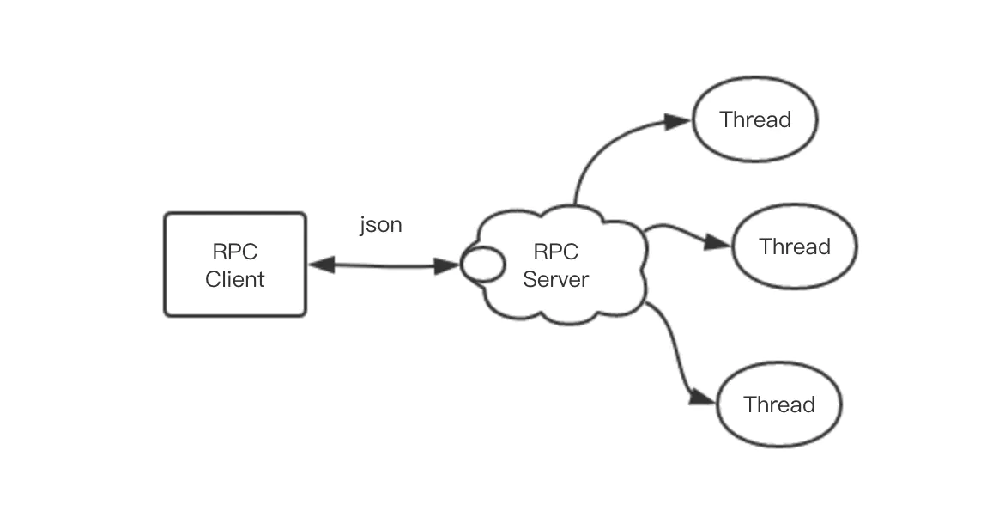
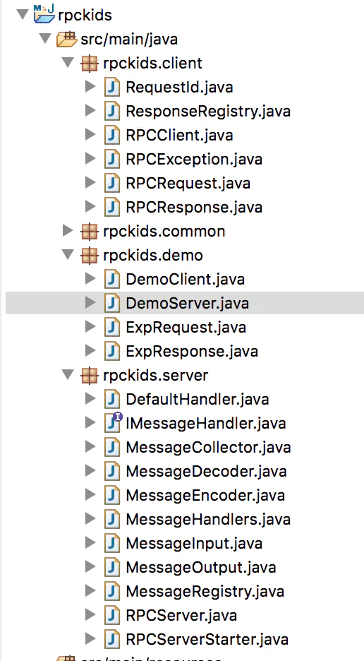

----
title: 大厨小鲜——基于Netty自己动手实现RPC框架
date: 2019-03-26
description: 

tags:
- Java
- Netty
- RPC

nav:
- Java 框架

categories:
- Netty

image: images/java/netty-logo.png

----
今天我们要来做一道小菜，这道菜就是RPC通讯框架。它使用netty作为原料，fastjson序列化工具作为调料，来实现一个极简的多线程RPC服务框架。

我们暂且命名该RPC框架为rpckids。

食用指南
====

在告诉读者完整的制作菜谱之前，我们先来试试这个小菜怎么个吃法，好不好吃，是不是吃起来很方便。如果读者觉得很难吃，那后面的菜谱就没有多大意义了，何必花心思去学习制作一门谁也不爱吃的大烂菜呢？

例子中我会使用rpckids提供的远程RPC服务，用于计算斐波那契数和指数，客户端通过rpckids提供的RPC客户端向远程服务传送参数，并接受返回结果，然后呈现出来。你可以使用rpckids定制任意的业务rpc服务。

斐波那契数输入输出比较简单，一个Integer，一个Long。 指数输入有两个值，输出除了计算结果外还包含计算耗时，以纳秒计算。之所以包含耗时，只是为了呈现一个完整的自定义的输入和输出类。

指数服务自定义输入输出类
------------

    // 指数RPC的输入
    public class ExpRequest {
            private int base;
            private int exp;
        
        // constructor & getter & setter
    }
    
    // 指数RPC的输出
    public class ExpResponse {
    
            private long value;
            private long costInNanos;
    
            // constructor & getter & setter
    }
    

斐波那契和指数计算处理
-----------

    public class FibRequestHandler implements IMessageHandler<Integer> {
    
            private List<Long> fibs = new ArrayList<>();
    
            {
                    fibs.add(1L); // fib(0) = 1
                    fibs.add(1L); // fib(1) = 1
            }
    
            @Override
            public void handle(ChannelHandlerContext ctx, String requestId, Integer n) {
                    for (int i = fibs.size(); i < n + 1; i++) {
                            long value = fibs.get(i - 2) + fibs.get(i - 1);
                            fibs.add(value);
                    }
                    // 输出响应
                    ctx.writeAndFlush(new MessageOutput(requestId, "fib_res", fibs.get(n)));
            }
    
    }
    
    public class ExpRequestHandler implements IMessageHandler<ExpRequest> {
    
            @Override
            public void handle(ChannelHandlerContext ctx, String requestId, ExpRequest message) {
                    int base = message.getBase();
                    int exp = message.getExp();
                    long start = System.nanoTime();
                    long res = 1;
                    for (int i = 0; i < exp; i++) {
                            res *= base;
                    }
                    long cost = System.nanoTime() - start;
                    // 输出响应
                    ctx.writeAndFlush(new MessageOutput(requestId, "exp_res", new ExpResponse(res, cost)));
            }
    
    }
    

构建RPC服务器
--------

RPC服务类要监听指定IP端口，设定io线程数和业务计算线程数，然后注册斐波那契服务输入类和指数服务输入类，还有相应的计算处理器。

    public class DemoServer {
    
            public static void main(String[] args) {
                    RPCServer server = new RPCServer("localhost", 8888, 2, 16);
                    server.service("fib", Integer.class, new FibRequestHandler())
                              .service("exp", ExpRequest.class, new ExpRequestHandler());
                    server.start();
            }
    
    }
    

构建RPC客户端
--------

RPC客户端要链接远程IP端口，并注册服务输出类(RPC响应类)，然后分别调用20次斐波那契服务和指数服务，输出结果

    public class DemoClient {
    
            private RPCClient client;
    
            public DemoClient(RPCClient client) {
                    this.client = client;
                    // 注册服务返回类型
                    this.client.rpc("fib_res", Long.class).rpc("exp_res", ExpResponse.class);
            }
    
            public long fib(int n) {
                    return (Long) client.send("fib", n);
            }
    
            public ExpResponse exp(int base, int exp) {
                    return (ExpResponse) client.send("exp", new ExpRequest(base, exp));
            }
    
            public static void main(String[] args) {
                    RPCClient client = new RPCClient("localhost", 8888);
                    DemoClient demo = new DemoClient(client);
                    for (int i = 0; i < 20; i++) {
                            System.out.printf("fib(%d) = %d\n", i, demo.fib(i));
                    }
                    for (int i = 0; i < 20; i++) {
                            ExpResponse res = demo.exp(2, i);
                            System.out.printf("exp2(%d) = %d cost=%dns\n", i, res.getValue(), res.getCostInNanos());
                    }
            }
    
    }
    

运行
--

先运行服务器，服务器输出如下，从日志中可以看到客户端链接过来了，然后发送了一系列消息，最后关闭链接走了。

    server started @ localhost:8888
    connection comes
    read a message
    read a message
    ...
    connection leaves
    

再运行客户端，可以看到一些列的计算结果都成功完成了输出。

    fib(0) = 1
    fib(1) = 1
    fib(2) = 2
    fib(3) = 3
    fib(4) = 5
    ...
    exp2(0) = 1 cost=559ns
    exp2(1) = 2 cost=495ns
    exp2(2) = 4 cost=524ns
    exp2(3) = 8 cost=640ns
    exp2(4) = 16 cost=711ns
    ...
    
    

牢骚
==

本以为是小菜一碟，但是编写完整的代码和文章却将近花费了一天的时间，深感写码要比做菜耗时太多了。因为只是为了教学目的，所以在实现细节上还有好多没有仔细去雕琢的地方。如果是要做一个开源项目，力求非常完美的话。至少还要考虑一下几点。

1.  客户端连接池
2.  多服务进程负载均衡
3.  日志输出
4.  参数校验，异常处理
5.  客户端流量攻击
6.  服务器压力极限

如果要参考grpc的话，还得实现流式响应处理。如果还要为了节省网络流量的话，又需要在协议上下功夫。这一大堆的问题还是抛给读者自己思考去吧。

关注公众号「**码洞**」，发送「RPC」即可获取以上完整菜谱的GitHub开源代码链接。读者有什么不明白的地方，洞主也会一一解答。

下面我们接着讲RPC服务器和客户端精细的制作过程

服务器菜谱
=====

定义消息输入输出格式，消息类型、消息唯一ID和消息的json序列化字符串内容。消息唯一ID是用来客户端验证服务器请求和响应是否匹配。

    public class MessageInput {
            private String type;
            private String requestId;
            private String payload;
    
            public MessageInput(String type, String requestId, String payload) {
                    this.type = type;
                    this.requestId = requestId;
                    this.payload = payload;
            }
    
            public String getType() {
                    return type;
            }
    
            public String getRequestId() {
                    return requestId;
            }
        
        // 因为我们想直接拿到对象，所以要提供对象的类型参数
            public <T> T getPayload(Class<T> clazz) {
                    if (payload == null) {
                            return null;
                    }
                    return JSON.parseObject(payload, clazz);
            }
    
    }
    
    public class MessageOutput {
    
            private String requestId;
            private String type;
            private Object payload;
    
            public MessageOutput(String requestId, String type, Object payload) {
                    this.requestId = requestId;
                    this.type = type;
                    this.payload = payload;
            }
    
            public String getType() {
                    return this.type;
            }
    
            public String getRequestId() {
                    return requestId;
            }
    
            public Object getPayload() {
                    return payload;
            }
    
    }
    

消息解码器，使用Netty的ReplayingDecoder实现。简单起见，这里没有使用checkpoint去优化性能了，感兴趣的话读者可以参考一下我之前在公众号里发表的相关文章，将checkpoint相关的逻辑自己添加进去。

    public class MessageDecoder extends ReplayingDecoder<MessageInput> {
    
            @Override
            protected void decode(ChannelHandlerContext ctx, ByteBuf in, List<Object> out) throws Exception {
                    String requestId = readStr(in);
                    String type = readStr(in);
                    String content = readStr(in);
                    out.add(new MessageInput(type, requestId, content));
            }
    
            private String readStr(ByteBuf in) {
                    // 字符串先长度后字节数组，统一UTF8编码
                    int len = in.readInt();
                    if (len < 0 || len > (1 << 20)) {
                            throw new DecoderException("string too long len=" + len);
                    }
                    byte[] bytes = new byte[len];
                    in.readBytes(bytes);
                    return new String(bytes, Charsets.UTF8);
            }
    
    }
    

消息处理器接口，每个自定义服务必须实现handle方法

    public interface IMessageHandler<> {
    
            Tvoid handle(ChannelHandlerContext ctx, String requestId, T message);
    
    }
    
    // 找不到类型的消息统一使用默认处理器处理
    public class DefaultHandler implements IMessageHandler<MessageInput> {
    
            @Override
            public void handle(ChannelHandlerContext ctx, String requesetId, MessageInput input) {
                    System.out.println("unrecognized message type=" + input.getType() + " comes");
            }
    
    }
    

消息类型注册中心和消息处理器注册中心，都是用静态字段和方法，其实也是为了图方便，写成非静态的可能会优雅一些。

    public class MessageRegistry {
            private static Map<String, Class<?>> clazzes = new HashMap<>();
    
            public static void register(String type, Class<?> clazz) {
                    clazzes.put(type, clazz);
            }
    
            public static Class<?> get(String type) {
                    return clazzes.get(type);
            }
    }
    
    public class MessageHandlers {
    
            private static Map<String, IMessageHandler<?>> handlers = new HashMap<>();
            public static DefaultHandler defaultHandler = new DefaultHandler();
    
            public static void register(String type, IMessageHandler<?> handler) {
                    handlers.put(type, handler);
            }
    
            public static IMessageHandler<?> get(String type) {
                    IMessageHandler<?> handler = handlers.get(type);
                    return handler;
            }
    
    }
    

响应消息的编码器比较简单

    @Sharable
    public class MessageEncoder extends MessageToMessageEncoder<MessageOutput> {
    
            @Override
            protected void encode(ChannelHandlerContext ctx, MessageOutput msg, List<Object> out) throws Exception {
                    ByteBuf buf = PooledByteBufAllocator.DEFAULT.directBuffer();
                    writeStr(buf, msg.getRequestId());
                    writeStr(buf, msg.getType());
                    writeStr(buf, JSON.toJSONString(msg.getPayload()));
                    out.add(buf);
            }
    
            private void writeStr(ByteBuf buf, String s) {
                    buf.writeInt(s.length());
                    buf.writeBytes(s.getBytes(Charsets.UTF8));
            }
    
    }
    

好，接下来进入关键环节，将上面的小模小块凑在一起，构建一个完整的RPC服务器框架，这里就需要读者有必须的Netty基础知识了，需要编写Netty的事件回调类和服务构建类。

    @Sharable
    public class MessageCollector extends ChannelInboundHandlerAdapter {
        // 业务线程池
            private ThreadPoolExecutor executor;
    
            public MessageCollector(int workerThreads) {
                    // 业务队列最大1000，避免堆积
                    // 如果子线程处理不过来，io线程也会加入处理业务逻辑(callerRunsPolicy)
                    BlockingQueue<Runnable> queue = new ArrayBlockingQueue<>(1000);
                    // 给业务线程命名
                    ThreadFactory factory = new ThreadFactory() {
    
                            AtomicInteger seq = new AtomicInteger();
    
                            @Override
                            public Thread newThread(Runnable r) {
                                    Thread t = new Thread(r);
                                    t.setName("rpc-" + seq.getAndIncrement());
                                    return t;
                            }
    
                    };
                    // 闲置时间超过30秒的线程自动销毁
                    this.executor = new ThreadPoolExecutor(1, workerThreads, 30, TimeUnit.SECONDS, queue, factory,
                                    new CallerRunsPolicy());
            }
    
            public void closeGracefully() {
                    // 优雅一点关闭，先通知，再等待，最后强制关闭
                    this.executor.shutdown();
                    try {
                            this.executor.awaitTermination(10, TimeUnit.SECONDS);
                    } catch (InterruptedException e) {
                    }
                    this.executor.shutdownNow();
            }
    
            @Override
            public void channelActive(ChannelHandlerContext ctx) throws Exception {
                    // 客户端来了一个新链接
                    System.out.println("connection comes");
            }
    
            @Override
            public void channelInactive(ChannelHandlerContext ctx) throws Exception {
                    // 客户端走了一个
                    System.out.println("connection leaves");
                    ctx.close();
            }
    
            @Override
            public void channelRead(ChannelHandlerContext ctx, Object msg) throws Exception {
                    if (msg instanceof MessageInput) {
                            System.out.println("read a message");
                            // 用业务线程池处理消息
                            this.executor.execute(() -> {
                                    this.handleMessage(ctx, (MessageInput) msg);
                            });
                    }
            }
    
            private void handleMessage(ChannelHandlerContext ctx, MessageInput input) {
                    // 业务逻辑在这里
                    Class<?> clazz = MessageRegistry.get(input.getType());
                    if (clazz == null) {
                            // 没注册的消息用默认的处理器处理
                            MessageHandlers.defaultHandler.handle(ctx, input.getRequestId(), input);
                            return;
                    }
                    Object o = input.getPayload(clazz);
                    // 这里是小鲜的瑕疵，代码外观上比较难看，但是大厨表示才艺不够，很无奈
                    // 读者如果感兴趣可以自己想办法解决
                    @SuppressWarnings("unchecked")
                    IMessageHandler<Object> handler = (IMessageHandler<Object>) MessageHandlers.get(input.getType());
                    if (handler != null) {
                            handler.handle(ctx, input.getRequestId(), o);
                    } else {
                            // 用默认的处理器处理吧
                            MessageHandlers.defaultHandler.handle(ctx, input.getRequestId(), input);
                    }
            }
    
            @Override
            public void exceptionCaught(ChannelHandlerContext ctx, Throwable cause) throws Exception {
                    // 此处可能因为客户端机器突发重启
                    // 也可能是客户端链接闲置时间超时，后面的ReadTimeoutHandler抛出来的异常
                    // 也可能是消息协议错误，序列化异常
                    // etc.
                    // 不管它，链接统统关闭，反正客户端具备重连机制
                    System.out.println("connection error");
                    cause.printStackTrace();
                    ctx.close();
            }
    
    }
    
    public class RPCServer {
    
            private String ip;
            private int port;
            private int ioThreads; // 用来处理网络流的读写线程
            private int workerThreads; // 用于业务处理的计算线程
    
            public RPCServer(String ip, int port, int ioThreads, int workerThreads) {
                    this.ip = ip;
                    this.port = port;
                    this.ioThreads = ioThreads;
                    this.workerThreads = workerThreads;
            }
    
            private ServerBootstrap bootstrap;
            private EventLoopGroup group;
            private MessageCollector collector;
            private Channel serverChannel;
    
        // 注册服务的快捷方式
            public RPCServer service(String type, Class<?> reqClass, IMessageHandler<?> handler) {
                    MessageRegistry.register(type, reqClass);
                    MessageHandlers.register(type, handler);
                    return this;
            }
    
        // 启动RPC服务
            public void start() {
                    bootstrap = new ServerBootstrap();
                    group = new NioEventLoopGroup(ioThreads);
                    bootstrap.group(group);
                    collector = new MessageCollector(workerThreads);
                    MessageEncoder encoder = new MessageEncoder();
                    bootstrap.channel(NioServerSocketChannel.class).childHandler(new ChannelInitializer<SocketChannel>() {
                            @Override
                            public void initChannel(SocketChannel ch) throws Exception {
                                    ChannelPipeline pipe = ch.pipeline();
                                    // 如果客户端60秒没有任何请求，就关闭客户端链接
                                    pipe.addLast(new ReadTimeoutHandler(60));
                                    // 挂上解码器
                                    pipe.addLast(new MessageDecoder());
                                    // 挂上编码器
                                    pipe.addLast(encoder);
                                    // 将业务处理器放在最后
                                    pipe.addLast(collector);
                            }
                    });
                    bootstrap.option(ChannelOption.SO_BACKLOG, 100)  // 客户端套件字接受队列大小
                             .option(ChannelOption.SO_REUSEADDR, true) // reuse addr，避免端口冲突
                             .option(ChannelOption.TCP_NODELAY, true) // 关闭小流合并，保证消息的及时性
                             .childOption(ChannelOption.SO_KEEPALIVE, true); // 长时间没动静的链接自动关闭
                    serverChannel = bootstrap.bind(this.ip, this.port).channel();
                    System.out.printf("server started @ %s:%d\n", ip, port);
            }
    
            public void stop() {
                    // 先关闭服务端套件字
                    serverChannel.close();
                    // 再斩断消息来源，停止io线程池
                    group.shutdownGracefully();
                    // 最后停止业务线程
                    collector.closeGracefully();
            }
    
    }
    

上面就是完整的服务器菜谱，代码较多，读者如果没有Netty基础的话，可能会看得眼花缭乱。如果你不常使用JDK的Executors框架，阅读起来估计也够呛。如果读者需要相关学习资料，可以找我索取。

客户端菜谱
=====

服务器使用NIO实现，客户端也可以使用NIO实现，不过必要性不大，用同步的socket实现也是没有问题的。更重要的是，同步的代码比较简短，便于理解。所以简单起见，这里使用了同步IO。

定义RPC请求对象和响应对象，和服务器一一对应。

    public class RPCRequest {
    
            private String requestId;
            private String type;
            private Object payload;
    
            public RPCRequest(String requestId, String type, Object payload) {
                    this.requestId = requestId;
                    this.type = type;
                    this.payload = payload;
            }
    
            public String getRequestId() {
                    return requestId;
            }
    
            public String getType() {
                    return type;
            }
    
            public Object getPayload() {
                    return payload;
            }
    
    }
    
    public class RPCResponse {
    
            private String requestId;
            private String type;
            private Object payload;
    
            public RPCResponse(String requestId, String type, Object payload) {
                    this.requestId = requestId;
                    this.type = type;
                    this.payload = payload;
            }
    
            public String getRequestId() {
                    return requestId;
            }
    
            public void setRequestId(String requestId) {
                    this.requestId = requestId;
            }
    
            public String getType() {
                    return type;
            }
    
            public void setType(String type) {
                    this.type = type;
            }
    
            public Object getPayload() {
                    return payload;
            }
    
            public void setPayload(Object payload) {
                    this.payload = payload;
            }
    
    }
    

定义客户端异常，用于统一抛出RPC错误

    public class RPCException extends RuntimeException {
    
            private static final long serialVersionUID = 1L;
    
            public RPCException(String message, Throwable cause) {
                    super(message, cause);
            }
    
            public RPCException(String message) {
                    super(message);
            }
            
            public RPCException(Throwable cause) {
                    super(cause);
            }
    
    }
    

请求ID生成器，简单的UUID64

    public class RequestId {
    
            public static String next() {
                    return UUID.randomUUID().toString();
            }
    
    }
    

响应类型注册中心，和服务器对应

    public class ResponseRegistry {
            private static Map<String, Class<?>> clazzes = new HashMap<>();
    
            public static void register(String type, Class<?> clazz) {
                    clazzes.put(type, clazz);
            }
    
            public static Class<?> get(String type) {
                    return clazzes.get(type);
            }
    }
    

好，接下来进入客户端的关键环节，链接管理、读写消息、链接重连都在这里

    public class RPCClient {
    
            private String ip;
            private int port;
            private Socket sock;
            private DataInputStream input;
            private OutputStream output;
    
            public RPCClient(String ip, int port) {
                    this.ip = ip;
                    this.port = port;
            }
    
            public void connect() throws IOException {
                    SocketAddress addr = new InetSocketAddress(ip, port);
                    sock = new Socket();
                    sock.connect(addr, 5000); // 5s超时
                    input = new DataInputStream(sock.getInputStream());
                    output = sock.getOutputStream();
            }
    
            public void close() {
                    // 关闭链接
                    try {
                            sock.close();
                            sock = null;
                            input = null;
                            output = null;
                    } catch (IOException e) {
                    }
            }
    
            public Object send(String type, Object payload) {
                    // 普通rpc请求，正常获取响应
                    try {
                            return this.sendInternal(type, payload, false);
                    } catch (IOException e) {
                            throw new RPCException(e);
                    }
            }
    
            public RPCClient rpc(String type, Class<?> clazz) {
                    // rpc响应类型注册快捷入口
                    ResponseRegistry.register(type, clazz);
                    return this;
            }
    
            public void cast(String type, Object payload) {
                    // 单向消息，服务器不得返回结果
                    try {
                            this.sendInternal(type, payload, true);
                    } catch (IOException e) {
                            throw new RPCException(e);
                    }
            }
    
            private Object sendInternal(String type, Object payload, boolean cast) throws IOException {
                    if (output == null) {
                            connect();
                    }
                    String requestId = RequestId.next();
                    ByteArrayOutputStream bytes = new ByteArrayOutputStream();
                    DataOutputStream buf = new DataOutputStream(bytes);
                    writeStr(buf, requestId);
                    writeStr(buf, type);
                    writeStr(buf, JSON.toJSONString(payload));
                    buf.flush();
                    byte[] fullLoad = bytes.toByteArray();
                    try {
                            // 发送请求
                            output.write(fullLoad);
                    } catch (IOException e) {
                            // 网络异常要重连
                            close();
                            connect();
                            output.write(fullLoad);
                    }
                    if (!cast) {
                            // RPC普通请求，要立即获取响应
                            String reqId = readStr();
                            // 校验请求ID是否匹配
                            if (!requestId.equals(reqId)) {
                                    close();
                                    throw new RPCException("request id mismatch");
                            }
                            String typ = readStr();
                            Class<?> clazz = ResponseRegistry.get(typ);
                            // 响应类型必须提前注册
                            if (clazz == null) {
                                    throw new RPCException("unrecognized rpc response type=" + typ);
                            }
                            // 反序列化json串
                            String payld = readStr();
                            Object res = JSON.parseObject(payld, clazz);
                            return res;
                    }
                    return null;
            }
    
            private String readStr() throws IOException {
                    int len = input.readInt();
                    byte[] bytes = new byte[len];
                    input.readFully(bytes);
                    return new String(bytes, Charsets.UTF8);
            }
    
            private void writeStr(DataOutputStream out, String s) throws IOException {
                    out.writeInt(s.length());
                    out.write(s.getBytes(Charsets.UTF8));
            }
    }
    

牢骚重提
====

本以为是小菜一碟，但是编写完整的代码和文章却将近花费了一天的时间，深感写码要比做菜耗时太多了。因为只是为了教学目的，所以在实现细节上还有好多没有仔细去雕琢的地方。如果是要做一个开源项目，力求非常完美的话。至少还要考虑一下几点。

1.  客户端连接池
2.  多服务进程负载均衡
3.  日志输出
4.  参数校验，异常处理
5.  客户端流量攻击
6.  服务器压力极限

如果要参考grpc的话，还得实现流式响应处理。如果还要为了节省网络流量的话，又需要在协议上下功夫。这一大堆的问题还是抛给读者自己思考去吧。

关注公众号「**码洞**」，发送「RPC」即可获取以上完整菜谱的GitHub开源代码链接。读者有什么不明白的地方，洞主也会一一解答。
原文：https://juejin.im/post/5ad2a99ff265da238d51264d