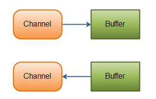

----
title: Java NIO (1) 基本概念
date: 2017-04-21
description: 

tags:
- NIO
- Java

nav:
- Java

categories:
- Java NIO

image: images/java/basic/java_logo.png

----
Java 1.4之后引入了NIO框架。
 	
## Java NIO: Channels and Buffers（通道和缓冲区）

标准的IO是在字节流和字符流进行操作。NIO 是在通道（Channel）和缓冲区（Buffer）进行操作。数据总是从通道读取到缓冲区里，或者从缓冲区写入到通道里。

##  Java NIO: Asynchronous IO（异步IO）

NIO可以做异步IO，例如：当线程从通道读取数据到缓冲区时，线程还是可以进行其他事情。当数据被写入到缓冲区时，线程可以继续处理它。从缓冲区写入通道也类似。

## Java NIO: Selectors（选择器）

Java NIO包含了选择器的概念。选择器用于监听多个通道的事件（比如：连接打开，数据达到）。因此，单个的线程可以监听多个数据通道。

所以 Java NIO 核心组件包括：

Channels
Buffers
Selectors

除了以上列出来的，还有一些其他的组件，比如Pipe 、FileLock等组件类 ，这些类在使用的过程中，都会结合上面列出的三个核心组件类来使用。

##  Channels

NIO里的 Channel 类似一个IO流， 数据通过Buffer可以写到Channel，通过Channel读取数据到Buffer。

 

*Channel* 实现类有：

*FileChannel* —— 读写文件数据
*DatagramChannel* —— 通过UDP读写网络上的数据
*SocketChannel* —— 通过TCP读写网络上的数据
*ServerSocketChannel* —— 监听TCP连接，为每一个新的请求连接创建一个*SocketChannel*

这些实现覆盖了 UDP + TCP 网络 IO 和文件 IO。

使用FileChannel读文件数据例子：

``` java
RandomAccessFile aFile = new RandomAccessFile("data/nio-data.txt", "rw");
FileChannel inChannel = aFile.getChannel();

ByteBuffer buf = ByteBuffer.allocate(48);

int bytesRead = inChannel.read(buf);
while (bytesRead != -1) {

  System.out.println("Read " + bytesRead);
  buf.flip();//从写模式切换到读模式，后续会有详解

  while(buf.hasRemaining()){
      System.out.print((char) buf.get());
  }

  buf.clear();//清空buf里面的缓冲数据
  bytesRead = inChannel.read(buf);
}
aFile.close();
```

##  Buffers
Buffer 实现类有：

*ByteBuffer*
*CharBuffer*
*DoubleBuffer*
*FloatBuffer*
*IntBuffer*
*LongBuffer*
*ShortBuffer* 

这些实现累覆盖了Java基本数据类型：byte, short, int, long, float, double 和 char。我们可以使用不同的Buffer来传递不同类型的数据。

另外还有，*MappedByteBuffer* 这个实现类，它是*ByteBuffer*的子类。具体用法后续给出单独的文章。

Channels和IO流不同点：支持读和写、支持异步读写、总是从Buffers读取数据或写入数据到Buffers。


## Selectors

一个线程可以通过*Selector*来管理多个*Channel*对象。如果你的应用程序打开了多个连接（Channels），处理起来是非常方便的。例如下面的图示，一个线程，处理3个Channel。

 

使用Selector，需要先把Channel注册到Selector上，然后调用select() 方法，这个方法调用后将阻塞，直到注册到Selector上的Channel有一个事件准备
就绪，例如：一个连接接入或收到了数据等，这时就可以对这个事件进行后续的处理了。