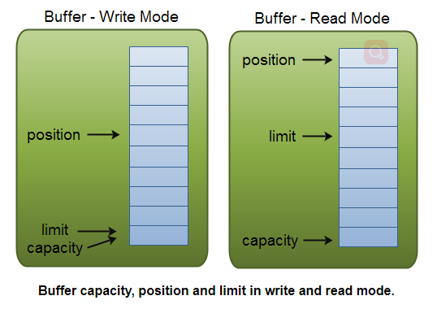

----
title: Java NIO(2) Buffer
date: 2017-04-22
description: 

tags:
- Buffer
- NIO
- Java

nav:
- Java

categories:
- Java NIO

image: images/java/basic/java_logo.png

----
Buffer 本质上是内存区域上的一块你可以读写的内存块。这个内存块被包在 NIO Buffer对象中，我们通过 Buffer 提供的一系列方法来便捷的操作这个内存块。

## Buffer 的基本使用

Buffer 的使用有下面四个典型的过程：

1. 写数据到 Buffer
2. 调用 buffer.flip()
3. 从 Buffer 读取数据
4. 调用 buffer.clear() 或 buffer.compact()

当往 Buffer 里面写数据的时候，Buffer 对象会跟踪写了多少数据。当你需要读取数据的时候，你需要调用 flip() 方法，将写模式转换成读模式。当读取完数据，需要调用clear() 或compact() 方法来清楚buffer里的数据，才可以重新进行写数据。

clear和compact区别：
clear() 方法清空buffer里面的全部数据，写数据的时候从0开始写；
compact()方法会清空已读的数据，将未读的数据移动到buffer开始处，写数据的时候，从未读数据之后开始写；

下面是一个简单的例子:

	RandomAccessFile aFile = new RandomAccessFile("data/nio-data.txt", "rw");
	FileChannel inChannel = aFile.getChannel();

	//create buffer with capacity of 48 bytes
	ByteBuffer buf = ByteBuffer.allocate(48);

	int bytesRead = inChannel.read(buf); //read into buffer.
	while (bytesRead != -1) {

	  buf.flip();  //make buffer ready for read

	  while(buf.hasRemaining()){
	      System.out.print((char) buf.get()); // read 1 byte at a time
	  }

	  buf.clear(); //make buffer ready for writing
	  bytesRead = inChannel.read(buf);
	}
	aFile.close();

## Buffer 容量（capacity）、位置（position）和限制（limit）

容量：论buffer在读模式还是写模式，都是一样的，即buffer可容纳的数据量；
位置和限制：由buffer写模式或读模式决定。

如下图所示：

 

当调用 flip()，buffer从写模式切换为读模式，position为0，limit为可读取的最多的数据量；
当调用clear()，buffer从读模式切换为写模式，position为0，limit为容量大小；
当调用compact()，buffer从读模式切换为写模式，position为上次未读数据大小，limit位容量大小；

感受一下：

    public static void main(String[] args) throws IOException {
        IntBuffer buf = IntBuffer.allocate(20);
        System.out.println("----init----");
        printParameters(buf);

        System.out.println("----put 1----");
        buf.put(1);
        printParameters(buf);

        System.out.println("----put 2 3 4 5----");
        buf.put(2);
        buf.put(3);
        buf.put(4);
        buf.put(5);
        printParameters(buf);

        System.out.println("----flip()----");
        buf.flip();
        printParameters(buf);

        System.out.println("----call get()----");
        System.out.print("read: ");
        for (int i=0;i <= buf.limit() - 1; i++){
            System.out.print(buf.get()+" ");
        }
        System.out.println();
        printParameters(buf);

        System.out.println("----call flip() and get() 3 times----");
        buf.flip();
        System.out.print("read: ");
        for (int i=0;i < 3; i++){
            System.out.print(buf.get()+" ");
        }
        System.out.println();
        printParameters(buf);

        System.out.println("----call compact()----");
        buf.compact();
        printParameters(buf);
    }

    private static void printParameters(IntBuffer buf) {
        System.out.println("limit:" + buf.limit());
        System.out.println("position:" + buf.position());
        System.out.println("capacity:" + buf.capacity());
    }

输出：

    ----init----
    limit:20
    position:0
    capacity:20
    ----put 1----
    limit:20
    position:1
    capacity:20
    ----put 2 3 4 5----
    limit:20
    position:5
    capacity:20
    ----flip()----
    limit:5
    position:0
    capacity:20
    ----call get()----
    read: 1 2 3 4 5 
    limit:5
    position:5
    capacity:20
    ----call flip() and get() 3 times----
    read: 1 2 3 limit:5
    position:3
    capacity:20
    ----call compact() and read 1 2 3----
    limit:20
    position:2
    capacity:20

NIO Buffer类型包括：

> ByteBuffer
MappedByteBuffer
CharBuffer
DoubleBuffer
FloatBuffer
IntBuffer
LongBuffer
ShortBuffer

顾名思义，允许你使用不同类型的Buffer，操作不同类型的数据。

分配Buffer大小：

    ByteBuffer buf = ByteBuffer.allocate(48);
    CharBuffer buf2 = CharBuffer.allocate(1024);

写数据到Buffer：

1、通过Channel：

    int bytesRead = inChannel.read(buf); //read into buffer.

2、通过put()方法：

    buf.put(127);    

从Buffer读数据：

1、通过Channel:

    int bytesWritten = inChannel.write(buf);

2、 通过get()方法：

    byte aByte = buf.get();    

## rewind()

只重置position为0，不改变limit。

rewind，flip， clear 源码对比，可以简单感受一下：

    public final Buffer rewind() {
        position = 0;
        mark = -1;
        return this;
    }

    public final Buffer flip() {
        limit = position;
        position = 0;
        mark = -1;
        return this;
    }

    public final Buffer clear() {
        position = 0;
        limit = capacity;
        mark = -1;
        return this;
    }

## mark() and reset()

mark() 标记一个位置，再次调用reset()的时候，position回到mark()标记的位置。

源码：

    public final Buffer mark() {
        mark = position;
        return this;
    }

    public final Buffer reset() {
        int m = mark;
        if (m < 0)
            throw new InvalidMarkException();
        position = m;
        return this;
    }