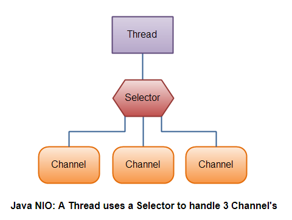

----
title: Java NIO(3) 选择器 Selector
date: 2017-04-23
description: 

tags:
- Selector
- NIO
- Java

nav:
- Java

categories:
- Java NIO

image: images/java/io.png

----
Selector 是Java NIO的重要组件之一，它可以检查一个或多个通道（Channel），并确定哪个通道进入准备好的状态，比如：准备读或者准备写数据。通过Selector 这种方式，单个线程可以管理多个通道，从而实现处理多个网络连接。

## 为什么用选择器(Selector)？

仅使用单个线程来处理多个通道的优点是，可以需要较少的线程来处理通道。实际上，你可以只使用一个线程来处理所有的通道。对于操作系统来说，在线程之间切换成本很高，而且每个线程都占用了操作系统中的一些资源(内存)。因此，使用的线程越少越好。

现代操作系统和CPU在多任务处理方面变得越来越好，因此随着时间的推移，多线程的开销变得越来越小。如果一个CPU有多个内核，那么如果不同时处理多个任务，反而会浪费CPU资源。但是请了解，设计问题不属于本文讨论范畴。在这里，你只需要了解，使用一个选择器，你可以通过一个线程来处理多个通道。

下图是一个线程处理3个通道的示意图：

 

## 创建选择器

通过调用selector. open()方法创建一个选择器，如下所示:

    Selector selector = Selector.open();

## 使用选择器的注册通道

为了让选择器使用通道，你必须在选择器上注册通道。你可以使用SelectableChannel.register() 方法来注册，如下：

    channel.configureBlocking(false);
    SelectionKey key = channel.register(selector, SelectionKey.OP_READ);

注意， 只有非阻塞模式的通道才可以使用选择器。这意味着，因为 FileChannel 不能切换成非阻塞模式，所以不能使用选择器。Socket的通道 则可以正常工作。

注意 register() 方法的第二个参数。这是一个“兴趣集”，意思是你想通过选择器在通道中监听的事件。你可以监听下面四个不同的事件：

> Connect
Accept
Read
Write

一个通道“触发一个事件”称之为“就绪”。所以，一个通道成功连接到另一台服务器，这里称之为“连接（Connect）就绪”；服务器套接字通道（ socket channel ）接收了来自客户端的连接，称之为“接收（Accept）就绪”；一个可以读取数据的通道是“读（Read）”就绪；一个可以写数据的通道是“写（Write）”就绪。

这四个事件由四个 SelectionKey 常量表示:

1. SelectionKey.OP_CONNECT
2. SelectionKey.OP_ACCEPT
3. SelectionKey.OP_READ
4. SelectionKey.OP_WRITE

如果你对不止一个事件感兴趣，可以通过 “OR” 把常量放在一起，像这样：

    int interestSet = SelectionKey.OP_READ | SelectionKey.OP_WRITE;    

## SelectionKey

正如你在上一节中看到的，当您使用选择器注册一个通道时，register()方法将返回一个SelectionKey对象。这个SelectionKey对象包含一些有趣的属性：

> 兴趣集 interest set
 就绪集 ready set
 通道Channel
 选择器Selector
一个连接对象(可选)

#### Interest Set

兴趣集是你感兴趣的“选择”的事件集合，如“使用选择器的注册通道”中所描述的，你可以通过下面这样的写法来判断趣集：

	int interestSet = selectionKey.interestOps();

	boolean isInterestedInAccept  = interestSet & SelectionKey.OP_ACCEPT;
	boolean isInterestedInConnect = interestSet & SelectionKey.OP_CONNECT;
	boolean isInterestedInRead    = interestSet & SelectionKey.OP_READ;
	boolean isInterestedInWrite   = interestSet & SelectionKey.OP_WRITE;    

####  Ready Set

已就绪的集合是通道已准备就绪的操作集合。在“选择（selection）”之后，你将主要访问已就绪的集合。“选择（selection）” 将在后面的部分中解释。你可以像这样访问就绪集：

    int readySet = selectionKey.readyOps();

你可以用类似判断兴趣集的方式来判断哪个渠道的事件或操作已经就绪，也可以通过下面的四个方法来判断：

	selectionKey.isAcceptable();
	selectionKey.isConnectable();
	selectionKey.isReadable();
	selectionKey.isWritable();

## 获取 Channel 和 Selector

	Channel  channel  = selectionKey.channel();
	Selector selector = selectionKey.selector();

## 附加对象

你可以将一个对象附加到SelectionKey，这是用于识别特定的通道的简便方法，或者将更多的信息附加到通道上。例如，你可以附加使用通道的缓冲区，或者一个包含更多聚合数据的对象。下面是如何附加对象：

    selectionKey.attach(theObject);
    Object attachedObj = selectionKey.attachment();

你还可以在使用选择器注册通道的时候，同时附加一个对象。像下面这样：

    SelectionKey key = channel.register(selector, SelectionKey.OP_READ, theObject);

## 通过选择器（Selector）选择通道

一旦你使用选择器（Selector）注册了一个或多个通道，你就可以调用Selector中的 select() 方法。这个方法返回对你所感兴趣的事件(connect, accept, read or write) 已经就绪的通道。比如，如果你对已经准备好read的通道感兴趣，那么你将可以接收准备好read的通道。

select()方法有三个：
 
    int select()  //阻塞，直到至少一个通道的事件且是你注册的事件就绪 
    int select(long timeout) // 与select() 一样阻塞，直到达到了超时的时间（毫秒数）为止
    int selectNow()//不阻塞，它会立即返回任何准备好的通道

select()方法返回的 int 表示多少通道准备好了。也就是说，自上次调用select()以来，有多少通道已经准备好了。如果你调用select()，它返回1，表示一个通道已经准备好了。如果你再次调用select()一次，此时另外一个通道已经就绪，它将再次返回1。如果你没有处理第一次调用select()时准备好的通道，那么此时实际上有两个就绪通道，但是每次select()调用，只有一个通道已经准备好了。

## selectedKeys()

一旦你调用 select() 方法返回大于0，表明一个或多个通道已经就绪，你就可以通过调用选择器的selectedKeys()方法，得到“SelectionKey”集合，通过集合访问就绪的通道。代码：

    Set<SelectionKey> selectedKeys = selector.selectedKeys();    

当你使用选择器注册一个通道时，Channel.register()方法将返回一个SelectionKey对象。这个SelectionKey对象就代表了该选择器注册的一个通道。你可以通过selectedKeySet()方法得到这些SelectionKey。例子：

    Set<SelectionKey> selectedKeys = selector.selectedKeys();

    Iterator<SelectionKey> keyIterator = selectedKeys.iterator();

    while(keyIterator.hasNext()) {
        
        SelectionKey key = keyIterator.next();

        if(key.isAcceptable()) {
            // a connection was accepted by a ServerSocketChannel.
            SocketChannel client = (SocketChannel) key.channel();  

        } else if (key.isConnectable()) {
            // a connection was established with a remote server.

        } else if (key.isReadable()) {
            // a channel is ready for reading

        } else if (key.isWritable()) {
            // a channel is ready for writing
        }

        keyIterator.remove();
    }

注意在每次迭代结束时调用 keyIterator.remove() 。选择器不会从SelectionKey集合删除SelectionKey实例。当你处理通道时，你需要手动这样做。当通道再次变为其他“就绪”状态时，选择器会再次将它（Channel）添加到所选的键集中。

调用SelectionKey.channel()方法返回通道。你需要自己转换成实际的类型使用，比如：ServerSocketChannel 或 SocketChannel 。

## wakeUp()

如果一个线程调用了select() 方法，这个线程阻塞了。那么你可以通过另外一个线程调用Selector.wakeup() 方法，来使这个阻塞的线程立刻返回，即使还没有就绪的Channel事件。

如果一个线程调用了Selector.wakeup() 方法，且当前没有其他因为调用select() 方法而阻塞的线程。那么当下一次某个线程调用select()方法的时候，它将立即返回。

## close()

当选择器调用 close()，选择器所以的SelectionKey 将失效，对应的渠道则不会关闭。

完整的示例代码：

    Selector selector = Selector.open();

    channel.configureBlocking(false);

    SelectionKey key = channel.register(selector, SelectionKey.OP_READ);

    while(true) {

      int readyChannels = selector.select();

      if(readyChannels == 0) continue;

      Set<SelectionKey> selectedKeys = selector.selectedKeys();

      Iterator<SelectionKey> keyIterator = selectedKeys.iterator();

      while(keyIterator.hasNext()) {

        SelectionKey key = keyIterator.next();

        if(key.isAcceptable()) {
            // a connection was accepted by a ServerSocketChannel.

        } else if (key.isConnectable()) {
            // a connection was established with a remote server.

        } else if (key.isReadable()) {
            // a channel is ready for reading

        } else if (key.isWritable()) {
            // a channel is ready for writing
        }

        keyIterator.remove();
      }
    }