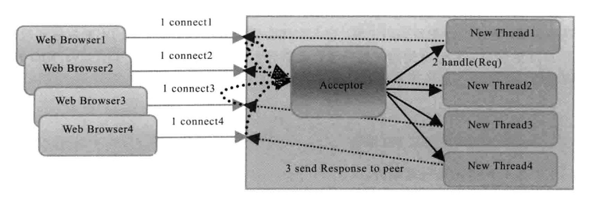
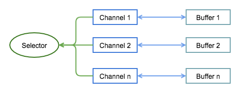
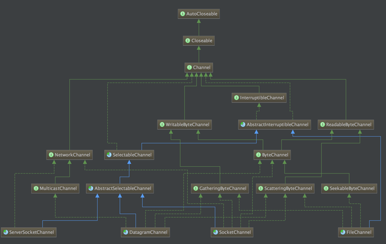
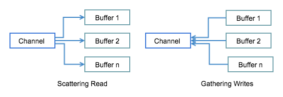
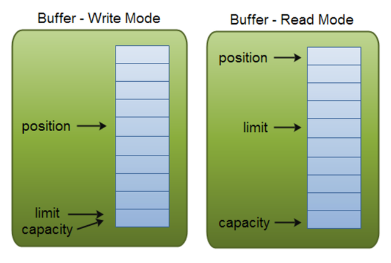
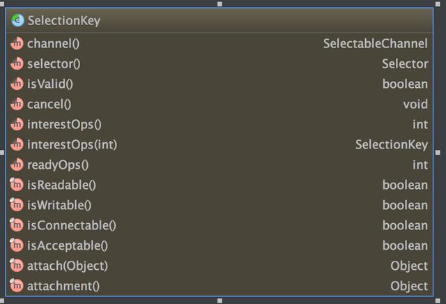
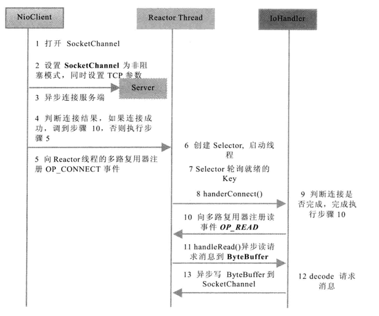
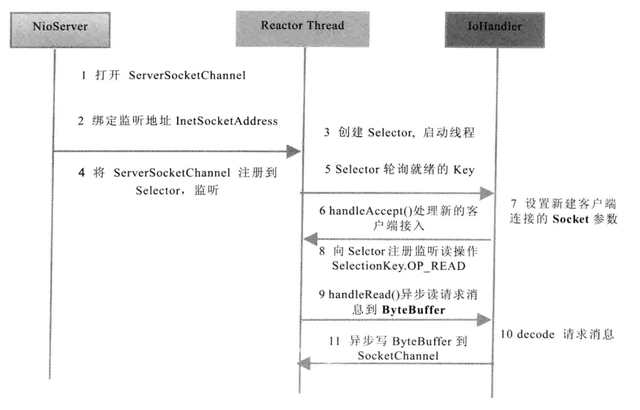

----
title: 谈一谈 Java IO 模型
date: 2019-02-27
description: 

tags:
- Reactor
- NIO模型
- NIO
- Java

nav:
- Java

categories:
- Java NIO

image: images/java/basic/java_logo.png

----
Java IO 模型对于 Java 开发工程师来说，是日常工作中经常接触的内容，特别是随着分布式系统的兴起，IO 也显得越来越重要，Java 的 IO 模型本质上还是利用操作系统提供的接口来实现，不熟悉这一部分内容的话，可以先看一下上篇文章[Unix 网络 IO 模型及 Linux 的 IO 多路复用模型](https://tech.fenxiangz.com/topic/70/unix-%E7%BD%91%E7%BB%9C-io-%E6%A8%A1%E5%9E%8B%E5%8F%8A-linux-%E7%9A%84-io-%E5%A4%9A%E8%B7%AF%E5%A4%8D%E7%94%A8%E6%A8%A1%E5%9E%8B)，本文跟上篇的内容是紧密相连的，特别是本文的重点 —— Java NIO 部分，其底层原理就是 UNIX 的 IO 多路复用，IO 多路复用在上篇文章中讲述了很多。

这篇文章大概内容如下：

1.  Java IO 模型的简单介绍；
2.  BIO 、NIO、AIO 模型的介绍，会详细介绍 NIO；
3.  几种 IO 模型的对比。

## Java IO 模型介绍
---

在 JDK 推出 Java NIO 之前，基于 Java 的所有 Socket 通信都采用了同步阻塞模式（BIO），这种一对一的通信模型虽然简化了开发的难度，但在性能和可靠性方面却存在这巨大的瓶颈，特别是无法处理高并发的场景，使得 Java 在服务器端应用十分有限。

正是由于 Java 传统 BIO 的拙劣表现，使得 Java 不得不去开发新版的 IO 模型，最终，JDK1.4 提供了新的 NIO 类库，Java 可以支持非阻塞 IO；之后，JDK1.7 正式发布，不但对 NIO 进行了升级，还提供了 AIO 功能。本文就是在对 Java 这些 IO 模型学习后，总结的一篇笔记。

### 网络编程
---
网络编程的基本模型是 Client/Server 模型，也就是两个进程之间进行相互通信，其中服务端提供位置信息（绑定的 IP 地址和端口），客户端通过连接操作向服务端监听的地址发起连接请求，通过三次握手建立连接，如果连接成功，双方就可以通过网络套接字（socket）进行通信（可以参考TCP的三次握手和四次挥手），下面先看一下两种对 IO 模型常见的分类方式。

### 同步与异步
---

描述的是用户线程与内核的交互方式，与消息的通知机制有关：

1.  同步：当一个同步调用发出后，需要等待返回消息（用户线程不断去询问），才能继续进行；
2.  异步：当一个异步调用发出后，调用者不能立即得到返回消息，完成后会通过状态、通知和回调来通知调用者。

简单来说就是：

1.  同步：同步等待消息通知，消息返回才能继续进行；
2.  异步：异步等待消息通知，完成后被调系统通过回调等来通知调用者。

### 阻塞与非阻塞
---

阻塞和非阻塞指的是不能立刻得到结果之前，会不会阻塞当前线程。

1.  阻塞：当前线程会被挂起，直到结果返回；
2.  非阻塞：指在不能立刻得到结果之前，该函数不会阻塞当前线程，而会立刻返回（会导致线程切换的增加）。

举个栗子说明：

|类别 |	示例	| |
|:--|:--|:--|
| 同步阻塞	| 在银行排队，不干别的事情	| 效率最低 |
| 同步非阻塞	| 排队时，边打电话边抬头看是否到自己了	| 效率低下|
| 异步阻塞	| 在银行领一个号后，在银行里等，不能做别的事情	 |  |
| 异步非阻塞	| 领完号后，在忙着自己的事情，直到柜台通知	| 效率较高 |

## BIO
---

BIO 模型是 Java IO 最开始提供的一种 IO 模型，BIO 又可以细分为两种模型，一是传统的同步阻塞模型，二是在对传统 BIO 模型的基本上进行的优化，又称为伪异步 IO 模型。

### 传统的 BIO 模型
---

传统 BIO 中，ServerSocket 负责绑定 IP 地址，启动监听端口；Socket 负责发起连接操作，连接成功后，双方通过输入和输出流进行同步阻塞通信。采用 BIO 通信模型的 Server，通常由一个独立的 Acceptor 线程负责监听 Client 端的连接，它接受到 Client 端连接请求后为每个 Client 创建一个新的线程进行处理，处理完之后，通过输出流返回给 Client 端，线程销毁，过程如下图所示（图来自《Netty 权威指南》）。

 

这个模型最大的问题是：

*   缺乏扩展性，不能处理高性能、高并发场景，线程是 JVM 中非常宝贵的资源，当线程数膨胀后，系统的性能就会急剧下降，随着并发访问量的继续增大，系统就会出现线程堆栈溢出、创建新线程失败等问题，导致 Server 不能对外提供服务。

示例代码参考 [Java BIO 示例](https://github.com/wangzzu/ProgramlLearn/tree/aab89008091660f1f231763660eb329eb5928bde/java_learn/java_socket/src/main/java/bio/)。

### 伪异步 IO 模型
-----------------------------------------------------------------------------------------------------------------

为了改进这种一对一的连接模型，后来又演进出了一种通过线程池或者消息队列实现 1 个或者多个线程处理所有 Client 请求的模型，由于它底层依然是同步阻塞 IO，所以被称为【伪异步 IO 模型】。相比于传统 BIO 后端不断创建新的线程处理 Client 请求，它在后端使用一个**线程池**来代替，通过线程池可以灵活的调配线程资源，设置线程的最大值，防止由于海量并发接入导致线程资源耗尽，过程如下图所示（图来自《Netty 权威指南》）。

 

看似这个模型解决了 BIO 面对的问题，实际上，由于它是面向数据流的模型，底层依然是同步阻塞模型，在处理一个 socket 输入流，它会一直阻塞下去，除非：有数据可读、可用数据读取完毕、有异常，否则会一直一直阻塞下去。这个模型最大的问题是：

*   阻塞的时间取决于对应 IO 线程的处理速度和网络 IO 的传输速度，处理效率不可控。

## Java NIO
---

Java NIO 是 Java IO 模型中最重要的 IO 模型，也是本文主要讲述的内容，正式由于 NIO 的出现，Java 才能在服务端获得跟 C 和 C++ 一样的运行效率，NIO 是 New IO（或者 Non-block IO）的简称。

与 Socket 类和 ServerSocket 类相对应，NIO 也提供了 SocketChannel 和 ServerSocketChannel 两种不同套接字通道的实现，它们都支持阻塞和非阻塞两种模式。一般来说，低负载、低并发的应用程序可以选择同步阻塞 IO 以降低复杂度，但是高负载、高并发的网络应用，需要使用 NIO 的非阻塞模式进行开发。

### 基本概念
---

在 NIO 中有三种非常重要的概念：

*   缓冲区（buffer）：本质上是一个数组，它包含一些要读写的数据；
*   通道（channel）：是一个通道，通过它读写数据，类似于自来水管；
*   多路复用器（selector）：用于选择已经就绪的任务，selector 会轮询注册在其上的 channel，选出已经就绪的 channel。

 

三者之间的关系如上图所示，这里先简单概括一下：

*   Buffer：是缓冲区，任何时候访问 NIO 数据，都是通过 Buffer 进行；
*   Channel：通过它读写 Buffer 中的数据，可以用于读、写或同时读写；
*   Selector：多路复用器，Selector 不断轮询注册在其上的 Channel，如果某个 Channel 有新的 TCP 链接接入、读和写事件，这个 Channel 就处于就绪状态，会被 Selector 轮询出来，然后通过`SelectionKey()` 可以获取就绪 Channel 的集合，进行后续的 IO 操作。

下面详细介绍一下这三个概念。

#### Channel

Channel 是全双工的，可以比流更好地映射底层操作系统的 API，与流也非常相似，有以下几点区别：

*   Channel 可以读也可以写，但流（InputStream 或 OutputStream）是单向的；
*   通道可以异步读写；
*   它是基于缓冲区（Buffer）进行读写；

在 Java 中提供以下几种 Channel：

1.  FileChannel：用于文件的读写；
2.  DatagramChannel：用于 UDP 数据读写；
3.  SocketChannel：用于 Socket 数据读写；
4.  ServerSocketChannel：监听 TCP 连接请求。

这些 Channel 类之间的继承关系如下图所示

 

从上图中，可以看出，Channel 可以分为两大类：用于网络读写的 `SelectableChannel` 和用于文件操作的 `FileChannel`。

其中，FileChannel 只能在阻塞模式下工作，具体可以参考[Java NIO FileChannel文件通道](http://wiki.jikexueyuan.com/project/java-nio-zh/java-nio-filechannel.html)。

##### NIO Scatter/Gather

Java NIO 发布时内置了对 scatter/gather的支持：

*   Scattering read 指的是从通道读取的操作能把数据写入多个 Buffer，也就是 scatter 代表了数据从一个 Channel 到多个 Buffer的过程。
*   Gathering write 则正好相反，表示的是从多个 Buffer 把数据写入到一个 Channel中。

 

示例如下，具体参考 [Java NIO Scatter / Gather](http://wiki.jikexueyuan.com/project/java-nio-zh/java-nio-scatter-gather.html)

#### Buffer

Buffer，本质上是一块内存区，可以用来读写数据，它包含一些要写入或者要读出的数据。在 NIO 中，所有数据都是通过 Buffer 处理的，读取数据时，它是直接读到缓冲区中，写入数据时，写入到缓冲区。

最常用的缓冲区是 ByteBuffer，一个 ByteBuffer 提供了一组功能用于操作 byte 数组，除了 ByteBuffer，还有其他的一些 Buffer，如：CharBuffer、IntBuffer 等，它们之间的关系如下图所示。

 

##### 基本用法

Buffer 基本用法（读写数据过程）：

1.  把数据写入 Buffer；
2.  调用 `flip()`，Buffer 由写模式变为读模式；
3.  Buffer 中读取数据；
4.  调用 `clear()` 清空 buffer，等待下次写入。

示例如下：

##### Buffer 位置信息

Buffer 实质上就是一块内存，用于读写数据，这块内存被 NIO Buffer 管理，一个 Buffer 有三个属性是必须掌握的，分别是：

*   capacity：容量；
*   position：位置；
*   limit：限制；

其中，position 和 limit 的具体含义取决于当前 buffer 的模式，capacity 在两种模式下都表示容量，Buffer 读模式和写模式如下图所示。

 

1.  容量（capacity）
    *   Buffer 有一块固定的内存，其大小就是 capacity，一旦 Buffer 写满，就需要清空已读数据以便下次继续写入新的数据；
2.  位置（Position）
    *   写模式时，当写入数据到 Buffer 的时候从一个确定的位置开始，初始化时这个位置 position 为0，写入数据后，position 的值就会指向数据之后的单元，position 最大的值可以达到 `capacity-1`；
    *   读模式时，也需要从一个确定的位置开始，Buffer 从写模式变为读模式时，position 会归零，每次读取后，position 向后移动；
3.  上限（limit）
    *   写模式时，limit 就是能写入的最大数据量，等同于 Buffer 的容量；
    *   读模式时，limit 代表我们能读取的最大容量，它的值等同于写模式下 position 位置。

##### Buffer 常用方法

*   `flip()`：把 buffer 从模式调整为读模式，在读模式下，可以读取所有已经写入的数据；
*   `clear()`：清空整个 buffer；
*   `compact()`：只清空已读取的数据，未被读取的数据会被移动到 buffer 的开始位置，写入位置则紧跟着未读数据之后；
*   `rewind()`：将 position 置为0，这样我们可以重复读取 Buffer 中的数据，limit 保持不变；
*   `mark()`和`reset()`：通过mark方法可以标记当前的position，通过reset来恢复mark的位置
*   `equals()`：判断两个 Buffer 是否相等，需满足：类型相同、Buffer 中剩余字节数相同、所有剩余字节相等；
*   `compareTo()`：compareTo 比较 Buffer 中的剩余元素，只不过这个方法适用于比较排序的。

#### Selector

Selector 是 Java NIO 核心部分，简单来说，它的作用就是：Selector 不断轮询注册在其上的 Channel，如果某个 Channel 上面有新的 TCP 连接、读和写事件，这个 Channel 就处于就绪状态，会被 Selector 轮询出来，然后通过 `SelectorKey()` 可以获取就绪 Channel 的集合，进行后续的 IO 操作。

一个 Selector 可以轮询多个 Channel，由于 JDK 底层使用了 `epoll()` 实现，它并没有最大连接句柄 1024/2048 的限制，这就意味着只需要一个线程负责 Selector 的轮询，就可以连接上千上万的 Client。

##### 注册 Channel

举一个栗子，简单介绍 `Selector` 的使用。

`register()` 的第二个参数代表的是 selector 监听的事件类型，Selector 可以监听事件类型总共有以下四种：

1.  SelectionKey.OP_CONNECT：只会注册一次，成功之后（TCP 连接建立之后），这个监听事件就取消了；
2.  SelectionKey.OP_ACCEPT：主要用于服务端，就是监听是否有新的连接请求；
3.  SelectionKey.OP_READ：注册之后不会取消，监听是否数据到来；
4.  SelectionKey.OP\_WRITE：最好的使用方法是每当发送数据时，就注册一次，然后再取消，否则每次 select 轮询时，注册 OP\_WRITE 事件的 Channel 都是 ready 的，除非 socket send buffer 满了（参考 [Communicating between nio OP\_READ and OP\_WRITE operations](https://stackoverflow.com/questions/23136079/communicating-between-nio-op-read-and-op-write-operations)）。

##### SelectionKey

`Set<SelectionKey> selectionKeys = selector.selectedKeys();` 返回的是已经就绪的 Channel 集合，`SelectionKey` 对象的详细属性如下图所示。

 

### NIO 原理
--------------------------------------------------------------------------------

Java NIO 实现的关键是 IO 多路复用（具体可以参考上篇文章：[Linux 的 IO 多路复用模型](https://tech.fenxiangz.com/topic/70/unix-%E7%BD%91%E7%BB%9C-io-%E6%A8%A1%E5%9E%8B%E5%8F%8A-linux-%E7%9A%84-io-%E5%A4%9A%E8%B7%AF%E5%A4%8D%E7%94%A8%E6%A8%A1%E5%9E%8B#linux-%E7%9A%84-io-%E5%A4%9A%E8%B7%AF%E5%A4%8D%E7%94%A8%E6%A8%A1%E5%9E%8B)），在 Linux 平台，Java NIO 是基于 epoll（2.6以上，之前是 Select） 来实现的。

Linux 的 select/epoll 使用的是 Reactor 网络 IO 模式。网络编程中，有两种常用的设计模式，它们都是基于事件驱动：

*   Reactor 模式：主动模式，应用程序不断去轮询，问操作系统 IO 是否就绪，实际的 IO 操作还是由应用实现（IO 多路复用采用的模式）；
*   Proactor 模式：被动模式，操作系统把 IO 完成后通知应用程序，此时数据已经就绪。

这两种模式详细内容可以参考[两种高性能 I/O 设计模式 Reactor 和 Proactor](https://tech.fenxiangz.com/topic/72/%E4%B8%A4%E7%A7%8D%E9%AB%98%E6%80%A7%E8%83%BD-i-o-%E8%AE%BE%E8%AE%A1%E6%A8%A1%E5%BC%8F-reactor-%E5%92%8C-proactor)一文。

### NIO 编程
--------------------------------------------------------------------------------

关于 Java NIO，有两种最常见的使用方式：

*   使用原生的 Java NIO（如 Kafka）；
*   使用 Netty（Hadoop 的 RPC 框架 Avro 底层使用 Netty 做通信框架）。

在实际使用中，推荐第二种，使用 Netty 将会大大提高开发效率，后续会写篇关于 Netty 的文章，介绍一下 Netty 的具体内容，这里使用一个基于 Java 原生 NIO API 的小示例，讲述一下 NIO 的使用方法。

#### Client 端

NIO Client 创建序列图如下图所示（图片来自《Netty 权威指南》）。

 

具体的代码及注释参考：[NIO Client 端代码](https://github.com/wangzzu/ProgramlLearn/tree/aab89008091660f1f231763660eb329eb5928bde/java_learn/java_socket/src/main/java/nio/client/)。

#### Server 端

NIO Server 创建序列图如下图所示（图片来自《Netty 权威指南》）。

 

具体的代码及注释参考：[NIO Server 端代码](https://github.com/wangzzu/ProgramlLearn/tree/aab89008091660f1f231763660eb329eb5928bde/java_learn/java_socket/src/main/java/nio/server/)。

## IO 模型对比
---

在对比之前，先简单介绍 Java AIO 模型，这里就不再进行相应的展开了。

### AIO
---

NIO 2.0 中引入异步通道的概念，并提供了异步文件通道和异步套接字导通的实现，它是真正的异步非阻塞I IO，底层是利用事件驱动（AIO）实现，不需要多路复用器（Selector）对注册的通道进行轮组操作即可实现异步读写。

可以参考[在 Java 7 中体会 NIO.2 异步执行的快乐](https://www.ibm.com/developerworks/cn/java/j-lo-nio2/)

### 几种 IO 模型功能和特性对比
---

| | 传统 BIO  |	伪异步 IO	  |   NIO	|  AIO | 
|:--|:--|:--|:--|:--|
| client 数：IO 线程数  |	1：1  |	M：N（M 可以大于 N）|	M：1	| M：0（不需要额外的线程，被动回调）
|   IO 类型（阻塞） | 	阻塞IO	|   阻塞IO	|    非阻塞IO	|   非阻塞IO
|   IO 类型（同步）| 	同步 IO	|   同步 IO	|    同步 IO（IO 多路复用）	|  异步 IO
|   可靠性   | 	非常差 | 	差    | 	高	 |   高
|   吞吐量   | 	低	|  中	  |  高	|  高

本文主要是对 Java IO 模型总结，特别是对 NIO 模型的总结。

参考

*   《Netty 权威指南》；
*   Java NIO [英文版](http://tutorials.jenkov.com/java-nio/index.html)，[中文版](http://ifeve.com/java-nio-all/)；