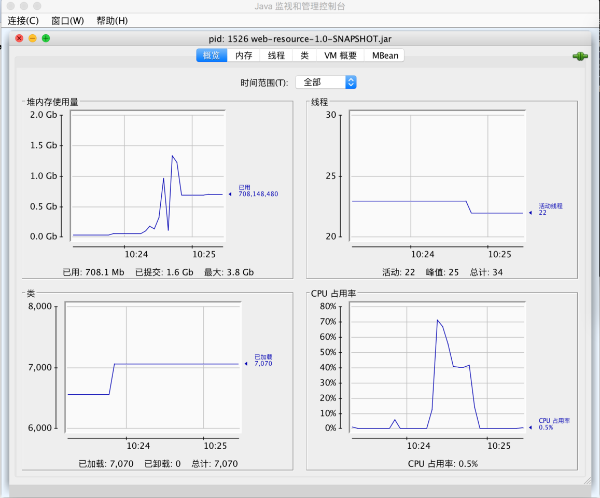
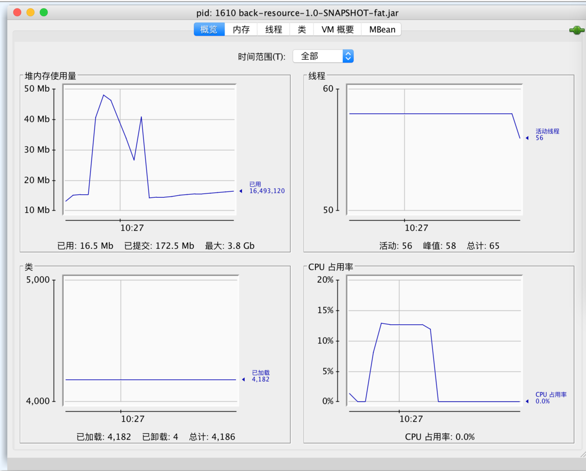

---

title: 请给Sprint Boot多一些内存
date: 2020-05-20
description:
{: id="20201220214147-q2sjtgj"}

tags:
{: id="20201220214147-mfi4vmp"}

- {: id="20201220214147-sf00abt"}Java
- {: id="20201220214147-yadsgiw"}Spring
- {: id="20201220214147-m36aaxy"}Spring Boot
{: id="20201220214147-fqg4oin"}

nav:
{: id="20201220214147-gx8ebwx"}

- {: id="20201220214147-j1ml2db"}Spring
{: id="20201220214147-bx5wg0h"}

categories:
{: id="20201220214147-4t2z0qr"}

- {: id="20201220214147-osqi6j6"}Spring Boot
{: id="20201220214147-z914eac"}

image: images/java/spring-framework.png
{: id="20201220214147-atmlyv8"}

---

## 概述
{: id="20201220214147-pw0xbea"}

SprintBoot总体来说，搭建还是比较容易的，特别是SpringCloud全家桶，简称亲民微服务，但在发展趋势中，容器化技术已经成熟，面对巨耗内存的SprintBoot，小公司表示用不起。如今，很多刚诞生的JAVA微服务框架大多主打“轻量级”，主要还是因为SprintBoot太重。
{: id="20201220214147-pm3pu82"}

## JAVA系微服务框架No1-Spring Cloud
{: id="20201220214147-o4l3tzu"}

#### 介绍
{: id="20201220214147-gjozwa8"}

有Spring大靠山在，更新、稳定性、成熟度的问题根本不需要考虑。在JAVA系混的技术人员大约都听说过Spring的大名吧，所以不缺程序员……，而且这入手的难度十分低，完全可以省去一个架构师。
但是，你必然在服务器上付出：
{: id="20201220214147-ng5so98"}

- {: id="20201220214147-k80ffb8"}至少一台“服务发现 ”的服务器；
- {: id="20201220214147-1ia9040"}可能有一个统一的网关Gateway;
- {: id="20201220214147-jq3cld6"}可能需要一个用于“分布式配置管理”的配置中心；
- {: id="20201220214147-h6xinu0"}可能进行“服务追踪”，知道我的请求从哪里来，到哪里去；
- {: id="20201220214147-ef9xfbi"}可能需要“集群监控”；
  项目上线后发现，我们需要好多服务器，每次在集群中增加服务器时，都感觉心疼；
{: id="20201220214147-p7iao40"}

#### 压测30秒
{: id="20201220214147-qqvov3t"}

##### 压测前的内存占用
{: id="20201220214147-5ga3kpg"}

如图，内存占用304M。
{: id="20201220214147-3xd33tb"}

##### 压测时的内存占用
{: id="20201220214147-2vpljhu"}

如图，内存占用1520M（1.5G），CPU上升到321%
{: id="20201220214147-5vfk3h5"}

##### 概览
{: id="20201220214147-96o7z55"}

{: id="20201220214147-tmnqorx"}

##### 总结
{: id="20201220214147-27jam26"}

一个SprintBoot的简单应用，最少1G内存，一个业务点比较少的微服务编译后的JAR会大约50M；而SprintCloud引入的组件会相对多一些，消耗的资源也会相对更多一些。
{: id="20201220214147-x3bnerj"}

启动时间大约10秒左右: `Started Application in 10.153 seconds (JVM running for 10.915)`
{: id="20201220214147-47jpxxc"}

## JAVA系响应式编程的工具包Vert.x
{: id="20201220214147-smiavcp"}

#### 介绍
{: id="20201220214147-9gbjewo"}

背靠Eclipse的[Eclipse Vert.x](https://vertx.io/)是一个用于在JVM上构建响应式应用程序的工具包。定位上与SprintBoot不冲突，甚至可以将Vert.x结合SprintBoot使用。众多Vert.x模块提供了大量微服务的组件，在很多人眼里是一种微服务架构的选择。
{: id="20201220214147-ag0fdwr"}

华为微服务框架[Apache ServiceComb](http://servicecomb.apache.org/cn/)就是以Vert.x为底层框架实现的，在"基准测试网站TechEmpower"中，Vert.x的表现也十分亮眼。
{: id="20201220214147-zrqz0x1"}

#### 压测30秒
{: id="20201220214147-50r5ek9"}

##### 压测前的内存占用
{: id="20201220214147-dbbg609"}

如图，内存占用65M。
{: id="20201220214147-b3i4k4i"}

##### 压测时的内存占用
{: id="20201220214147-tktyfqv"}

如图，内存占139M，CPU占2.1%，给人的感觉似乎并没有进行压测。
{: id="20201220214147-py27qgm"}

##### 概览
{: id="20201220214147-idprk0r"}

{: id="20201220214147-rgjlp6c"}

##### 总结
{: id="20201220214147-wh8bht6"}

Vert.x单个服务打包完成后大约7M左右的JAR，不依赖Tomcat、Jetty之类的容器，直接在JVM上跑。
{: id="20201220214147-fhv77ds"}

Vert.x消耗的资源很低，感觉一个1核2G的服务器已经能够部署许多个Vert.x服务。除去编码方面的问题，真心符合小项目和小模块。git市场上已经出现了基于Vert.x实现的开源网关- [VX-API-Gateway帮助文档](https://duhua.gitee.io/vx-api-gateway-doc/)
对多语言支持，很适合小型项目快速上线。
{: id="20201220214147-uqz5yqf"}

启动时间不到1秒：`Started Vert.x in 0.274 seconds (JVM running for 0.274)`
{: id="20201220214147-6frmns4"}

## JAVA系其他微服务框架
{: id="20201220214147-gdjv6sv"}

### SparkJava
{: id="20201220214147-6t755ri"}

- {: id="20201220214147-7cva448"}jar比较小，大约10M
- {: id="20201220214147-zr4cveu"}占内存小，大约30~60MB；
- {: id="20201220214147-7kngx56"}性能还可以，与SprintBoot相仿；
{: id="20201220214147-a13e6q0"}

### Micronaut
{: id="20201220214147-nf6ndc5"}

- {: id="20201220214147-9cqbgqv"}Grails团队新宠；
- {: id="20201220214147-eoaosd2"}可以用 Java、Groovy 和 Kotlin 编写的基于微服务的应用程序；
- {: id="20201220214147-g17bwcm"}相比SprintBoot已经比较全面；
- {: id="20201220214147-4qu7gf3"}性能较优，编码方式与SprintBoot比较类似；
- {: id="20201220214147-2p8ubl3"}启动时间和内存消耗方面比其他框架更高效；
- {: id="20201220214147-4f1116f"}多语言；
- {: id="20201220214147-5161c69"}依赖注入；
- {: id="20201220214147-71qm6ac"}内置多种云本地功能；
- {: id="20201220214147-j9ste59"}很新，刚发布1.0.0
{: id="20201220214147-bj2da2i"}

### Javalin
{: id="20201220214147-6lpj304"}

- {: id="20201220214147-t9dxj08"}上手极为容易；
- {: id="20201220214147-l7yghs5"}灵活，可以兼容同步和异步两种编程思路；
- {: id="20201220214147-49rm9t2"}JAR小，4～5M；
- {: id="20201220214147-rjtn5md"}多语言；
- {: id="20201220214147-ro8rdip"}有KOA的影子；
- {: id="20201220214147-6psbirj"}只有大约2000行源代码，源代码足够简单，可以理解和修复；
- {: id="20201220214147-efuyirs"}符合当今趋势；
- {: id="20201220214147-7lds5qu"}多语言；
- {: id="20201220214147-tayrvu1"}嵌入式服务器Jetty；
{: id="20201220214147-330vwn1"}

### Quarkus
{: id="20201220214147-659t7rr"}

- {: id="20201220214147-jmuwpvd"}启动快；
- {: id="20201220214147-rmrwyrj"}JAR小，大约10M；
- {: id="20201220214147-ielk1nr"}文档很少；
{: id="20201220214147-n7qj592"}

原文：https://juejin.im/post/5c89f266f265da2d8763b5f9
{: id="20201220214147-z1z6u9j"}

{: id="20201220214147-n06vm4c" type="doc"}
