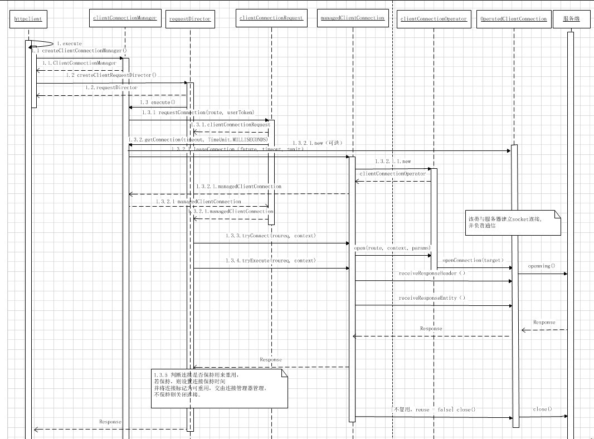
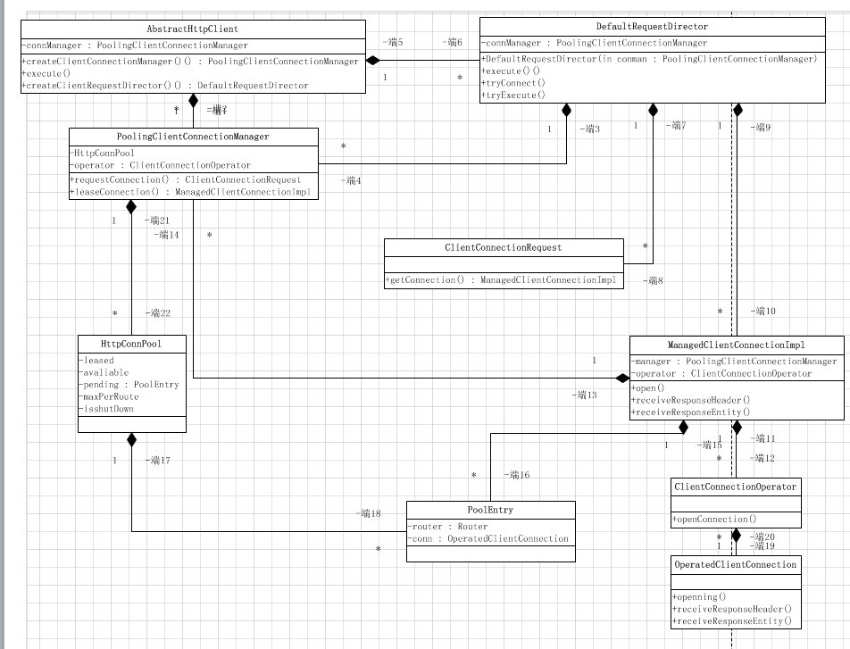
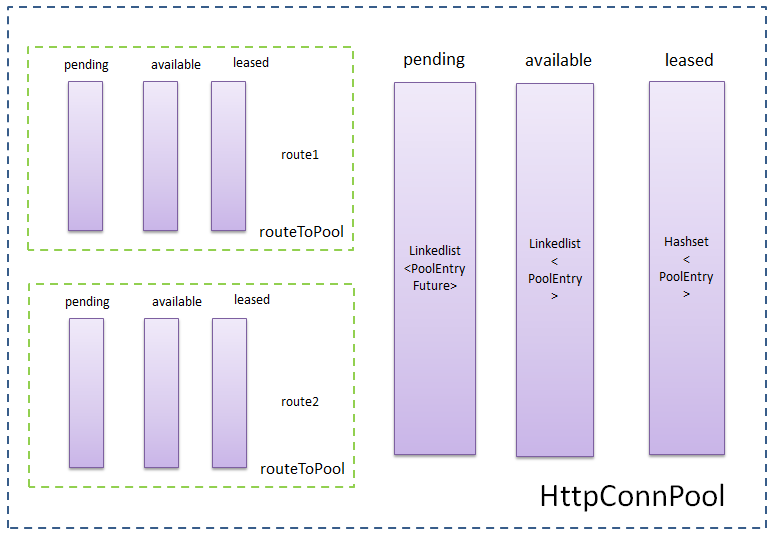
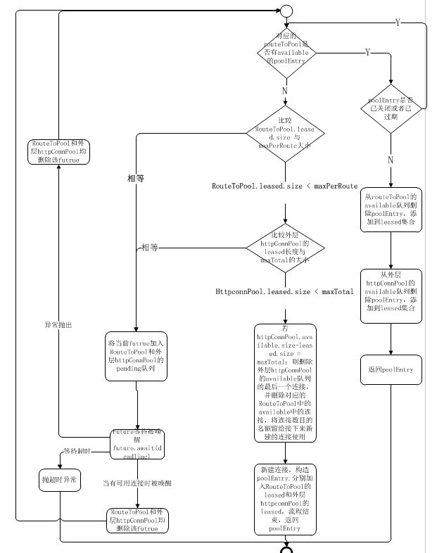
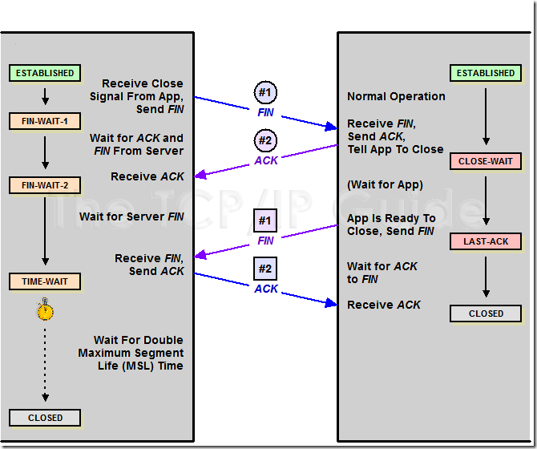

----
title: HttpClient连接池原理及一次连接时序图
date: 2020-12-23
description: 

tags:
- Java
- HttpClient

nav:
- Java

categories:
- RPC

image: images/java/basic/java_logo.png

----
# HttpClient介绍

HttpClient是一个实现了http协议的开源Java客户端工具库，可以通过程序发送http请求。

## 1.1 HttpClient发送请求和接收响应

### 1.1.1 **代码示例**

以Get请求为例，以下代码获得google主页内容并将返回结果打印出来。

    public final static void main(String[] args) throws Exception {
        HttpClient httpclient = new DefaultHttpClient();
        try {
            HttpGet httpget = new HttpGet("http://www.google.com/");
            System.out.println("executing request " + httpget.getURI());
            // 创建response处理器
            ResponseHandler<String> responseHandler = new BasicResponseHandler();
            String responseBody = httpclient.execute(httpget, responseHandler);
            System.out.println("----------------------------------------");
            System.out.println(responseBody);
            System.out.println("----------------------------------------");
        } finally {
            //HttpClient不再使用时，关闭连接管理器以保证所有资源的释放
            httpclient.getConnectionManager().shutdown();
        }
    }

### **1.1.2 时序图**

httpClient执行一次请求，即运行一次httpClient.execute()方法，时序图如下：

### **1.1.3 时序图说明**

#### 1.1.3.1  时序图编号说明

 1.1、1.2、1.3等均为操作1的子操作，即：操作1 execute()中又分别调用了操作1.1 createClientConnectionManager()、操作1.2 createClientRequestDirector()以及操作1.3 requestDirector 对象的execute()方法等，以此类推。

 按时间先后顺序分别编号为1,2,3等，以此类推。

#### 1.1.3.2 主要类说明

 
 对于图中各对象，httpClient jar包中均提供对应的接口及相应的实现类。

 图中直接与服务器进行socket通信的是最右端接口OperatedClientConnection某一实现类的对象，图中从右到左进行了层层的封装，最终开发人员直接使用的是接口HttpClient某一实现类的对象进行请求的发送和响应的接收（如2.1.1代码示例）。

 时序图中各对象所在类关系如下图类图所示（仅列出图中所出现的各个类及方法，参数多的方法省略部分参数，其他类属性和操作请参照源码）：
 
**1.1.3.2.1 接口OperatedClientConnection**

 该接口对应一个http连接，与服务器端建立socket连接进行通信。

**1.1.3.2.2 接口ManagedClientConnection**

 该接口对一个http连接OperatedClientConnection进行封装，ManagedClientConnection维持一个PoolEntry<HttpRoute, OperatedClientConnection>路由和连接的对应。提供方法获得对应连接管理器，对http连接的各类方法，如建立连接，获得相应，关闭连接等进行封装。

**1.1.3.2.3 接口RequestDirector**

 RequestDirector为消息的发送执行者，该接口负责消息路由的选择和可能的重定向，消息的鉴权，连接的分配回收（调用ClientConnectionManager相关方法），建立，关闭等并控制连接的保持。

 连接是否保持以及保持时间默认原则如下：

**连接是否保持**：客户端如果希望保持长连接，应该在发起请求时告诉服务器希望服务器保持长连接（http 1.0设置connection字段为keep-alive，http 1.1字段默认保持）。根据服务器的响应来确定是否保持长连接，判断原则如下：

检查返回response报文头的Transfer-Encoding字段，若该字段值存在且不为chunked，则连接不保持，直接关闭。其他情况进入下一步。

检查返回的response报文头的Content-Length字段，若该字段值为空或者格式不正确（多个长度，值不是整数），则连接不保持，直接关闭。其他情况进入下一步

检查返回的response报文头的connection字段（若该字段不存在，则为Proxy-Connection字段）值

如果这俩字段都不存在，则http 1.1版本默认为保持，将连接标记为保持， 1.0版本默认为连接不保持，直接关闭。

如果字段存在，若字段值为close 则连接不保持，直接关闭；若字段值为keep-alive则连接标记为保持。

**连接保持时间**：连接交换至连接管理时，若连接标记为保持，则将由连接管理器保持一段时间；若连接没有标记为保持，则直接从连接池中删除并关闭entry。连接保持时，保持时间规则如下：

保持时间计时开始时间为连接交换至连接池的时间。

保持时长计算规则为：获取keep-alive字段中timeout属性的值，

若该字段存在，则保持时间为 timeout属性值*1000，单位毫秒。

若该字段不存在，则连接保持时间设置为-1，表示为无穷。

响应头日志示例：

    17:59:42.051 [main] DEBUG org.apache.http.headers - << Keep-Alive: timeout=5, max=100
    17:59:42.051 [main] DEBUG org.apache.http.headers - << Connection: Keep-Alive
    17:59:42.051 [main] DEBUG org.apache.http.headers - << Content-Type: text/html; charset=utf-8
    17:59:42.062 [main] DEBUG c.ebupt.omp.sop.srmms.SopHttpClient - Connection can be kept alive for 5000 MILLISECONDS

若需要修改连接的保持及重用默认原则，则需编写子类继承自AbstractHttpClient，分别覆盖其  createConnectionReuseStrategy() 和createConnectionKeepAliveStrategy() 方法。

**1.1.3.2.4 接口ClientConnectionManager**

 ClientConnectionManager为连接池管理器，是线程安全的。Jar包中提供的具体实现类有BasicClientConnectionManager和PoolingClientConnectionManager。其中BasicClientConnectionManager只管理一个连接。PoolingClientConnectionManager管理连接池。

 若有特殊需要，开发人员可自行编写连接管理器实现该接口。

 连接管理器自动管理连接的分配以及回收工作，并支持连接保持以及重用。连接保持以及重用由RequestDirector进行控制。

**1.1.3.2.5 接口HttpClient**

接口HttpClient为开发人员直接使用的发送请求和接收响应的接口，是线程安全的。jar包中提供的实现类有：AbstractHttpClient, DefaultHttpClient, AutoRetryHttpClient, ContentEncodingHttpClient, DecompressingHttpClient, SystemDefaultHttpClient。其中其他所有类都继承自抽象类AbStractHttpClient，该类使用了门面模式，对http协议的处理进行了默认的封装,包括默认连接管理器，默认消息头，默认消息发送等，开发人员可以覆盖其中的方法更改其默认设置。

AbstractHttpClient默认设置连接管理器为BasicClientConnectionManager。若要修改连接管理器，则应该采用以下方式之一：

初始化时，传入连接池，例如：

ClientConnectionManager connManager  = new PoolingClientConnectionManager();

HttpClient httpclient = new DefaultHttpClient(connManager);

编写httpClient接口的实现类，继承自AbstractHttpClient并覆盖其createClientConnectionManager()方法，在方法中创建自己的连接管理器。

#### 1.1.3.3 方法说明

createClientConnectionManager()，创建连接池，该方法为protected。子类可覆盖修改默认连接池。

createClientRequestDirector()，创建请求执行者，该方法为protected。子类可覆盖但一般不需要。

httpClient中调用1.2方法所创建的请求执行者requestDirector的execute()方法。该方法中依次调用如下方法：

1.3.1调用连接管理器的requestConnection(route, userToken)方法，该方法调用连接池httpConnPool的lease方法，创建一个Future<HttpPoolEntry>。Futrue用法参见Java标准API。返回clientConnectionRequest。

1.3.2调用clientConnectionRequest的getConnection(timeout, TimeUnit.MILLISECONDS)方法，该方法负责将连接池中可用连接分配给当前请求，具体如下：

创建clientConnectionOperator。

执行1.3.1中创建的Future的任务，该任务获得当前可用的poolEntry<router，OperatedClientConnection>并封装成managedClientConnectionImpl返回。

1.3.3调用 tryConnect(roureq, context)方法，该方法最终调用OperatedClientConnection的openning方法，与服务器建立socket连接。

1.3.4调用 tryExecute(roureq, context)方法，该方法最终调用OperatedClientConnection的receiveResponseHeader（）和receiveResponseEntity（）获得服务器响应。

1.3.5 判断连接是否保持用来重用，若保持，则设置保持时间，并将连接标记为可重用不保持则调用managedClientConnectionImpl的close方法关闭连接，该方法最终调用OperatedClientConnection的close()方法关闭连接。

最终respose返回至httpClient。

发送请求的线程需处理当前连接，若已被标记为重用，则交还至连接池管理器；否则，关闭当前连接。（使用响应处理器ResponseHanler）。本次请求结束。

## 1.2 HttpClient连接池

若连接管理器配置为PoolingClientConnectionManager，则httpClient将使用连接池来管理连接的分配，回收等操作。

### **1.2.1 连接池结构**

连接池结构图如下，其中：

PoolEntry<HttpRoute, OperatedClientConnection>为路由和连接的对应。

routeToPool可以多个（图中仅示例两个）；图中各队列大小动态变化，并不相等；

maxTotal限制的是外层httpConnPool中leased集合和available队列的总和的大小，leased和available的大小没有单独限制；

同理：maxPerRoute限制的是routeToPool中leased集合和available队列的总和的大小；

### **1.2.2 连接池工作原理**

#### 1.2.2.1  分配连接

分配连接给当前请求包括两部分：1从连接池获取可用连接PoolEntry；2.将连接与当前请求绑定。其中第一部分从连接池获取可用连接的过程为：

1 获取route对应连接池routeToPool中可用的连接，有则返回该连接。若没有则转入下一步。

2 若routeToPool和外层HttpConnPool连接池均还有可用的空间，则新建连接，并将该连接作为可用连接返回；否则进行下一步

3 将当前请求放入pending队列，等待执行。

4 上述过程中包含各个队列和集合的删除，添加等操作以及各种判断条件，具体流程如下：

#### 1.2.2.2  回收连接

连接用完之后连接池需要进行回收，具体流程如下：

1 若当前连接标记为重用，则将该连接从routeToPool中的leased集合删除，并添加至available队列，同样的将该请求从外层httpConnPool的leased集合删除，并添加至其available队列。同时唤醒该routeToPool的pending队列的第一个PoolEntryFuture。将其从pending队列删除，并将其从外层httpConnPool的pending队列中删除。

2 若连接没有标记为重用，则分别从routeToPool和外层httpConnPool中删除该连接，并关闭该连接。

#### 1.2.2.3  过期和空闲连接的关闭

连接如果标记为保持时，将由连接管理器保持一段时间，此时连接可能出现的情况是：

连接处于空闲状态，时间已超过连接保持时间

连接处于空闲状态，时间没有超过连接保持时间

以上两种情况中，随时都会出现连接的服务端已关闭的情况，而此时连接的客户端并没有阻塞着去接受服务端的数据，所以客户端不知道连接已关闭，无法关闭自身的socket。

连接池提供的方法：

首先连接池在每个请求获取连接时，都会在RouteToPool的available队列获取Entry并检测此时Entry是否已关闭或者已过期，若是则关闭并移除该Entry。

closeExpiredConnections()该方法关闭超过连接保持时间的空闲连接。

closeIdleConnections(timeout,tunit)该方法关闭空闲时间超过timeout的连接，空闲时间从交还给连接管理器时开始，不管是否已过期超过空闲时间则关闭。所以Idle时间应该设置的尽量长一点。

以上两个方法连接关闭的过程均是：

关闭entry;

RouteToPool中删除当前entry。先删available队列中的，如果没有，再删除leased集合中的。

httpConnPool中删除当前entry。删除过程同RouteToPool

唤醒阻塞在RouteToPool中的第一个future。

## 1.3 相关原理说明

### 1.3.1 **Tcp连接的关闭**

Http连接实际上在传输层建立的是tcp连接，最终利用的是socket进行通信。http连接的保持和关闭实际上都和TCP连接的关闭有关。TCP关闭过程如下图：

说明：

 TCP连接程序中使用socket编程进行实现。一条TCP是一条抽象的连接通道，由通信双方的IP+端口号唯一确定，两端分别通过socket实例进行操作，一个socket实例包括一个输入通道和输出通道，一端的输出通道为另一端的输入通道。

 Tcp连接的关闭是连接的两端分别都需要进行关闭（调用close(socket)，该函数执行发送FIN，等待ACK等图示操作）。实际上没有客户端和服务端的区别，只有主动关闭和被动关闭的区别。对于上层的其http连接，实际上也就是http服务端主动关闭或者http客户端主动关闭，而不管谁主动，最终服务端和客户端都需要调用close(socket)关闭连接。
 
 主动关闭的一端A调用了close函数之后，若另一端B并没有阻塞着等待着数据，就无法检测到连接的A端已关闭，就没法关闭自身的socket，造成资源的浪费。http连接都是一次请求和响应，之后便交回给连接管理池，因此在http连接池中应当能够移除已过期或者空闲太久的连接，因为他们可能已经被服务器端关闭或者客户端短期内不再使用。

 TIME_WAIT状态：

**可靠地实现TCP全双工连接的终止**

在进行关闭连接四路握手协议时，最后的ACK是由主动关闭端发出的，如果这个最终的ACK丢失，被动关闭端将重发最终的FIN，因此主动关闭端必须维护状态信息允许它重发最终的ACK。如果不维持这个状态信息，那么主动关闭端将发送RST分节（复位），被动关闭端将此分节解释成一个错误（在java中会抛出connection reset的SocketException)。因而，要实现TCP全双工连接的正常终止，主动关闭的客户端必须维持状态信息进入TIME_WAIT状态。

**允许老的重复分节在网络中消逝**

TCP分节可能由于路由器异常而“迷途”，在迷途期间，TCP发送端可能因确认超时而重发这个分节，迷途的分节在路由器修复后也会被送到最终目的地，这个原来的迷途分节就称为lost duplicate。在关闭一个TCP连接后，马上又重新建立起一个相同的IP地址和端口之间的TCP连接，后一个连接被称为前一个连接的化身（incarnation)，那么有可能出现这种情况，前一个连接的迷途重复分组在前一个连接终止后出现，从而被误解成从属于新的化身。为了避免这个情况，TCP不允许处于TIME_WAIT状态的连接启动一个新的化身，因为TIME_WAIT状态持续2MSL，就可以保证当成功建立一个TCP连接的时候，来自连接先前化身的重复分组已经在网络中消逝。

# HttpClient最佳实践

## 2.1 总原则

### 2.1.1 **版本**

原Commons HttpClient：3.x不再升级维护，使用Apache HttpComponents的HttpClient代替。Pom文件修改如下：

1 原maven依赖：

    <dependency>
           <groupId>commons-httpclient</groupId>
           <artifactId>commons-httpclient</artifactId>
           <version>3.1</version>
    </dependency>

2 替换为：

    <dependency>
           <groupId>org.apache.httpcomponents</groupId>
           <artifactId>httpclient</artifactId>
           <version>4.2.1</version>
    </dependency>

### **2.1.2 使用http连接池管理器**

 编写类继承自DefaultHttpClient(以下假设为SopHttpClient)，覆盖其createClientConnectionManager()方法，方法中创建连接池管理器。

 开启一个线程（假设为IdleConnectionMonitorThread）用来清除连接池中空闲和过期的连接。

### **2.1.3 保持HttpClient单例**

Spring配置中使用默认scope，即单例模式，其他类使用时由Spring配置进行依赖注入，不要使用new方法。SopHttpClient应该提供方法destroy()并配置在Spring销毁该bean前调用，destory()方法中关闭对应连接池管理器和监控线程IdleConnectionMonitorThread。

### **2.1.4 异常处理机制（请求和响应）：**

编写类实现接口HttpRequestRetryHandler（可参照默认实现DefaultHttpRequestRetryHandler），并覆盖AbstractHttpClient中的createHttpRequestRetryHandler()方法创建新的重试处理机制。

### **2.1.5 参数可配置**

各参数（连接池默认ip、端口和大小等，超时时间等）尽量都集中在SopHttpClient类中，设置为由Spring进行统一配置，且提供接口在程序中修改。

### **2.1.6 保证连接交回至连接池管理器**

#### 2.1.6.1  方式

HttpResponse response = httpclient.execute(httpMethod);

HttpEntity entity = response.getEntity();

这两段代码返回的entity是HttpEntity的实现类BasicManagedEntity。此时与本次请求关联的连接尚未归还至连接管理器。需要调用以下两条语句：

InputStream instream = entity.getContent();//获得响应具体内容

//处理响应：代码省略

instream.close();//关闭输入流同时会将连接交回至连接处理器

#### 2.1.6.2  使用默认的响应处理器BasicResponseHandler

 HttpClient Jar包中提供BasicResponseHandler。**如果返回的类型能确定需要解码为String类型的话，推荐使用该响应处理器。**

 该处理器解码http连接响应字节流为String类型，对返回码>=300的响应进行了异常封装，并能够保证连接交还给连接池管理器。

 该处理器将字节解码为字符的过程依次如下：

1 如果响应http报文Head部分由指定的charset，则使用该charset进行解码，否则进行下一步。例如使用UTF-8解码以下响应：

17:59:42.051 [main] DEBUG org.apache.http.headers - << Content-Type: text/html; charset=utf-8

2 如果响应报文未执行charset，则使用传入EntityUntils.toString()时指定的charset进行解码。否则进行下一步

3 使用ISO-8859-1进行解码。

#### 2.1.6.3  BasicManagedEntity关闭连接池管理器原理

**2.1.6.3.1**

BasicManagedEntity实现了三个接口:HttpEntity，ConnectionReleaseTrigger, EofSensorWatcher。

调用BasicManagedEntity的getContent方法时，实际上初始化了EofSensorInputStream的实例，并将BasicManagedEntity当前对象自身作为EofSensorWatcher传入。

    //BasicManagedEntity类的继承体系，HttpEntityWrapper实现了接口HttpEntity
    public class BasicManagedEntity extends HttpEntityWrapper 
            implements ConnectionReleaseTrigger, EofSensorWatcher

BasicManagedEntity的getContent方法：

    @Override
    public InputStream getContent() throws IOException {
        return new EofSensorInputStream(wrappedEntity.getContent(), this);
    }

    // EofSensorInputStream构造函数声明
    public EofSensorInputStream(final InputStream in,final EofSensorWatcher watcher);

**2.1.6.3.2** 

调用EofSensorInputStream的close方法，该方法调用自身的checkClose()方法，checkClose()方法中调入了传入的EofSensorWatcher watcher的streamClosed()方法并关闭输入流，由于上一步骤中实际传入的watcher是BasicManagedEntity的实例，因此实际上调用的是BasicManagedEntity的streamClose()方法。

    //close方法
    @Override
    public void close() throws IOException {

        // tolerate multiple calls to close()

        selfClosed = true;

        checkClose();

    }

    //checkClose方法
    protected void checkClose() throws IOException {
        if (wrappedStream != null) {
            try {
                boolean scws = true; // should close wrapped stream?
                if (eofWatcher != null)
                    scws = eofWatcher.streamClosed(wrappedStream);
                if (scws)
                    wrappedStream.close();
            } finally {
                wrappedStream = null;
            }
        }
    }

**2.1.6.3.3** 

BasicManagedEntity的streamClose()方法中将连接交回至连接池管理器。

    public boolean streamClosed(InputStream wrapped) throws IOException {
        try {
            if (attemptReuse && (managedConn != null)) {
                boolean valid = managedConn.isOpen();
                // this assumes that closing the stream will
                // consume the remainder of the response body:
                try {
                    wrapped.close();
                    managedConn.markReusable();
                } catch (SocketException ex) {
                    if (valid) {
                        throw ex;
                    }
                }
            }
        } finally {
            releaseManagedConnection();
        }
        return false;

}

### **2.1.7 其他**

HttpClient 提供了非常灵活的架构，同时提供了很多接口，需要修改时，找到对应接口和默认实现类，参照默认实现类进行修改即可（或继承默认实现类，覆盖其对应方法）。通常需要更改的类有AbstractHttpClient和各种handler以及Strategy

文章转载自：https://developer.aliyun.com/article/11893