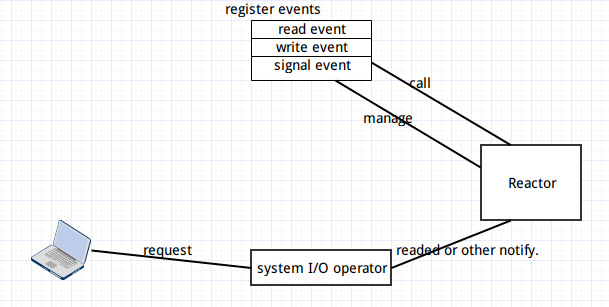
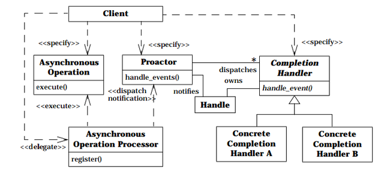
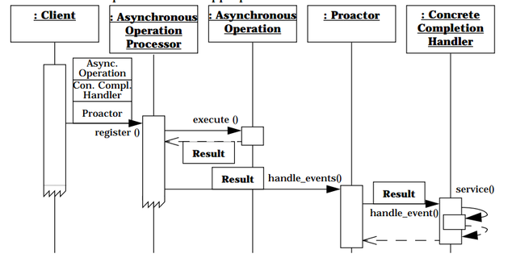
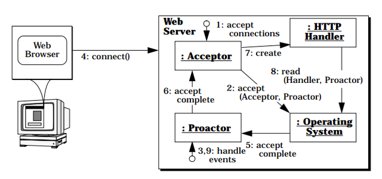
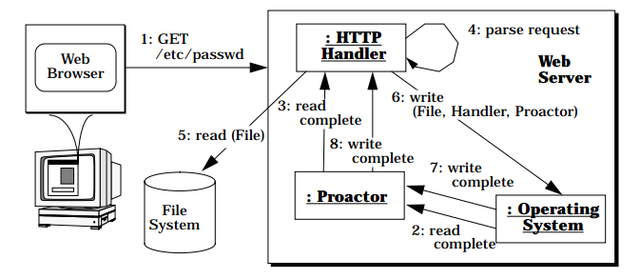

----
title: 两种高性能 I/O 设计模式 Reactor 和 Proactor
date: 2017-12-08
description: 

tags:
- IO
- 网络
- 模型

nav:
- Linux

categories:
- IO

image: images/linux.png

----
Reactor 和 Proactor 是基于事件驱动，在网络编程中经常用到两种设计模式。

曾经在一个项目中用到了网络库 libevent，也学习了一段时间，其内部实现所用到的就是 Reactor，所知道的还有 ACE；Proactor 模式的库有 Boost.Asio，ACE，暂时没有用过。但我也翻阅了一些文档，理解了它的实现方法。下面是我在学习这两种设计模式过程的笔记。

#### Reactor

Reactor，即反应堆。Reactor 的一般工作过程是首先在 Reactor 中注册（Reactor）感兴趣事件，并在注册时候指定某个已定义的回调函数（callback）；当客户端发送请求时，在 Reactor 中会触发刚才注册的事件，并调用对应的处理函数。在这一个处理回调函数中，一般会有数据**接收**、处理、**回复**请求等操作。

libevent 采用的就是 Reactor 的设计思想。其 **Reactor 的中心思想是众所周知的 I/O 多路复用**：select,poll,epoll,kqueue 等.libevent 精彩的将定时事件，信号处理，I/O 事件结合在在一起，也就是说用户同时在 Reactor 中注册上述三类事件。遗憾的是，libevent 不支持多线程，也就是说它同步处理请求，导致不能处理大量的请求；这样并不是说 Reactor 实现的网络库都不支持多线程，而是 libevent 本身的原因，我们也可以通过修改让 ilbevent 支持多线程，并发处理多个请求。

下面是 libevent 的一段代码，大概能够说明 Reactor 工作模式：

    /*accept callback function.*/
    void accept_callback(int fd,  short ev,void *arg)
    {
        ......
    }
    ......
    struct event accept_event;
    event_set(&accept_event,
                    socketlisten,
                    EV_READ|EV_PERSIST,
                    accept_callback,
                    NULL);
    
    event_add(&accept_event,
                    NULL);
    
    event_dispatch();
    

#### Proactor

从上面 Reactor 模式中，发现服务端数据的接收和发送都占用了用户状态（还有一种内核态），这样服务器的处理操作就在数据的读写上阻塞花费了时间，节省这些时间的办法是借助操作系统的异步读写；异步读写在调用的时候可以传递回调函数或者回送信号，当异步操作完毕，内核会自动调用回调函数或者发送信号。Proactor 就是这么做的，所以很依赖操作系统。来一幅 UML：

和时序图：

_注：这两幅美艳的图片来自 Proactor.doc，下面会提到._

Proactor 的实现主要有三个部分：异步操作处理器，Proactor 和 事件处理函数。其中：

    - 异步操作处理器，很依赖操作系统的异步处理机制，如若操作系统没有实现，我们可以自行模拟，即开专门的数据读写线程，数据读写完毕触发相应的时间（如果有注册的话）；
    - Proactor，会接收异步操作的提醒，调用相应的事件处理函数，它有自己的 event loop；
    - 事件处理函数，事件触发，执行操作；
    

曾经看过 Proactor.doc，作者是 Douglas C. Schmidt，你可以在[这里](http://www.laputan.org/pub/sag/proactor.pdf)阅读此文档。里面的关于 Proactor 的讲解很精彩，部分摘抄和自己的理解如下：当连接 web 服务器时：

*   web 服务器指定（1）接收器，此接收器相当于服务器的客户端，它可以启动异步的 accept 操作；
    
*   接收器调用操作系统上的异步接收操作（2），并传递自己和 Proactor 的引用；异步接收操作结束后，前者用作事件处理函数，后者会回过头来分发事件；_注：传递 Proactor 是为了让操作系统通知正确的 Proactor，可能会存在多个 Proactor；传递接收器自己是为了在异步接收操作结束后 Proactor 能调用正确的事件处理函数，以下同理。_
    
*   web 服务器调用 Proactor 的事件循环；（3）
    
*   web 浏览器连接 web 服务器；（4）
    
*   异步接收操作结束后，操作系统产生事件（通过回调或者信号）并通知 Proactor（5），Proactor 收到后会调用相应的事件处理函数，即交由接收器处理；（6）
    
*   接收器生成 HTTP 处理器，执行操作；（7）
    
*   HTTP 处理器解析事件，启动异步读操作（8），获取来自浏览器的 GET 请求。同样，HTTP 处理器传递自己和 Proactor 的引用；
    
*   web 服务器的控制权交还回 Proactor 的事件循环。（9）
    

接收 GET 请求过后，会处理数据：

*   浏览器发送（1）一个 HTTP GET 请求；
    
*   异步读操作结束后，操作系统会通知 Proactor，Proactor 分发给事件处理函数；（2，3）
    
*   事件处理器解析请求。（4）2-4 步骤会重复，指导所有的数据都接收为止；
    
*   事件处理器产生答复数据；（5）
    
*   HTTP 处理器启动异步写操作（6），传输应答数据，同样的这里还会传递处理器自己和 Proactor；
    
*   异步写操作结束，操作系统通知 Proactor（7），Proactor 分发给事件处理函数（8）。6-8 步骤会重复直到所有的数据写完为止。至此，一个请求回复完成。
    

#### 总结

相比网络编程中最简单的思路模式：bind,listen,accept,read,server operator,write，Reactor 和 Proactor 是两种高性能的设计模式，掌握此两种模式，有助于理解一些网络库的工作流程。此文提到了两种设计模式，但没有一些技术细节，譬如多线程同步。如果在 Reactor 中支持多线程，或多个线程共享一个 Proactor，线程的同步问题就来了。共享一篇印象笔记关于线程的综合讨论：[这里](http://app.yinxiang.com/shard/s9/sh/732ee92e-0eac-4080-94ce-b9a04e173cdf/9b403c45ee885eb64949970fddd3417e).

《[Comparing Two High-Performance I/O Design Patterns](http://www.artima.com/articles/io_design_patterns.html)》提到**一个将 Reactor 模拟 Proactor 而不借助操作系统异步机制的方法**：同样在 Reactor 注册感兴趣的事件（比如读），当事件发生时，执行非阻塞的读，读毕即才调用数据处理——假异步。

最后，实践出真知。欢迎讨论。

原文：http://daoluan.net/linux/%E5%AD%A6%E4%B9%A0%E6%80%BB%E7%BB%93/%E7%BD%91%E7%BB%9C%E7%BC%96%E7%A8%8B/2013/08/20/two-high-performance-io-design-patterns.html