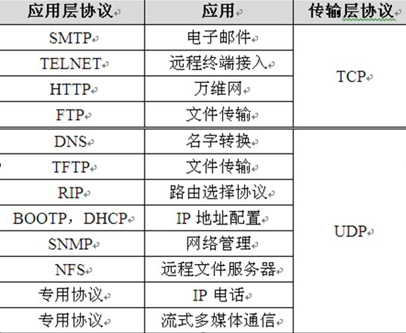
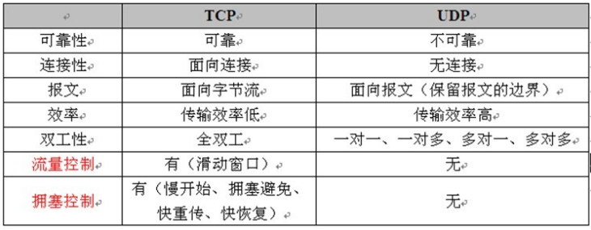
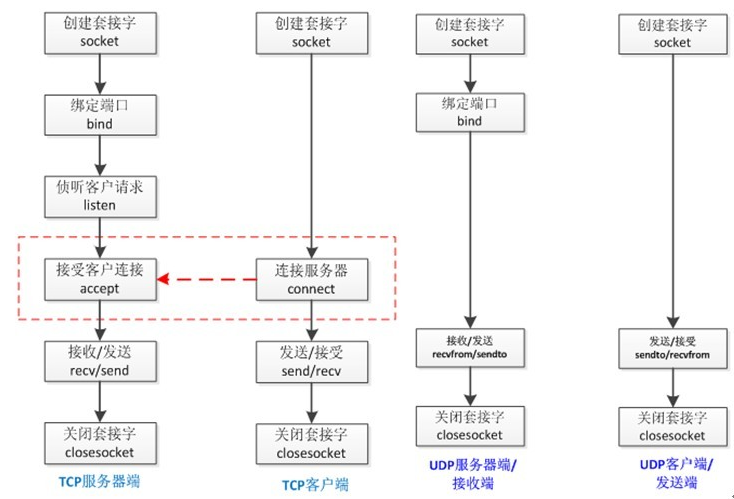

----
title: 面向报文（UDP）和面向字节流（TCP）的区别
date: 2017-11-26
description: 

tags:
- TCP
- UDP
- 网络协议

nav:
- 计算机网络

categories:
- TCP/IP

image: images/computer-networking.png

----
面向报文的传输方式是应用层交给 UDP 多长的报文，UDP 就照样发送，即一次发送一个报文。因此，应用程序必须选择合适大小的报文。若报文太长，则 IP 层需要分片，降低效率。若太短，会是 IP 太小。UDP 对应用层交下来的报文，既不合并，也不拆分，而是保留这些报文的边界。这也就是说，应用层交给 UDP 多长的报文，UDP 就照样发送，即一次发送一个报文。

面向字节流的话，虽然应用程序和 TCP 的交互是一次一个数据块（大小不等），但 TCP 把应用程序看成是一连串的无结构的字节流。TCP 有一个缓冲，当应用程序传送的数据块太长，TCP 就可以把它划分短一些再传送。如果应用程序一次只发送一个字节，TCP 也可以等待积累有足够多的字节后再构成报文段发送出去。

下图是 TCP 和 UDP 协议的一些应用。

 

下图是 TCP 和 UDP 协议的比较。
 

这里再详细说一下面向连接和面向无连接的区别：

面向连接举例：两个人之间通过电话进行通信;
面向无连接举例：邮政服务，用户把信函放在邮件中期待邮政处理流程来传递邮政包裹。显然，不可达代表不可靠。
从程序实现的角度来看，可以用下图来进行描述。

 

从上图也能清晰的看出，TCP 通信需要服务器端侦听 listen、接收客户端连接请求 accept，等待客户端 connect 建立连接后才能进行数据包的收发（recv/send）工作。而 UDP 则服务器和客户端的概念不明显，服务器端即接收端需要绑定端口，等待客户端的数据的到来。后续便可以进行数据的收发（recvfrom/sendto）工作。

在前面讲解 UDP 时，提到了 UDP 保留了报文的边界，下面我们来谈谈 TCP 和 UDP 中报文的边界问题。在默认的阻塞模式下，TCP 无边界，UDP 有边界。

对于 TCP 协议，客户端连续发送数据，只要服务端的这个函数的缓冲区足够大，会一次性接收过来，即客户端是分好几次发过来，是有边界的，而服务端却一次性接收过来，所以证明是无边界的；而对于 UDP 协议，客户端连续发送数据，即使服务端的这个函数的缓冲区足够大，也只会一次一次的接收，发送多少次接收多少次，即客户端分几次发送过来，服务端就必须按几次接收，从而证明，这种 UDP 的通讯模式是有边界的。

TCP 无边界，造成对采用 TCP 协议发送的数据进行接收比较麻烦，在接收的时候易出现粘包，即发送方发送的若干包数据到接收方接收时粘成一包。由于 TCP 是流协议，对于一个 socket 的包，如发送 10AAAAABBBBB 两次，由于网络原因第一次又分成两次发送， 10AAAAAB 和 BBBB，如果接包的时候先读取 10(包长度) 再读入后续数据，当接收得快，发送的慢时，就会出现先接收了 10AAAAAB, 会解释错误 , 再接到 BBBB10AAAAABBBBB，也解释错误的情况。这就是 TCP 的粘包。

在网络传输应用中，通常需要在网络协议之上再自定义一个协议封装一下，简单做法就是在要发送的数据前面再加一个自定义的包头，包头中可以包含数据长度和其它一些信息，接收的时候先收包头，再根据包头中描述的数据长度来接收后面的数据。详细做法是：先接收包头，在包头里指定包体长度来接收。设置包头包尾的检查位（ 比如以 0xAA 开头，0xCC 结束来检查一个包是否完整）。对于 TCP 来说：

1）不存在丢包，错包，所以不会出现数据出错 ；
2）如果包头检测错误，即为非法或者请求，直接重置即可。

为了避免粘包现象，可采取以下几种措施。

一、对于发送方引起的粘包现象，用户可通过编程设置来避免，TCP 提供了强制数据立即传送的操作指令 push，TCP 软件收到该操作指令后，就立即将本段数据发送出去，而不必等待发送缓冲区满；

二、对于接收方引起的粘包，则可通过优化程序设计、精简接收进程工作量、提高接收进程优先级等措施，使其及时接收数据，从而尽量避免出现粘包现象；
三、由接收方控制，将一包数据按结构字段，人为控制分多次接收，然后合并，通过这种手段来避免粘包。

原文：http://blog.csdn.net/ce123/article/details/8976006