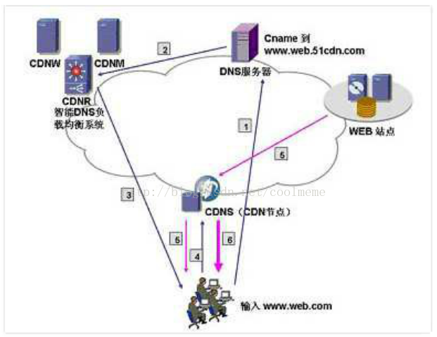

----
title: 一张图说明 CDN 网络的原理
date: 2017-11-26
description: 

tags:
- CDN

nav:
- 计算机网络

categories:
- 网络/其他

image: images/computer-networking.png

----
 

CDN用户访问流程图

1. 用户向浏览器输入 www.web.com 这个域名，浏览器第一次发现本地没有 dns 缓存，则向网站的 DNS 服务器请求；

2. 网站的 DNS 域名解析器设置了 CNAME，指向了 www.web.51cdn.com, 请求指向了 CDN 网络中的智能 DNS 负载均衡系统；

3. 智能 DNS 负载均衡系统解析域名，把对用户响应速度最快的 IP 节点返回给用户；

4. 用户向该 IP 节点（CDN 服务器）发出请求；

5. 由于是第一次访问，CDN 服务器会向原 web 站点请求，并缓存内容；

6. 请求结果发给用户。

CDN 网络是在用户和服务器之间增加 Cache 层，如何将用户的请求引导到 Cache 上获得源服务器的数据，主要是通过接管 DNS 实现，这就是 CDN 的最基本的原理，当然很多细节没有涉及到，比如第 1 步，首先向本地的 DNS 服务器请求。第 5 步，内容淘汰机制（根据 TTL）等。但原理大体如此。

当用户访问加入 CDN 服务的网站时，域名解析请求将最终交给全局负载均衡 DNS 进行处理。全局负载均衡 DNS 通过一组预先定义好的策略，将当时最接近用 户的节点地址提供给用户，使用户能够得到快速的服务。同时，它还与分布在世界各地的所有 CDNC 节点保持通信，搜集各节点的通信状态，确保不将用户的请求 分配到不可用的 CDN 节点上，实际上是通过 DNS 做全局负载均衡。

对于普通的 Internet 用户来讲，每个 CDN 节点就相当于一个放置在它周围的 WEB。通过全局负载均衡 DNS 的控制，用户的请求被透明地指向离他最近的节点，节点中 CDN 服务器会像网站的原始服务器一样，响应用户的请求。由于它离用户更近，因而响应时间必然更快。

每个 CDN 节点由两部分组成: 负载均衡设备和高速缓存服务器

负载均衡设备负责每个节点中各个 Cache 的负载均衡，保证节点的工作效率; 同时，负载均衡设备还负责收集节点与周围环境的信息，保持与全局负载 DNS 的通信，实现整个系统的负载均衡。CDN 的管理系统是整个系统能够正常运转的保证。它不仅能对系统中的各个子系统和设备进行实时监控，对各种故障产生相应的告警，还可以实时监测到系统中 总的流量和各节点的流量，并保存在系统的数据库中，使网管人员能够方便地进行进一步分析。通过完善的网管系统，用户可以对系统配置进行修改。

理论上，最简单的 CDN 网络有一个负责全局负载均衡的 DNS 和各节点一台 Cache，即可运行。DNS 支持根据用户源 IP 地址解析不同的 IP，实现 就近访问。为了保证高可用性等，需要监视各节点的流量、健康状况等。一个节点的单台 Cache 承载数量不够时，才需要多台 Cache，多台 Cache 同时 工作，才需要负载均衡器，使 Cache 群协同工作。