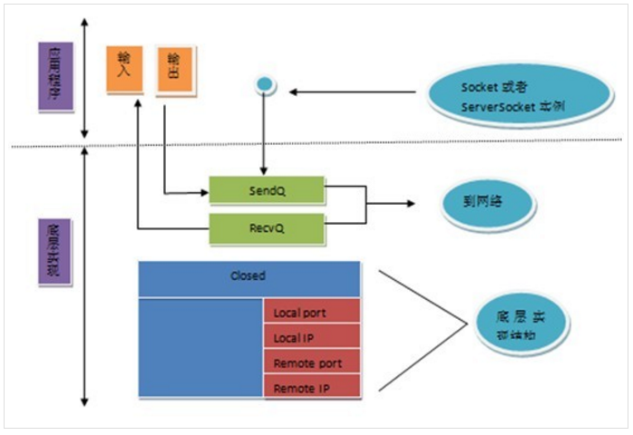

----
title: 深入剖析 Socket 实现
date: 2017-11-26
description: 

tags:
- Socket

nav:
- 计算机网络

categories:
- TCP/IP

image: images/computer-networking.png

----
在我们平时的开发中用到的最多的是 HTTP 协议，而 HTTP 协议本身是一种应用层协议，属于文本协议；并且这种协议也基本上满足了应用的大部分需求。HTTP 协议当初的设计并没有想到它应用的是如此的广泛，所以设计的时候考虑的比较简单实用，也许也就是这种简单实用才这么广泛；但如今，HTTP 协议似乎并不能满足所有的需求，特别是当今的 web2.0 时代，浏览器应用横行的年代，也越来越多需要长连接的应用，所以在 HTML5 以及 Flash 等客户端应用中都加入了长连接的定义，并且我也相信在未来的互联网开发中会出现很多的长连接应用。在我们公司也曾经自己开发过长连接的应用，前端是基于 flash 的，后端是基于 Java 的实现，自己基于 TCP/IP 协议制定了一套稳定，安全，可靠的应用层协议，至今一直在线上运行，情况也比较稳定；在此，我想基于我的知识和对于 socket 的理解在这里做一次分享，也许不是很深入和透彻，但绝对很基础。

其实如果不理解套接字的具体实现所关联的数据结构和底层协议的工作细节，就很难抓住网络编程的精妙之处，对于 TCP 套接字（即 Socket 的实例）来说更是如此。这里我就对创建和使用 Socket 和 ServerSocket 实例的底层细节进行介绍。请注意，这些内容仅仅涵盖了一些普通的事件实例，略去了很多细节。尽管如此，我相信即使是这样的基础的理解也是有用的。如果希望了解更详尽的内容，可以参考 TCP 规范，或关于该方面的其他著作（例如 TCP/IP 详解）。


图 1 是一个 Socket 实例所关联的一些信息的简化视图。JVM 或其运行的平台（即，主机操作系统中的 “套接字层”）为这些类的支持提供了底层实现。Java 对象上的操作则转换成了这种底层抽象上的操作。在这里，“Socket” 指的是图 1 中的类之一，而 “套接字（socket）” 指的是底层抽象，这种抽象是有操作系统提供或由 JVM 自己实现（例如在嵌入式系统中）。有一点需要注意，即运行在统一主机上的其他程序可能也会通过底层套接字抽象来使用网络，因此会与 Java Socket 实例竞争系统资源，如端口等。




在此，“套接字结构” 是指底层实现（包括 JVM 和 TCP/IP，但通常是后者）的数据结构集，这些数据结构包括了特定 Socket 实例所关联的信息。例如，套接字结构除其他信息外还包括：


*  该套接字所关联的本地和远程互联网地址和端口号。本地互联网地址（图中标记为 “Local IP”）是赋值给本地主机的；本地端口号在 Socket 实例创建时设置的。远程地址和端口号标记了与本地套接字连接的远程套接字（如果没有连接的话）。不久，我们将对这些值确定的时间和方式做进一步介绍。


* 一个 FIFO（先进先出，First In First Out）队列用于存放接收到的等待分配的数据，以及一个用于存放等待传输的数据的队列。


* 列表对于 TCP 套接字，还包括了与打开和关闭 TCP 握手相关的额外协议状态信息。图 1 中，状态是 “关闭”；所有套接字的起始状态都是关闭的。

一些多用途操作系统为用户提供了获取底层数据结构 “快照” 的工具，netstat 是其中之一，它在 UNIX（Linux）和 Windows 平台上都可用。只要给定适当的选项，netstat 就能显示和图 1 的那些信息：SendQ 和 RecvQ 中的字节数，本地和远程 IP 地址和端口号，以及连接状态等。netstat 的命令行选项有多种，但它输出看起来是这样的：
```
Active Internet connections(server and established)
Proto  Recv-Q  Send-Q  Local Address         Foreign Address       State
tcp    0       0       0.0.0.0:36045           0.0.0.0:*            LISTEN
tcp    0       0       0.0.0.0:111             0.0.0.0:*            LISTEN
tcp    0       0       0.0.0.0:53363           0.0.0.0:*            LISTEN
tcp    0       0       127.0.0.1:25            0.0.0.0:*            LISTEN
tcp    0       0       128.133.190.219:34077   4.71.104.187:80      TIME_WAIT
tcp    0       0       128.133.190.219:43346   79.62.132.8:22       ESTABLISHED
tcp    0       0       128.133.190.219:875     128.133.190.43:2409  ESTABLISHED
tcp6   0       0       :::22                   :::*                 LISTEN
```
前 4 行和最后一行描述了正在侦听连接的服务器套接字。

第 5 行代表了到一个 Web 服务器（80 端口）的连接，该服务器已经单方面关闭。

倒数第 2 行是现有的 TCP 连接。

如果系统支持的话，你可能想要尝试一下 netstat，来检测下上文描述的场景的连接状态。然而要知道，这些图中描述的状态转换过程转瞬即逝，可能很难通过 netstat 提供的 “快照” 功能将其捕获。

了解这些数据结构，以及底层协议如何对其进行影响是非常有用的，因为它们控制了各种 Socket 对象行为的各个方面。例如，由于 TCP 提供了一种可信赖的字节流服务，任何写入 Socket 的 OutputStream 的数据副本都必须保留，直到其在连接的另一端被成功接收。向输出流写数据并不意味着数据实际上已经被发送，他们只是被复制到了本地缓冲区。就算在 Socket 的 OutputStream 上进行 flush 操作，也不能保证数据能够立即发送到信道。此外，字节流服务的自身属性决定了其无法保留输入流中消息的边界信息，这里的边界信息的意思就是上一个数据包和下一个数据包之间的区别信息。这使一些协议的接收和解析过程变得复杂。另一方面，对于 DatagramSocket，数据包并没有为重传而进行缓存，任何时候调用 send() 方法返回后，数据就已经发送给了执行传输任务的网络子系统。如果网络子系统由于某种原因无法处理这些消息，该数据包将毫无提示地被丢弃（不过这种情况很少发生）。

### 缓冲区和 TCP

 作为程序员，在使用 TCP 套接字时需要记住的最重要一点是：

>不能假设在连接的一端将数据写入输出流和在另一端从输入流读取数据之间有任何一致性。

尤其是在发送端由单个输出流的 write() 方法传输的数据，可能会通过另一端的多个输入流的 read() 方法来获取；而一个 read() 方法可能会返回多个 write() 方法传输的数据。

为了展示这种情况，考虑如下程序：
```
   byte[] buf0 = new byte[1000];
   byte[] buf1 = new byte[2000];
   byte[] buf2 = new byte[5000];
   …
   Socket s = new Socket(destAddr, destPort);
   OutputStream out = s.getOutputStream();
   …
   out.write(buf0);
   …
   out.write(buf1);
   …
   out.write(buf2);
   …
   s.close();
```
其中，圆点代表了设置缓冲区数据的代码，但不包括对 out.write() 方法的调用。在本节的讨论中，“in” 代表接收端 Socket 的 InputStream，“out” 代表发送端 Socket 的 OutputStream。

这个 TCP 连接想接收端传输 8000 字节。在连接的接收端，这 8000 字节的分组方式取决于连接两端 out.write() 方法和 in.read() 方法的调用时间差，以及提供给 in.read() 方法的缓冲区大小。

我们可以认为 TCP 连接上发送的所有字节序列在某一瞬间被分成了 3 个 FIFO 队列；

* 列表 SendQ：在发送端底层实现中缓存的字节，这些字节已经写入了输出流，但还没在接收端主机上成功接收。


* 列表 RecvQ：在接收端底层实现中缓存的字节，等待分配到接收程序，即从输入流中读取。


*  列表 Delivered：接收者从输入流已经读取到的字节。

调用 out.write() 方法将向 SendQ 追加字节。TCP 协议负责将字节按顺序从 SendQ 移动到 RecvQ。有重要的一点需要明确，这个转移过程无法由用户程序控制或直接观察到，并且在块中（chunk）发生，这些块的大小在一定程度上独立于传递给 write() 方法的缓冲区大小。

接收程序从 Socket 的 InputStream 读取数据时，字节就从 RecvQ 移动到 Delivered 中，而转移的块的大小依赖于 RecvQ 中的数据量和传递给 read() 方法缓冲区大小。


->图 2   3 次调用 write() 方法后 3 个队列的状态<-

图 2 展示了上例中 3 次调用 out.write() 方法后，另一端调用 in.read() 方法前，以上 3 个队列的可能状态。不同的阴影效果分别代表了上文中 3 次调用 write() 方法传输的不同数据。

图 2 描述的发送端主机的 netstat 输出的瞬间状态中，会包含类似于下一行的内容：

在接收端主机，netstat 会显示：

现在假设接收者调用 read() 方法时使用的缓冲区数组大小为 2000 字节，read() 调用则将把等待分配队列 (RecvQ) 中的 1500 字节全部移动到数组中，返回值为 1500。注意，这些数据包括了第一次和第二次调用 write() 方法时传输的字节。在过一段时间，但 TCP 连接传完更多数据后，这三部分的状态可能如图 3 所示。


->图 3  第一次调用 read() 方法后<-

如果接收者现在调用 read() 方法时使用 4000 字节的缓冲区数组，将有很多字节从等待分配队列（RecvQ）转移到已分配队列（Delivered）中。这包括第二次调用 write() 方法时剩下的 1500 字节加上第三次调用 write() 的前 2500 字节。此时队列的状态如图 4 所示。


->图 4  另一次调用 read() 后<-

下次调用 read() 方法返回的字节数，取决于缓冲区数组的大小，以及发送方套接字 /TCP 实现通过网络向接收方实现传输数据的时机。数据从 SendQ 到 RecvQ 缓冲区的移动过程对应用程序协议的设计有重要的指导性。我们已经遇到过需要对使用带内（in-band）分隔符，并通过 Socket 来接收的消息进行解析的情况。

source: http://blog.csdn.net/zapldy/article/details/5813984