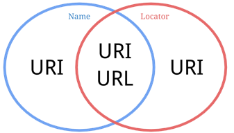

----
title: URL 和 URI 的区别
date: 2018-12-15
description: 

tags:
- URL
- URI
- 网络术语

nav:
- 计算机网络

categories:
- 网络/术语

image: images/linux.png

----

 

### URI, URL, URN

从上面的那幅图可以看出来，一共有三个不同的概念URI，URL，URN。这讨论这样的问题时，最好的方法就是回到原点啊，这里我们在[RFC 3986: Uniform Resource Identifier (URI): Generic Syntax](http://tools.ietf.org/html/rfc3986)里面收集了点资料：

“A Uniform Resource Identifier (URI) 是一个紧凑的字符串用来标示抽象或物理资源。”
“A URI 可以进一步被分为定位符、名字或两者都是。术语“Uniform Resource Locator” (URL) 是URI的子集，除了确定一个资源，还提供一种定位该资源的主要访问机制(如其网络“位置”)。”

<!--more-->

那我们无所不知的维基百科把这段消化的很好，并描述的更加形象了：

“URI可以分为URL，URI或同时具备locators 和names特性的一个东西。URN作用就好像一个人的名字，URL就像一个人的地址。换句话说：URN确定了东西的身份，URL提供了找到它的方式。”

通过这些描述我们可以得到一些结论： 

1、首先，URL是URI的一种（通过那个图就看的出来吧）。所以有人跟你说URL不是URI，他就错了呗。但也不是所有的URI都是URL哦，就好像蝴蝶都会飞，但会飞的可不都是蝴蝶啊，你让苍蝇怎么想！
2、让URI能成为URL的当然就是那个“访问机制”①，“网络位置”。例如： http:// 或 ftp:// 。
3、URN是唯一标识的一部分，就是一个特殊的名字。

下面就来看看例子吧，当来也是来自权威的RFC：

• ftp://ftp.is.co.za/rfc/rfc1808.txt (also a URL because of the protocol)
• http://www.ietf.org/rfc/rfc2396.txt (also a URL because of the protocol)
• ldap://[2001:db8::7]/c=GB?objectClass?one (also a URL because of the protocol)
• mailto:John.Doe@example.com (also a URL because of the protocol)
• news:comp.infosystems.www.servers.unix (also a URL because of the protocol)
• tel:+1-816-555-1212
• telnet://192.0.2.16:80/ (also a URL because of the protocol)
• urn:oasis:names:specification:docbook:dtd:xml:4.1.2

以上列举的都是URI, 其中一些是URL。哪些是URL? 就是那些提供了访问机制的.

### 总结

当我们替代web地址的时候，URI和URL那个更准确？

基于我读的很多的文章，包括RFC，我想说URI更准确。

别急，我有我的理由：

我们经常使用的URI不是严格技术意义上的URL。例如：你需要的文件在files.hp.com. 这是URI，但不是URL--系统可能会对很多协议和端口都做出正
确的反应。

你去http://files.hp.com 和 ftp://files.hp.com 可能得到完全不同的内容。这种情况可能更加普遍，想想不同谷歌域名上的不同服务啊。

所以，用URI吧，通常在技术上是正确的，URL可不一定。

最后“URL”这个术语正在被弃用。因此，就准确性而言，URI是相当安全选择。

### 译注：

①访问机制可以理解为“协议方案”，既约定好的一种信息交换协议，可以是：http、ftp、https、git等，标准的URI协议有很多种，具体可以访问[IANA-URI SCHEMES](http://www.iana.org/assignments/uri-schemes/uri-schemes.xhtml)参考。

### 附：

URI标准格式：scheme:[//[user:password@]host[:port]][/]path[?query][#fragment]
说明：
	scheme：协议方案名称
	user：用户名（登录信息，用于认证）
	password：密码（登录信息，用于认证）
	host：服务器地址
	port：服务器端口号
	path：带层次的文件路径
	query：查询字符串
	fragment：片段标识符

### 原文：
https://danielmiessler.com/study/url_vs_uri/