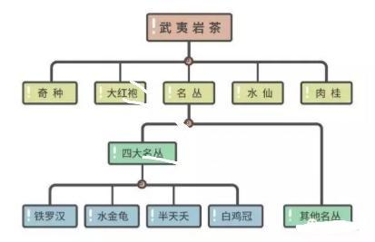

----
title: 武夷岩茶品类知识
date: 2021-01-07
description: 

tags:
- 武夷岩茶
- 茶知识

nav:
- 武夷岩茶

categories:
- 武夷岩茶

----
# 武夷岩茶的分类：大红袍、名枞、肉桂、水仙、奇种

不同的地理位置，造就了不同的特产。

茶叶更是典型的特产，需要特定地理位置才能种植相应的茶叶品种。

在我国，有六大名茶。其中**福建省就有三大名茶**

**1、红茶**：正山小种、金骏眉

**2、乌龙茶**：铁观音、福鼎白茶，武夷山岩茶（大红袍、肉桂），漳平水仙，漳州黄芽奇兰，永春佛手

**3、白茶**：白毫银针、白牡丹、贡眉、寿眉等

**所以，月是故乡明，茶是福建多！**

**我国六大名茶是指：乌龙茶、红茶、绿茶、白茶、黑茶和黄茶**。

**一、乌龙茶：**包括铁观音、黄金桂、武夷岩茶（包括大红袍、肉桂、武夷水仙）、漳平水仙、漳州黄芽奇兰、永春佛手、台湾冻顶乌龙、广东凤凰水仙、凤凰单枞等。

**二、红茶**：正山小种、金骏眉、银骏眉、坦洋工夫、祁门工夫、宁红等。

**三、绿茶**：龙井、碧螺春、黄山毛峰、南京雨花茶、信阳毛尖、庐山云雾茶、太平猴魁、六安瓜片等。

**四、白茶**：白毫银针、白牡丹、贡眉、寿眉等。

**五、黑茶**：普洱茶、茯砖茶、六堡茶等。

**六、黄茶**：君山银针、霍山黄芽、蒙山黄芽等。

今天，就说说武夷山岩茶。

**岩茶属于乌龙茶系列之一，乌龙茶属于六大名茶之一。**

# 大红袍与武夷岩茶的关系

大红袍，其实是一个茶树品种的名称，其3棵6株母树位于武夷山景区的九龙窠，已有超过350年的历史。

我们现在喝的大红袍，则是由母树大红袍的枝条扦插培育出来的，不是嫁接培育出来的，分为：

**纯种大红袍、普通大红袍 及 拼配大红袍。**

`纯种大红袍`: 母树的6株品种分别为：北斗1号、北斗2号和奇丹（每2株为1棵）。

`普通大红袍`: 从母树大红袍通过剪枝扦插，无性繁殖培育出来的。市场上经常说的一代大红袍、二代大红袍是不存在的，因为本身是无性繁殖。

`拼配大红袍`: 也称“商品大红袍”，是现在市场上最常见、销售量最多的大红袍。

大红袍属于武夷岩茶最具代表的产品。现在，大红袍又成为武夷岩茶对外的统一品牌名，**武夷岩茶被统称为“大红袍”**。

如果把大红袍当做品种名称，**大红袍则是武夷岩茶的系列之一**。

# 武夷岩茶的分类

武夷岩茶的名枞有几百种，甚至上千种，仅仅一个慧苑坑就有800多个种类。近几年武夷山还引进了外地的乌龙茶优良品种，有少量栽培、生产和上市销售，如黄旦、奇兰、黄奇、黄观音、金观音等。

不过，政府相关部门对岩茶种类进行了科学、规范的划分，根据**《武夷岩茶新国家标准（GB/T18745-2006）》**，**武夷岩茶产品分为五大类：**

**1、大红袍**

**2、名枞**

**3、肉桂**

**4、水仙**

**5、奇种。**

**大红袍**，是由母树大红袍的枝条扦插培育出来的品种。

**肉桂和水仙，都是武夷岩茶中的当家品种**，年总产量约占武夷岩茶的70%左右。这也难怪要将这两个品种单独列为两类了。

**名枞系列，**指的是从“菜茶”品种中经过长期选育而成，自然品质优异，具有典型的岩茶岩韵特征的有命名的茶树，典型的有十大名枞:大红袍、铁罗汉、白鸡冠、水金龟、半天妖、白牡丹、金桂、金锁匙、北斗、白瑞香。

大红袍是名枞系列的一种，但因为其知名度最高，故单独列出一个系列。

历史上将**白鸡冠、铁罗汉、水金龟、半天妖、大红袍列为五大名枞**，后来大红袍常被单独列为一大名枞，于是就有了我们现在常说的四大名枞。

**奇种系列**，是指武夷山野生茶叶树种，武夷山没有命名的野生茶叶树种或菜茶树种。“菜茶”，是武夷茶农对武夷山有性繁殖茶树群体品种的俗称。意思是这些茶就像门前门后所种的青菜一样普通，只供日常饮用。

对于五花八门的岩茶名称，我们实在没必要悉数记清，记住国家规定的五大类就差不多了。

就连当地一些茶农也反映，除了亲手栽培制作的，别的也很难分清，不易说对。我们只需辨识它们的质量好坏，感知它们的口感、岩韵就行了。

# 哪些地方才是正宗武夷岩茶？

根据《武夷岩茶新国家标准（GB/T18745-2006）》，武夷岩茶是指，在福建省武夷山市所辖区域范围内，在独特的武夷山自然生态环境下选用适宜的茶树品种进行无性繁育和栽培，并用独特的传统加工工艺制作而成，具有岩韵（岩骨花香）品质特征的乌龙茶。

武夷岩茶地理标志产品保护范围限于国家质量监督检验检疫总局根据《地理标志产品保护规定》批准的范围，即：福建省武夷山市所辖区域范围，含岚谷乡、吴屯乡、洋庄乡、星村镇、兴田镇、五夫镇、上梅乡、新丰街道、崇安街道、武夷街道等地区。

武夷山核心区属于丹霞地貌，一座山垂直而下，光照、水流、土壤都有非常大的区别，一路高低错落、阴阳不定，可谓移步换景。

变量如此之多，以至于武夷山无形中被分割成了无数小山场，每个山场都是一个独立的小气候区。

**不同的山场及气候，是武夷岩茶之所以复杂的第一个原因。**

很早以前，武夷岩茶就被分为三个区域：正岩，半岩和洲茶。

正岩以**三坑两涧**（慧苑坑、牛栏坑、大坑口、留香涧和悟源涧）为代表；

**九曲溪**边的河滩，则被称为洲茶；

介于两者之间的就是半岩：

**但如今，关于这三个区域的界定又进一步扩大**：

三坑两涧被称作名岩；武夷山核心景区，包括三十六峰、九十九岩，统统算入正岩；核心景区外、武夷山境内，算半岩茶；而武夷山外的茶，才叫洲茶：

也就是说，从前最次的九曲溪边洲茶，按现在的标准，都是正岩茶了呢。

如果看了以上的内容，还是云里雾里，也没有关系，只要你喝的岩茶适合你的口味就是好茶。

最贵的茶，不一定是你喜欢的茶，

便宜的茶，有可能你很喜欢。